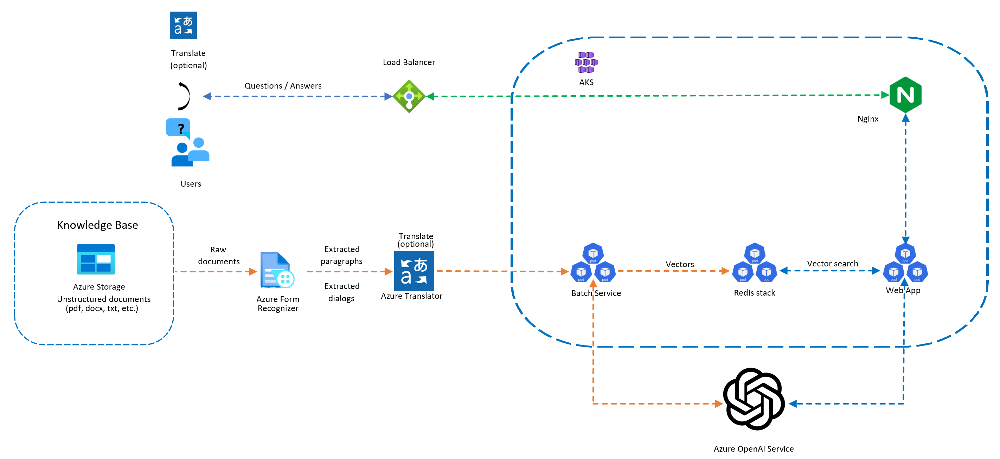

# Build Intelligent Apps on AKS

AKS is a great platform for hosting modern AI based applications for various reasons. It provides a single control plane to host all the assets required to build applications from end to end and even allows the development of appications using a Microservice architecture. What this means is that the AI based components can be separated from the rest of the applications. AKS also allows hosting of some of Azure's Congnitive services as containers withing your cluster, so that you can keep all the endpoints of your applications private as well as manage scaling however you need to. This is a significant advantage when it comes to securing your application. By hosting all components in a single control plane, you can streamline your DevOps process. 

## Core architecture components
In this scenario, we will be building an application that uses various cognitive services. It builds on top of the AKS secure baseline scenario so we will focus on discussing what is different in this scenario. For simplicity and quick deployment, you will be using the AKS construction helper to setup the base AKS environment. You will also be using Bicep to create the additional components that include include Azure Form Recognizer, Translator, Storage account with Queue service as well as Blob storage. In a future revision of this scenario, an option to use Azure Cache for Redis for vector search as opposed to running Redis stack as a container within the AKS cluster. This will shows the flexibility you get when you run your intelligent applications on AKS.

Within the cluster we will have three pods running. One for batch processing of the documents used to update the knowledge base of the conversational AI bot. Another is a customized Redis stack pod that is used for the vector search. The third will the front end application. You can run some of the cognitive services mentioned above as containers in the cluster as well, but for this vanilla installation, we will stick to running them as PaaS service on Azure. For more information about running cognitive services on AKS, please check out [Azure Cognitive Services containers](https://learn.microsoft.com/en-us/azure/cognitive-services/cognitive-services-container-support) page.



## Azure and AKS Features
During this workshop, you will be using various Azure and AKS features that make it easy to host intelligent application on AKS. Some of the features are listen below:
* Create embeddings and generate intelligent responses using using Azure OpenAI service
* Read text from PDF documents using Azure form recognizer
* Translate text to a different language as part of AI processing using Azure Translator
* Secure secrets with Azure Key vault
* Provide individual pods access to Key vault secrets using workload identity
* Secure your AKS environment with Azure Policy and Network policy
* Protect access to your application using Application Gateway
* Automatically scale your application with cluster autoscaler and horizontal pod autoscaler
* Queue jobs using Azure queue
* Store vectors of your knowledge base and perform vector search using a pod running on AKS
* Store domain knowledge on Azure blog storage
* Load balance traffic across various pods using Azure Load balancer and Nginx
* Limit network access using network security groups

## Azure OpenAI Embeddings QnA

A simple web application for a OpenAI-enabled document search. This repo uses Azure OpenAI Service for creating embeddings vectors from documents. For answering the question of a user, it retrieves the most relevant document and then uses GPT-3 to extract the matching answer for the question. For more information about this application and how to run it on other Azure services, please check out the [Azure OpenAI Embeddings QnA](https://github.com/azure-samples/azure-open-ai-embeddings-qna) repository.

## Deploy this Scenario

Begin by cloning this repository
```bash
    git clone --recurse-submodules https://github.com/Azure/AKS-Landing-Zone-Accelerator
```

Change directory to the infrastruture folder

```bash
    cd Scenarios/AKS-OpenAI-CogServe-Redis-Embeddings/infrastructure/
```
```bash
    RGNAME=embedding-openai-rg
    LOCATION=eastus
    az group create -l $LOCATION -n $RGNAME
```

Create the supporting resources (openai, storageaccount, translator, form reader)
```bash
 az deployment group create -g $RGNAME  --name intelligentappsdeployment --template-file intelligent-services.bicep --parameters parameters.json --parameters UniqueString=<your unique string>
```

get the openai api key from the created openai resource in the portal 

create the aks cluster and other supporting resources (acr, keyvault, etc). Get your signed in user information first which will be used to ensure you have access to the cluster.
```bash
SIGNEDINUSER=$(az ad signed-in-user show --query id --out tsv)
```

```bash
DEP=$(az deployment group create --name aksenvironmentdeployment -g $RGNAME  --parameters signedinuser=$SIGNEDINUSER api_key=<your openai key>  -f aks.bicep -o json)
```
Storage deployment information in environment variables
```bash
KVNAME=$(echo $DEP | jq -r '.properties.outputs.kvAppName.value')
OIDCISSUERURL=$(echo $DEP | jq -r '.properties.outputs.aksOidcIssuerUrl.value')
AKSCLUSTER=$(echo $DEP | jq -r '.properties.outputs.aksClusterName.value')
EMBEDINGAPPID=$(echo $DEP | jq -r '.properties.outputs.idsuperappClientId.value')
TENANTID=$(az account show --query tenantId -o tsv)
ACRNAME=$(az acr list -g $RGNAME --query [0].name  -o tsv)
```

Update manifest files with the environment variables
```bash
sed -i  "s/<identity clientID>/$EMBEDINGAPPID/" secret-provider-class.yaml
sed -i  "s/<kv name>/$KVNAME/" secret-provider-class.yaml
sed -i  "s/<tenant ID>/$TENANTID/" secret-provider-class.yaml

sed -i  "s/<identity clientID>/$EMBEDINGAPPID/" svc-accounts.yaml
sed -i  "s/<tenant ID>/$TENANTID/" svc-accounts.yaml
```
cd kubernetes


Update the env-configmap.yaml file with the correct environment variables

Log into the AKS cluster

```bash
az aks get-credentials -g $RGNAME -n aks-embedings-cluster
kubectl get nodes
```

cd to the manifests folder
```bash
cd ../kubernetes
```

deploy the kubernetes resources
```
kubectl apply -f .
```


