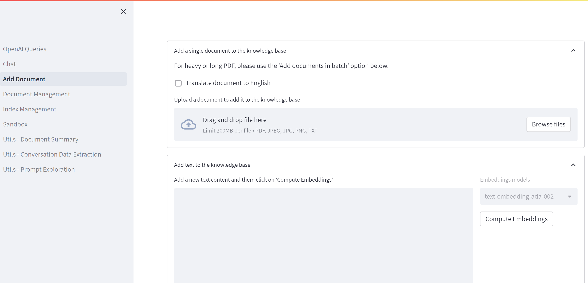
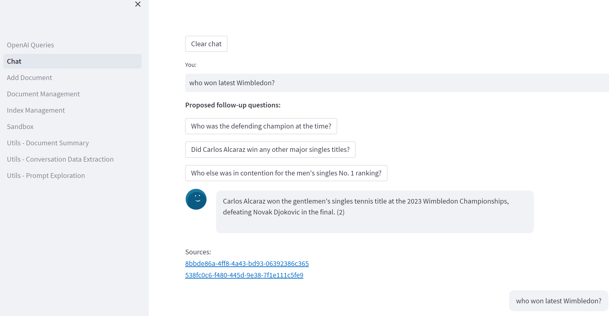

# Build Intelligent Apps on AKS

AKS is a great platform for hosting modern AI based applications for various reasons. It provides a single control plane to host all the assets required to build applications from end to end and even allows the development of applications using a Microservice architecture. What this means is that the AI based components can be separated from the rest of the applications. AKS also allows hosting of some of Azure's AI services as containers within your cluster, so that you can keep all the endpoints of your applications private as well as manage scaling however you need to. This is a significant advantage when it comes to securing your application. By hosting all components in a single cluster, you can streamline your DevOps process. 

## Core architecture components
In this scenario, we will be building an application that uses various Azure AI services. It builds on top of the AKS secure baseline scenario so we will focus on discussing what is different in this scenario. For simplicity and quick deployment, you will be using the AKS construction helper to setup the base AKS environment. You will also be using Bicep to create the additional components that include Azure Form Recognizer, Translator, Storage account with Queue service as well as Blob storage. In a future revision of this scenario, an option to use Azure Cache for Redis for vector search as opposed to running a Redis stack as a container within the AKS cluster. This will demonstrate the flexibility you get when you run your intelligent applications on AKS.

We will have three pods running within a cluster:
- One for batch processing of the documents that are used to update the knowledge base of the conversational AI bot.
- Another one is a customized Redis stack pod that is used for vector search.
- The third pod will host the front end application.

You can run some of the AI services mentioned above as containers in the cluster as well. However, for this vanilla installation, we will stick to running them as PaaS services on Azure. For more information about running Azure AI services on AKS, please check out [Azure Cognitive Services containers](https://learn.microsoft.com/en-us/azure/cognitive-services/cognitive-services-container-support) page.


## Azure and AKS Features
During this workshop, you will be using different Azure and AKS features that make it easy to host intelligent application on AKS. Some of the features are listen below:
* Create embeddings and generate intelligent responses using Azure OpenAI service
* Read text from PDF documents using Azure form recognizer
* Translate text to a different language as part of AI processing using Azure Translator
* Secure secrets with Azure Key vault
* Provide individual pods access to Key vault secrets using workload identity
* Secure your AKS environment with Azure Policy and Network policy
* Protect access to your application using Application Web routing Ingress Controller
* Automatically scale your application with cluster autoscaler and horizontal pod autoscaler
* Queue jobs using Azure queue
* Store vectors of your knowledge base and perform vector search using a pod running on AKS
* Store domain knowledge on Azure blob storage
* Load balance traffic across various pods using Azure Load balancer and Nginx
* Limit network access using network security groups

## Azure OpenAI Embeddings QnA

This is a simple web application for an OpenAI-enabled document search. This repo uses Azure OpenAI Service for creating embeddings vectors from documents. In order to answering users questions, it retrieves the most relevant document and then uses GPT-3 model to extract a matching answer for a question. For more information about this application and how to run it on other Azure services, please check out the [Azure OpenAI Embeddings QnA](https://github.com/azure-samples/azure-open-ai-embeddings-qna) repository.

## Deploy this Scenario

### Pre-requisites
- To Deploy this scenario, you must have **Azure OpenAI** Service enabled in your subscription.  If you haven't registered it yet, follow the instructions [here](https://learn.microsoft.com/legal/cognitive-services/openai/limited-access) to do so.

> **Warning** 
> Registration may take multiple hours.

- kubectl, preferably 1.25 and above  ( `az aks install-cli` )
- [Azure Subscription](https://azure.microsoft.com/free)
- [Azure CLI](https://learn.microsoft.com/cli/azure/what-is-azure-cli?WT.mc_id=containers-105184-pauyu)
- [Visual Studio Code](https://code.visualstudio.com/)
- [Docker Desktop](https://www.docker.com/products/docker-desktop/)
- [Git](https://git-scm.com/)
- Bash shell (e.g. [Windows Terminal](https://www.microsoft.com/p/windows-terminal/9n0dx20hk701) with [WSL](https://docs.microsoft.com/windows/wsl/install-win10) or [Azure Cloud Shell](https://shell.azure.com))

> **Note** 
> There are troubleshooting instructions at the end of this walkthrough.

## Deployment Process

## Fork and Clone the repo
1. Skip this step if you have a local terminal ready with kubectl and Azure CLI installed. Using a web browser, navigate to the [Azure Cloud Shell](https://shell.azure.com). Ensure your Cloud Shell is set to Bash. If it is on PowerShell, click the drop down in the top left corner and select Bash.
1. Clone this repository locally, and change the directory to the `./infrastructure` folder.
  ```bash
  git clone --recurse-submodules https://github.com/Azure/AKS-Landing-Zone-Accelerator
  cd Scenarios/AKS-OpenAI-CogServe-Redis-Embeddings/infrastructure/
  ```
1. Ensure you are signed into the `az` CLI (use `az login` if not)

If running in **Github Code Spaces**, update submodules explicitly run in `AKS-Landing-Zone-Accelerator/Scenarios/AKS-OpenAI-CogServe-Redis-Embeddings/`

```bash
git submodule update --init --recursive
cd Scenarios/AKS-OpenAI-CogServe-Redis-Embeddings/infrastructure/
``````

Ensure you are **signed into** the `az` CLI (use `az login` if not, or `az login --use-device-code` in **Github Code Spaces**)

### Setup environment specific variables

This will set environment variables, including your preferred `Resource Group` name and `Azure Region` for the subsequent steps, and create the `resource group` where we will deploy the solution.

 > **Important**
 > Set `UNIQUESTRING` to a value that will prevent your resources from clashing names, recommended combination of your initials, and 2-digit number (eg. js07).

Alternatively, you can generate a unique string in Linux by running the following command:
```bash
UNIQUESTRING=$(cat /dev/urandom | tr -dc 'a-z0-9' | fold -w 2 | head -n 1)$(cat /dev/urandom | tr -dc '0-9' | fold -w 2 | head -n 1)
```

```bash
UNIQUESTRING=<Your value here>
RGNAME=embedding-openai-rg
LOCATION=eastus
SIGNEDINUSER=$(az ad signed-in-user show --query id --out tsv) && echo "Current user is $SIGNEDINUSER"
```

### Deploy the environment using IaC (Bicep) and AKS Construction

Create all the solution resources using the provided `bicep` template and capture the output environment configuration in variables that are used later in the process.

> **NOTE**
> Our bicep template is using the [AKS-Construction](https://github.com/Azure/AKS-Construction) project to provision the AKS Cluster and associated cluster services/addons, in addition to the other workload specific resources.

 > **Important**
 > Ensure you have enough **quota** to deploy the gpt-35-turbo and text-embedding-ada-002 models before running the command below. Failure to do this will lead to an "InsufficientQuota" error in the model deployment. Most subscriptions have quota of 1 of these models, so if you already have either of those models deployed, you might not be able to deploy another one in the same subscription and you might have to use that deployment as your model instead to proceed. If that is the case, use the **Reusing existing  OpenAI Service** option. Otherwise use the **Deploy new resources** option.

#### Reusing existing OpenAI Service option

If you are re-using existing OpenAI resource set following variables and pass them to Bicep template

```bash
OPENAI_RGNAME=<Name of existing OpenAI RG>
OPENAI_ACCOUNTNAME=<Name of existing OpenAI service>
```

Add optional variable variables to the script below
```azcli
az deployment sub create \
        --name main-$UNIQUESTRING \
        --template-file main.bicep \
        --location=$LOCATION \
        --parameters UniqueString=$UNIQUESTRING \
        --parameters signedinuser=$SIGNEDINUSER \
        --parameters resourceGroupName=$RGNAME \
        --parameters openAIName=$OPENAI_ACCOUNTNAME \
        --parameters openAIRGName=$OPENAI_RGNAME       
```

#### Deploy new resources option
```bash
az deployment sub create \
        --name main-$UNIQUESTRING \
        --template-file main.bicep \
        --location=$LOCATION \
        --parameters UniqueString=$UNIQUESTRING \
        --parameters signedinuser=$SIGNEDINUSER \
        --parameters resourceGroupName=$RGNAME      
```

### Set Output Variables

```bash
KV_NAME=$(az deployment sub show --name main-$UNIQUESTRING --query properties.outputs.kvAppName.value -o tsv) && echo "The Key Vault name is: $KV_NAME"
OIDCISSUERURL=$(az deployment sub show --name main-$UNIQUESTRING --query properties.outputs.aksOidcIssuerUrl.value -o tsv) && echo "The OIDC Issue URL is: $OIDCISSUERURL"
AKSCLUSTER=$(az deployment sub show --name main-$UNIQUESTRING --query properties.outputs.aksClusterName.value -o tsv) && echo "The AKS cluster name is: $AKSCLUSTER"
BLOB_ACCOUNT_NAME=$(az deployment sub show --name main-$UNIQUESTRING --query properties.outputs.blobAccountName.value -o tsv) && echo "The Azure Storage Blob account name is: $BLOB_ACCOUNT_NAME"
FORMREC_ACCOUNT=$(az deployment sub show --name main-$UNIQUESTRING --query properties.outputs.formRecognizerName.value -o tsv) && echo "The Document Intelligence account name is: $FORMREC_ACCOUNT"
FORM_RECOGNIZER_ENDPOINT=$(az deployment sub show --name main-$UNIQUESTRING --query properties.outputs.formRecognizerEndpoint.value -o tsv) && echo "The Document Intelligence endpoint URL is: $FORM_RECOGNIZER_ENDPOINT"
TRANSLATOR_ACCOUNT=$(az deployment sub show --name main-$UNIQUESTRING --query properties.outputs.translatorName.value -o tsv) && echo "The Translator account name is: $TRANSLATOR_ACCOUNT"
OPENAI_ACCOUNTNAME=$(az deployment sub show --name main-$UNIQUESTRING --query properties.outputs.openAIAccountName.value -o tsv) && echo "The Azure OpenAI account name is: $OPENAI_ACCOUNTNAME"
OPENAI_API_BASE=$(az deployment sub show --name main-$UNIQUESTRING  --query properties.outputs.openAIURL.value -o tsv) && echo "The Azure OpenAI instance API URL is: $OPENAI_API_BASE"
OPENAI_RGNAME=$(az deployment sub show --name main-$UNIQUESTRING  --query properties.outputs.openAIRGName.value -o tsv) && echo "The Azure OpenAI Resource Group is: $OPENAI_RGNAME"
OPENAI_ENGINE=$(az deployment sub show --name main-$UNIQUESTRING  --query properties.outputs.openAIEngineName.value -o tsv) && echo "The Azure OpenAI GPT Model is: $OPENAI_ENGINE"
OPENAI_EMBEDDINGS_ENGINE=$(az deployment sub show --name main-$UNIQUESTRING  --query properties.outputs.openAIEmbeddingEngine.value -o tsv) && echo "The Azure OpenAI Embedding Model is: $OPENAI_EMBEDDINGS_ENGINE"
ACR_NAME=$(az acr list -g $RGNAME --query '[0]'.name -o tsv)  && echo "The Azure Container Registry name is: $ACR_NAME"
```

If variables are empty (some shells like zsh may have this issue) - see Troubleshooting section below.

 > **Important**
 > Ensure you those commands above captured the correct values for the environment variables by using the echo command, otherwise you might run into errors in the next few commands.


### Store the resource keys Key Vault Secrets

OpenAI API, Blob Storage, Form Recognizer and Translator keys will be secured in Key Vault, and passed to the workload using the CSI Secret driver

> Note: If you get a bad request error in any of the commands below, then it means the previous commands did not serialize the environment variable correctly. Use the echo command to get the name of the AI services used in the commands below and run the commands by replacing the environment variables with actual service names.

Enter the commands below to store the required secrets in Key vault
```bash
az keyvault secret set --name openaiapikey  --vault-name $KV_NAME --value $(az cognitiveservices account keys list -g $OPENAI_RGNAME -n $OPENAI_ACCOUNTNAME --query key1 -o tsv)

az keyvault secret set --name formrecognizerkey  --vault-name $KV_NAME --value $(az cognitiveservices account keys list -g $RGNAME -n $FORMREC_ACCOUNT --query key1 -o tsv)

az keyvault secret set --name translatekey  --vault-name $KV_NAME --value $(az cognitiveservices account keys list -g $RGNAME -n $TRANSLATOR_ACCOUNT --query key1 -o tsv)

az keyvault secret set --name blobaccountkey  --vault-name $KV_NAME --value $(az storage account keys list -g $RGNAME -n $BLOB_ACCOUNT_NAME --query \[1\].value -o tsv)
```

### Federate AKS MI with Service account 
Create and record the required federation to allow the CSI Secret driver to use the AD Workload identity, and to update the manifest files.

Note: if running Federation in **bash**, use below commands
```bash
CSIIdentity=($(az aks show -g $RGNAME -n $AKSCLUSTER --query "[addonProfiles.azureKeyvaultSecretsProvider.identity.resourceId,addonProfiles.azureKeyvaultSecretsProvider.identity.clientId]" -o tsv |  cut -d '/' -f 5,9 --output-delimiter ' '))

CLIENT_ID=${CSIIdentity[2]} && echo "CLIENT_ID is: $CLIENT_ID"
IDNAME=${CSIIdentity[1]} && echo "IDNAME is: $IDNAME"
IDRG=${CSIIdentity[0]} && echo "IDRG is: $IDRG"

az identity federated-credential create --name aksfederatedidentity --identity-name $IDNAME --resource-group $IDRG --issuer $OIDCISSUERURL --subject system:serviceaccount:default:serversa
```
 > **Important**
 > If running the commands below in **zsh** or in **Github Code Spaces**, the order of the variables is different. Make sure the variables make sense by taking a look at the echo'ed strings in your terminal. 

```bash
CSIIdentity=($(az aks show -g $RGNAME -n $AKSCLUSTER --query "[addonProfiles.azureKeyvaultSecretsProvider.identity.resourceId,addonProfiles.azureKeyvaultSecretsProvider.identity.clientId]" -o tsv |  cut -d '/' -f 5,9 --output-delimiter ' '))

CLIENT_ID=${CSIIdentity[3]} && echo "CLIENT_ID is $CLIENT_ID"
IDNAME=${CSIIdentity[2]} && echo "IDNAME is $IDNAME"
IDRG=${CSIIdentity[1]} && echo "IDRG is $IDRG"

az identity federated-credential create --name aksfederatedidentity --identity-name $IDNAME --resource-group $IDRG --issuer $OIDCISSUERURL --subject system:serviceaccount:default:serversa
```

### Build ACR Image for the web app
```bash
cd ../App/

az acr build --image oai-embeddings:v1 --registry $ACR_NAME -g $RGNAME -f ./WebApp.Dockerfile ./
```

### Deploy the Kubernetes Resources
In this step, you will deploy the kubernetes resources required to make the application run. This includes the ingress resources, deployments / pods, services, etc.

1. Change directory to the Kubernetes manifests folder `Scenarios/AKS-OpenAI-CogServe-Redis-Embeddings/kubernetes`.
  ```bash
  cd ../kubernetes/
  ```
1. Log into your AKS cluster and ensure you are properly logged in. The command should return the nodes in your cluster.
  ```bash
  az aks get-credentials -g $RGNAME -n $AKSCLUSTER
  kubectl get nodes
  ```
1. Get your ingress's IP address so you have the URL required to access your application on your browser
  ```bash
  INGRESS_IP=$(kubectl get svc nginx -n app-routing-system -o jsonpath='{.status.loadBalancer.ingress[0].ip}')
  echo "Ingress IP: $INGRESS_IP"
  ```
1. Save variables in a new .env file
  ```bash
  cat << EOF > .env
  CLIENT_ID=$CLIENT_ID
  TENANT_ID=$(az account show --query tenantId -o tsv)
  KV_NAME=$KV_NAME
  OPENAI_API_BASE=$OPENAI_API_BASE
  OPENAI_ENGINE=$OPENAI_ENGINE
  OPENAI_EMBEDDINGS_ENGINE=$OPENAI_EMBEDDINGS_ENGINE
  LOCATION=$LOCATION
  BLOB_ACCOUNT_NAME=$BLOB_ACCOUNT_NAME
  FORM_RECOGNIZER_ENDPOINT=$FORM_RECOGNIZER_ENDPOINT
  DNS_NAME=openai-$UNIQUESTRING.$INGRESS_IP.nip.io
  ACR_IMAGE=$ACR_NAME.azurecr.io/oai-embeddings:v1
  EOF
  ```
1. Deploy the Kubernetes resources. Use option 1 if you are using kubectl < 1.25. Use option 2 if you are using kubectl >= 1.25
  **Option 1:**
  ```bash
  kustomize build . > deploy-all.yaml
  kubectl apply -f deploy-all.yaml
  ```
  **Option 2:**
  ```
  kubectl apply -k .
  ```

### Test the app
1. Get the URL where the app can be reached
  ```bash
  kubectl get ingress
  ```
1. Copy the url under **HOSTS** and paste it in your browser. 
1. Try asking the chatbot a domain specific question by heading to the **Chat** tab and typing a question there. You will notice it fail to answer it correctly. 
1. Click on the `Add Document` tab in the left pane and either upload a PDF with domain information you would like to ask the chatbot about or copy and paste text containing the knowledge base in `Add text to the knowledge base` section, then click on `Compute Embeddings`

1. Head back to the **Chat** tab, try asking the same question again and watch the chatbot answer it correctly


### Troubleshooting
#### Insufficient Quota
Depending on your subscription OpenAI quota you may get deployment error
```json
Inner Errors:
{"code": "InsufficientQuota", "message": "The specified capacity '120' of account deployment is bigger than available capacity '108' for UsageName 'Tokens Per Minute (thousands) - GPT-35-Turbo'."}
```
There are few options - point deployment to the existing OpenAI resource instead of provisioning new one, or adjust quota.
Note: check if you have soft-deleted OpenAI instances taking up quota and purge them.


#### Bad request errors
Depending on type of terminal you are using, the command to create environment variables by querying the **INFRA_RESULT** variable that gets created with the deployment might not work properly. You will notice then when you get bad request errors when running subsequent commands. Try using the **echo** command to print the values of those environment variables into your terminal and replace the environment variables like `$OPENAI_ACCOUNTNAME` and `$OIDCISSUERURL` with the actual string values.


#### Pod deployment issues
If you notice that the api pod is stuck in *ContainerCreating* status, chances are that the federated identity was not created properly. To fix this, ensure that the "CSIIdentity" environment variable was created properly. You should then run the "az identity federated-credential create" command again using string values as opposed to environment variables. You can find the string values by using the **echo** command to print the environment variables in your terminal. It is the API deployment that brings the secrets from Key vault into the AKS cluster, so the other two pods require the API pod to be in a running state before they can start as well since they require the secrets.

#### 
