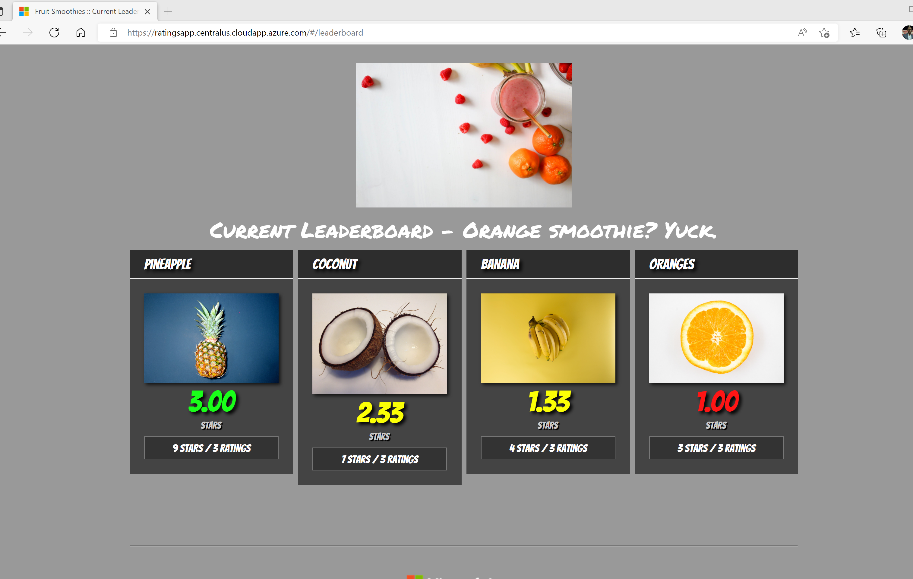

**This workload is still in development. Feel free to try it out, fix issues and PR to the repo.**


# Deploy a GMSA Integrated .NET Legacy Workload

This application is provided by Microsoft to demonstrate a Legacy .NET 4.7 application on Windows Containers. Follow the instructions in the documentation through generating and applying the credential spec file to the AKS cluster. After you configure GMSA, you will walk through the steps of deploying the application to the cluster. 

Because the infrastructure has been deployed in a private AKS cluster setup with private endpoints for the container registry and other components, you will need to perform the application container build and the publishing to the Container Registry from the Dev Jumpbox in the Hub VNET, connecting via the Bastion Host service. If your computer is connected to the hub network, you may be able to just use that as well. The rest of the steps can be performed on your local machine by using AKS Run commands which allow access into private clusters using RBAC. This will help with improving security and will provide a more user-friendly way of editing YAML files.

1. ## Prepare your Jumpbox VM with tools (run from local machine) 

* Add a rule in the Firewall to allow internet access to the VM's private IP. Verify VM's private IP and update if necessary

   ```PowerShell
   az network firewall network-rule create --collection-name 'VM-egress' --destination-ports '*' --firewall-name 'vnet-ESLZ-firewall' --name 'Allow-Internet' --protocols Any --resource-group 'ESLZ-HUB' --action Allow --dest-addr '*' --priority 201 --source-addresses '10.0.3.4/32'
   ```
* Add a rule in the Firewall to allow internet access to the your VM or computer's  IP. Verify VM's private IP and update if necessary

   ```PowerShell
   az network firewall network-rule create --collection-name 'VM-egress' --destination-ports '*' --firewall-name 'AZFW' --name 'Allow-Internet' --protocols Any --resource-group 'ESLZ-HUB' --action Allow --dest-addr '*' --priority 201 --source-addresses '<your vm or computer's ip>'
   ```
## Connecting to the Bastion Host

1. Use Bastion Host to connect to the jumpbox.
2. Enter the username and password. If you have used a public key, then select upload private key (corresponding to the public key) to connect.
3. Once you connect ensure you permit the site to read the content of your clipboard

* Clone it on the jumpbox.

   ```Git bash
   git clone https://github.com/Azure/AKS-Landing-Zone-Accelerator
   ```

* Run the script below to install the required tools (Az CLI, Docker, Kubectl, Helm etc). Navigate to "AKS-Landing-Zone-Accelerator/Scenarios/AKS-Secure-Baseline-PrivateCluster/Terraform/04-Network-Hub" folder.

   ``` PowerShell
   cd AKS-Landing-Zone-Accelerator/Scenarios/AKS-Secure-Baseline-PrivateCluster/Terraform/04-Network-Hub
   ./Install-Tools.ps1
   ```

* Login to Azure

   ```PowerShell
   $TENANTID=<tenant id>
   az login -t $TENANTID --debug
   ```

* Ensure you are connected to the correct subscription

   ```PowerShell
   az account set --subscription <subscription id>
   ```
## Build Container Images

The Dockerfile for the eShop application is in the repository you've already cloned to your jumpbox in the previous step. 

Navigate to the [eShop Dockerfile](../eshopLegacyApp/application/eshop.Dockerfile), build and tag the containers with the name of your Azure Container Registry and push the images to ACR. // Make sure it is the correct ACR

```PowerShell
# enter the name of your ACR below
$SPOKERG=<resource group name for spoke>
$ACRNAME=$(az acr show --name <ACR NAME> --resource-group $SPOKERG --query "name" --output tsv)

cd AKS-Landing-Zone-Accelerator/Scenarios/AKS-Secure-Baseline-PrivateCluster/Apps/eshopLegacyApp/application

docker build -t $ACRNAME.azurecr.io/eshopapp:v1 -f eshop.Dockerfile .
```

Log into ACR

```PowerShell 
az acr login -n $ACRNAME
```

Push the images into the container registry. Ensure you are logged into the Azure Container Registry, you should show a successful login from the command above.

```PowerShell
docker push $ACRNAME.azurecr.io/eshopapp:v1
```

To verify they have been pushed run the following commands:

```PowerShell
az acr repository show -n $ACRNAME --image eshopapp:v1
```
## Infrastructure Additions
To deploy the eShop application, you will need to add a SQL database to your base architecture and a Windows Server 2022 nodepool to your AKS cluster.

### Azure SQL Database
In addition to the base private architecture that you've deployed, you will need to deploy a SQL database to hold the product information. 

1. Create a SQL server and database in your Spoke resource group in the same location. 
2. Using the query editor in Azure Portal or SQL Server Management Studio (SSMS), run the [eShop Database Query](/Scenarios/AKS-Secure-Baseline-PrivateCluster/Apps/eshopLegacyApp/database%20scripts/insertdata.sql) on your database to create the necessary tables and hydrate the tables with data. 
3. Copy and paste your SQL database connection string in the placeholder in the [Web.config](/Scenarios/AKS-Secure-Baseline-PrivateCluster/Apps/eshopLegacyApp/application/src/eShopModernizedMVC/Web.config) for the eShop Application. DO NOT commit this connection string to your public Git repository. 

### AKS Windows Server 2022 Nodepool

The eShop container image uses Windows Server 2022 nodes. The base architecture deploys a default Windows nodepool which is Windows Server 2019. Update your existing cluster by adding a Windows Server 2022 nodepool through Terraform. Make sure you do this step before setting up GMSA because the setup needs the name of all Windows nodepools that need access to the KeyVault for pulling the domain credentials.  

## Setup Group Managed Service Account (GMSA) Integration

Before enabling GMSA on your AKS cluster, you will need to make the following updates to your architecture:
1. Update the DNS server on the hub and spoke VNETs to from Azure Default to Custom. The IP address will be the IP address of your domain controller. Reboot all virtual machines and your domain controller after performing this action.
2. Enable the application gateway add-on for your AKS cluster. This will allow the application to be accessed through the public IP address of the gateway. 

Follow the steps [here](https://learn.microsoft.com/en-us/virtualization/windowscontainers/manage-containers/gmsa-aks-ps-module) to setup your environment and setup GMSA on your cluster. These commands will need to be run on your domain controller or on a domain joined virtual machine.  

### Common Issues
1. If you are running these commands on your domain controller that is a Windows Server machine, you may have trouble installing the [Kubernetes CLI (kubectl)](https://kubernetes.io/docs/tasks/tools/install-kubectl-windows/) and [kubelogin](https://github.com/Azure/kubelogin). The error would mention "Install-AzAksKubectl". If so, you will need to manually install both following the links above. 

### How to Validate Your GMSA Integration

1. Check the status of your pods by running ``` kubectl get pods ```. If the status is *Running*, you're good to go. If the status of your pods is *CrashLoopBackOff*, run ``` kubectl logs <pod name> ``` to debug. This status likely means that your credential spec file is misconfigured or the cluster permissions to your KeyVault are misconfigured. If you believe your cred spec is correct, check the logs from the above command to verify the pod was able to pull down the image from the Azure Container Registry (ACR). 
2. To validate that your cluster is successfully retrieving your GMSA, go into your domain controller local server menu, go to Tools and select Event Viewer. Look under ActiveDirectory events. Look at the contents of the most recent events for a message that says "A caller successfully fetched the password of a group managed service account." The IP address of the caller should match one of your AKS cluster IPs. 

### Deploy workload

Navigate to "Scenarios/AKS-Secure-Baseline-PrivateCluster/Apps/eshopLegacyApp" folder.

1. Update the [manifest file](/Scenarios/AKS-Secure-Baseline-PrivateCluster/Apps/eshopLegacyApp/manifests/deployment.yml) for the sample application with your GMSA name and image name. 
2. Run ``` kubectl apply -f ingress.yml ``` to setup the Application Gateway for ingress on the cluster. 
3.  Run ``` kubectl apply -f deployment.yml ``` to deploy the application to the Windows 2022 nodes. 

## **(Optional)** Deploy the Ingress without support for HTTPS

This step is optional. If you would like to go straight to using https which is the secure option, skip this section and go straight to the **Update the Ingress to support HTTPS traffic** section.

It is important to first configure the NSG for the Application Gateway to accept traffic on port 80 if using the HTTP option. Run the following command to allow HTTP.

```PowerShell
   $APPGWSUBNSG=<Name of NSG for AppGwy>
   az network nsg rule create -g $SPOKERG --nsg-name $APPGWSUBNSG -n AllowHTTPInbound --priority 1000 \
      --source-address-prefixes '*' --source-port-ranges '*' \
      --destination-address-prefixes '*' --destination-port-ranges 80 --access Allow \
      --protocol Tcp --description "Allow Inbound traffic through the Application Gateway on port 80"
```

You will also need to update the firewall rules to allow http. Go into the portal and add a firewall rule that allows http on port 80.

### Check your deployed workload

1. Copy the ip address displayed by ``` kubectl get ingress ```, open a browser inside your domain controller or a domain joined virtual machine, navigate to the IP address obtained above from the ingress controller and explore your website

It is important to delete the rule that allows HTTP traffic to keep the cluster safe since we have completed the test.

```PowerShell
   az network nsg rule delete -g $SPOKERG --nsg-name $APPGWSUBNSG -n AllowHTTPInbound
```
**the optional steps end here**

## Deploy the Ingress with HTTPS support
**Please note: This section is still in development**

A fully qualified DNS name and a certificate are needed to configure HTTPS support on the the front end of the web application. You are welcome to bring your own certificate and DNS if you have them available, however a simple way to demonstrate this is to use a self-signed certificate with an FQDN configured on the IP address used by the Application Gateway.

**Objectives**

1. Configure the Public IP address of your Application Gateway to have a DNS name. It will be in the format of customPrefix.region.cloudapp.azure.com
2. Create a certificate using the FQDN and store it in Key Vault.

### Creating Public IP address for your Application Gateway

1. Find your application gateway in your landing zone resource group and click on it. By default it should be in the spoke resource group.

2. Click on the *Frontend public IP address*

   

3. Click on configuration in the left blade of the resulting page.

4. Enter a unique DNS name in the field provided and click **Save**.

   

### Create the self-signed certificate using Lets Encrypt

We are going to use Lets Encrypt and Cert-Manager to provide easy to use certificate management for the application within AKS. Cert-Manager will also handle future certificate renewals removing any manual processes.

1. First of all, you will need to install cert-manager into your cluster.

```PowerShell
   az aks command invoke --resource-group $ClusterRGName --name $ClusterName   --command "kubectl apply -f https://github.com/jetstack/cert-manager/releases/download/v1.8.0/cert-manager.yaml"
```
First of all this will create a new namespace called cert-manager which is where all of the resources for cert-manager will be kept. This will then go ahead and download some CRDs (CustomResourceDefinitions) which provides extra functionality in the cluster for the creation of certificates.

We will then proceed to test this certificate process with a staging certificate to begin with, before moving on to deploying a production certificate.

2. Edit the 'certificateIssuer.yaml' file and include your email address. This will be used for certificate renewal notifications.

Deploy certificateIssuer.yaml

```PowerShell
   az aks command invoke --resource-group $ClusterRGName --name $ClusterName   --command "kubectl apply -f certificateIssuer.yaml -n default" --file certificateIssuer.yaml
```

1. Edit the 'ingress.yml' with the FQDN of your host that you created earlier on the public IP of the Application Gateway.

Deploy ingress.yml

```PowerShell
   az aks command invoke --resource-group $ClusterRGName --name $ClusterName   --command "kubectl apply -f ingress.yml"

```

After updating the ingress, A request will be sent to letsEncrypt to provide a 'staging' certificate. This can take a few minutes. You can check on the progress by running the below command. When the status Ready = True. You should be able to browse to the same URL you configured on the PIP of the Application Gateway earlier.

```PowerShell
   az aks command invoke --resource-group $ClusterRGName --name $ClusterName   --command "kubectl get certificate"
```

If you notice the status is not changing after a few minutes, there could be a problem with your certificate request. You can gather more information by running a describe on the request using the below command.

```PowerShell
   az aks command invoke --resource-group $ClusterRGName --name $ClusterName   --command "kubectl get certificaterequest"
   az aks command invoke --resource-group $ClusterRGName --name $ClusterName   --command "kubectl describe certificaterequest <certificaterequestname>"
```

Upon navigating to your new FQDN you will see you receive a certificate warning because it is not a production certificate. If you have got this far, continue to the next step to remediate this issue.


4. Edit the 'certificateIssuer.yaml' file and replace the following:

    Change the metadata name to letsencrypt-prod
    Change the server to https://acme-v02.api.letsencrypt.org/directory
    change the privateKeySecretRef to letsencrypt-prod

Re-apply the updated file

```PowerShell
   az aks command invoke --resource-group $ClusterRGName --name $ClusterName   --command "kubectl apply -f certificateIssuer.yaml" --file certificateIssuer.yaml
```

5. The next step is to change the ingress to point to the production certificateIssuer. At the moment it is still pointing to the old staging issuer.

Edit 'deployment.yml' and replace the following values:

    cert-manager.io/issuer: letsencrypt-prod

Re-apply the updated file

```PowerShell
   az aks command invoke --resource-group $ClusterRGName --name $ClusterName   --command "kubectl apply -f deployment.yml"
```


Now you can access the website using using your FQDN. When you navigate to the website using your browser you might see a warning stating the destination is not safe. Give it a few minutes and this should clear out. However, for production you want to use Certified Authority (CA) certificates.


