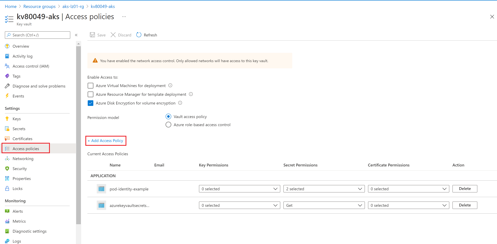
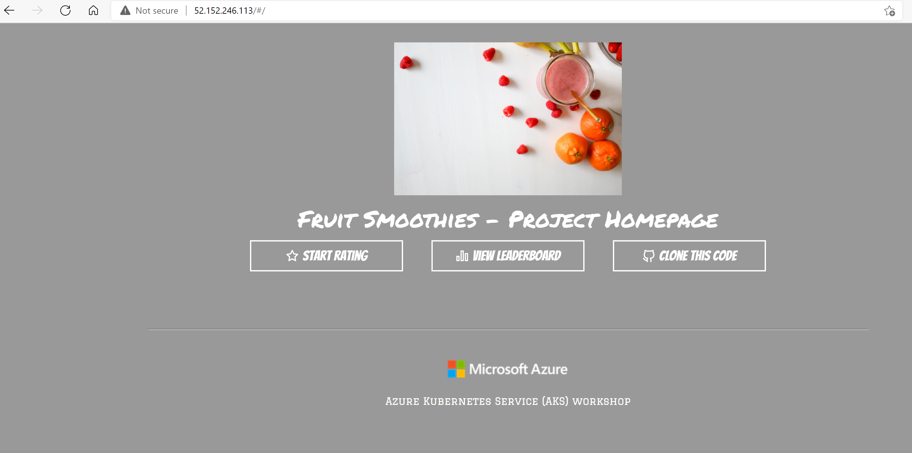
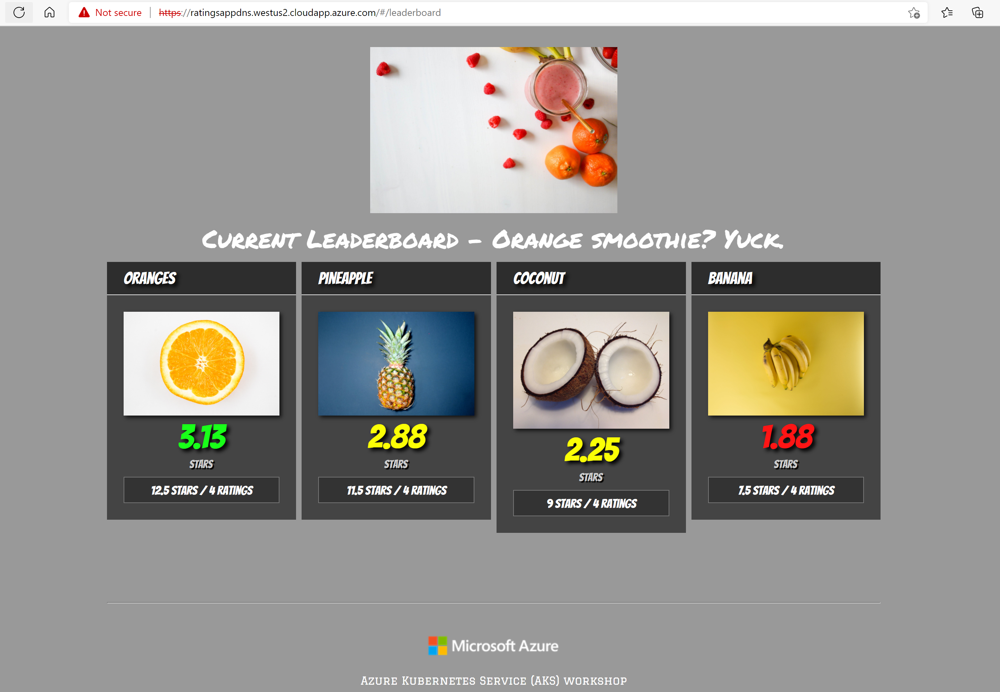

# Deploy a Basic Workload using the Fruit Smoothie Ratings Application

This application is provided by Microsoft Learning and is used as part of a self-paced Kubernetes training [workshop](https://docs.microsoft.com/en-us/learn/modules/aks-workshop/). You may find reviewing that workshop helpful as it presents some alternative deployment options and features using different architecture requirements. The application consists of a web frontend, an API service and a MongoDB database.

Because the infrastructure has been deployed in a private AKS cluster setup, you will need to perform the application deployment from the Dev Jumpbox in the Hub VNET, connect via the Bastion Host service. If your computer is connected to the hub network, you may be able to just use that as well.

## Prepare your Jumpbox VM with tools

* Add a rule in the Firewall to allow internet access to the VM's private IP. Verify VM's private IP and update if necessary

   ```bash
   az network firewall network-rule create --collection-name 'VM-egress' --destination-ports '*' --firewall-name 'AZFW' --name 'Allow-Internet' --protocols Any --resource-group 'ESLZ-HUB' --action Allow --dest-addr '*' --priority 201 --source-addresses '10.0.3.4/32'
   ```

## Connecting to the Bastion Host

1. Use Bastion Host to connect to the jumpbox.
2. Enter the username and password. If you have used a public key, then select upload private key (corresponding to the public key) to connect.
3. Once you connect ensure you permit the site to read the content of your clipboard

* Clone it on the jumpbox.

   ```bash
   git clone https://github.com/Azure/Enterprise-Scale-for-AKS
   ```

* Run the script to install required tools (Az CLI, Docker, Kubectl, Helm etc). Navigate to "/Scenarios/AKS-Secure-Baseline-PrivateCluster/Bicep/03-Network-Hub" folder

   ```bash
   cd Scenarios/AKS-Secure-Baseline-PrivateCluster/Bicep/03-Network-Hub
   chmod +x script.sh
   sudo ./script.sh
   ```

* Login to Azure

   ```bash
   az login -t <tenant id>
   ```

* Ensure you are connected to the correct subscription

   ```bash
   az account set --subscription <subscription id>
   ```

## Provide yourself Access to Create Secrets in your Key vault

1. Go to the Azure portal and find your container registry.
2. Click on **Access policies** under **Settings** in the left blade
3. Select the required access policies 
4. Under **Select principal** click on the **None selected** link and select the user group(s) you created for this to provide you and everyone in the group access to the Key vault
5. Click **Select** at the bottom of the the screen
6. **IMPORTANT**: Click **Save** at the top of the next screen to save the changes 

## Build Container Images

Clone the required repos to the Dev Jumpbox:

1. The Ratings API repo

```bash
git clone https://github.com/MicrosoftDocs/mslearn-aks-workshop-ratings-api.git
```

2. The Ratings Web repo

```bash
git clone https://github.com/MicrosoftDocs/mslearn-aks-workshop-ratings-web.git
```

Navigate to each of the application code directories, build and tag the containers with the name of your Azure Container Registry and push the images to ACR.

```bash
sudo docker build . -t <acrname>.azurecr.io/ratings-api:v1
sudo docker build . -t <acrname>.azurecr.io/ratings-web:v1
```

Log into ACR

```bash
sudo az acr login -n <acrname>
```

Push the images into the container registry. Ensure you are logged in u

```bash
sudo docker push <acrname>.azurecr.io/ratings-api:v1
sudo docker push <acrname>.azurecr.io/ratings-web:v1
```

Create the secret in keyvault. You may use anything you'd like for the username and password for the MongoDB database but this needs to match what you will use when you create the helm chart in the next steps.

**Note:** Passwords with special characters in a connection string might break the connection because of wrong encoding.

```bash
az keyvault secret set --name mongodburi --vault-name <keyvault name> --value "mongodb://<username>:<password>@ratings-mongodb.ratingsapp:27017/ratingsdb"
```

## Deploy the database into the cluster

You can deploy the workload into the cluster using the dev jumpbox or a computer that is on the private network since this is a private cluster. AKS Private Clusters provide better security and can only be accessed from inside your private network.

Get the connection credentials for the cluster:

```bash
az aks get-credentials --name <Cluster Name> --resource-group <Resource group Name>
```

Ensure you have access to the cluster

```bash
kubectl get nodes
```

On the Kubernetes cluster, create a namespace for the Ratings Application.

```bash
kubectl create namespace ratingsapp
```

The MongoDB backend application is installed using Helm. Your username and password must be the same username and password using in the connection string secret that was created in Key vault in the previous step.

```bash
helm repo add bitnami https://charts.bitnami.com/bitnami

helm install ratings bitnami/mongodb --namespace ratingsapp --set auth.username=<username>,auth.password=<password>,auth.database=ratingsdb
```

## Deploy the workload into the cluster

In this section you will be manipulating some deployment yaml files, replacing some entries related with Azure Key Vault, Azure Container Registry and Azure Active Directory references like ClientID, TenantID.

All files will be under the following folder: "/Scenarios/AKS-Secure-Baseline-PrivateCluster/Apps/RatingsApp"

You will have to carefully update the following files:

- [api-secret-provider-class.yaml](../Apps/RatingsApp/api-secret-provider-class.yaml)
- [1-ratings-api-deployment.yaml](../Apps/RatingsApp/1-ratings-api-deployment.yaml)
- [3a-ratings-web-deployment.yaml](../Apps/RatingsApp/3a-ratings-web-deployment.yaml)
- [4-ratings-web-service.yaml](../Apps/RatingsApp/4-ratings-web-service.yaml)

### Deploy workload

Navigate to "/Scenarios/AKS-Secure-Baseline-PrivateCluster/Apps/RatingsApp" folder.

1. Updading **api-secret-provider-class.yaml**

   Update the **"api-secret-provider-class.yaml"** file to reflect the correct value for the following items:
   
   - Key Vault name
   - Client ID for the AKS Key Vault Add-on
   - Tenant ID for the subscription.
   
   > If you don't have the Client ID, you can find it by going to the Key vault and clicking on **Access Policies** in the left blade. Find the identity that starts with "azurekeyvaultsecrets", then look for the resource by searching for the name in the search bar at the top. When you click on the resource, you will find the Client ID on the right side of the screen.
   
   Deploy the edited yaml file.
   
   ```bash
   kubectl apply -f api-secret-provider-class.yaml -n ratingsapp
   ```

2. Updading **1-ratings-api-deployment.yaml**

   Update the **"1-ratings-api-deployment.yaml"** file to reflect the correct name for the Azure Container Registry. Deploy the file.

   ```bash
   kubectl apply -f 1-ratings-api-deployment.yaml -n ratingsapp
   ```

3. Ensure the ratings-api deployment was successful. 

   If you don't get a running state then it is likely that the pod was unable to get the secret from Key vault. This may be because the username and password of the db doesn't match the connection string that was created in Key vault or because the proper access to the Key vault wasn't granted to the azuresecret identity.

   You can troubleshoot container creation issues by running

   ```bash
   kubectl describe pod <pod name> -n ratingsapp
   kubectl logs <pod name> -n ratingsapp
   ```

4. Updading **2-ratings-api-service.yaml**

   Deploy the "2-ratings-api-service.yaml" file.

   ```bash
   kubectl apply -f 2-ratings-api-service.yaml -n ratingsapp
   ```

5. Updading **3a-ratings-web-deployment.yaml**

   Update the **"3a-ratings-web-deployment.yaml"** file to reflect the correct name for the Azure Container Registry. Deploy the file.

   ```bash
   kubectl apply -f 3a-ratings-web-deployment.yaml -n ratingsapp
   ```

6. Deploy the "4-ratings-web-service.yaml" file.

   ```bash
   kubectl apply -f 4-ratings-web-service.yaml -n ratingsapp
   ```

## **(Optional)** Deploy the Ingress without support for HTTPS

This step is optional. If you would like to go straight to using https which is the secure option, skip this section and go straight to the **Update the Ingress to support HTTPS traffic** section.

1. Deploy the **"5a-ratings-web-ingress.yaml"** file.

   ```bash
   kubectl apply -f 5-http-ratings-web-ingress.yaml -n ratingsapp
   ```

2. Get the ip address of your ingress controller

   ```bash
   kubectl get ingress -n ratingsapp
   ```

### Check your deployed workload

1. Get the ip address of your ingress controller

   ```bash
   kubectl get ingress -n ratingsapp
   ```

2. Copy the ip address displayed, open a browser, navigate to that address and explore your website

   

## Deploy the Ingress with HTTPS support

A fully qualified DNS name and a certificate are needed to configure HTTPS support on the the front end of the web application. You are welcome to bring your own certificate and DNS if you have them available, however a simple way to demonstrate this is to use a self-signed certificate with an FQDN configured on the IP address used by the Application Gateway.

1. Configure the Public IP address of your Application Gateway to have a DNS name. It will be in the format of <customprefix>.<region>.cloudapp.azure.com
2. Create a certificate using the FQDN and store it in KeyVault.

### Creating Public IP address for your Application Gateway

1. Find your application gateway in your landing zone resource group and click on it. By default it should be in the spoke or landingzone resource group.

2. Click on the *Frontend public IP address* 

   

3. Click on configuration in the left blade of the resulting page

4. Enter a unique DNS name in the field provided and click **Save**

   

### Create the self signed certificate using openssl

Create the self signed certificate using openssl. Note that these steps need to be created by a computer within the hub or spoke network since the Key vault is private. Head back to your jump box and enter these commands.
   
*IMPORTANT* make sure you replace the <FQDN of App Gateway> in the command below with the FQDN you just created

```bash
openssl req -x509 -nodes -days 365 -newkey rsa:2048 -out aks-ingress-tls.crt -keyout aks-ingress-tls.key -subj "/CN=<FQDN of App Gateway>/O=AKS-INGRESS-TLS"

openssl pkcs12 -export -out aks-ingress-tls.pfx -in aks-ingress-tls.crt -inkey aks-ingress-tls.key -passout pass:
```

Create the secret in Key vault

```bash
az keyvault certificate import -f aks-ingress-tls.pfx -n aks-ingress-tls --vault-name <KeyVault Name>
```

### **Redeploy the workload using HTTPS**

Now that you have created the certificate in Key vault you can switch back to your computer and redeploy the workload using HTTPS

You will have to carefully update the following files:

- [web-secret-provider-class.yaml](../Apps/RatingsApp/web-secret-provider-class.yaml)
- [1-ratings-api-deployment.yaml](../Apps/RatingsApp/1-ratings-api-deployment.yaml)
- [3b-ratings-web-deployment.yaml](../Apps/RatingsApp/3b-ratings-web-deployment.yaml)
- [5-https-ratings-web-ingress.yaml](../Apps/RatingsApp/5-https-ratings-web-ingress.yaml)

1. Updating **web-secret-provider-class.yaml**

   Update the **"web-secret-provider-class.yaml"** file to reflect the correct value for the following items:
   
   - Key Vault name
   - Client ID for the AKS Key Vault Add-on
   - Tenant ID for the subscription.

   ```bash
   kubectl apply -f web-secret-provider-class.yaml -n ratingsapp
   ```

2. Delete the previous ratings-web deployment.

   ```bash
    kubectl delete -f 3a-ratings-web-deployment.yaml -n ratingsapp
   ```

3. Updating **3b-ratings-web-deployment.yaml**

   Update the **"3b-ratings-web-deployment.yaml"** file with the ACR name and redeploy the web application using the this file, which includes the necessary volume mounts to create the Kubernetes secret containing the certificate that will be used by the ingress controller.

   ```bash
   kubectl apply -f 3b-ratings-web-deployment.yaml -n ratingsapp
   ```

4. If you have deployed the optional HTTP version you must delete the previous Ingress resource

   ```bash
   kubectl delete -f 5-http-ratings-web-ingress.yaml -n ratingsapp
   ```

5. Updating **5-https-ratings-web-ingress.yaml**
   
   Update the **"5-https-ratings-web-ingress.yaml"** file to use the **FQDN that matches the certificate** and application gateway public IP address. Deploy the https ingress.

   ```bash
   kubectl apply -f 5-https-ratings-web-ingress.yaml -n ratingsapp 
   ```

Now you can access the website using using your FQDN. When you navigate to the website using your browser you will see a warning stating the destination is not safe. This is because you are using a self signed certificate which we used for illustration purposes. Do not use a self signed certificate in production. Go ahead and proceed to the destination to get access to your deployment.



## Next Step

:arrow_forward: [Cleanup](./08-cleanup.md)
