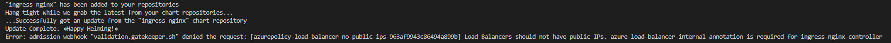
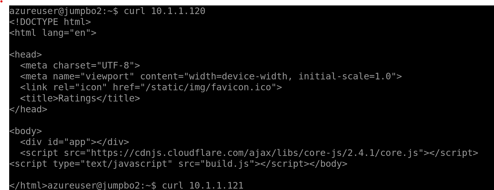

# Extra steps to use NGINX Ingress Controller following the Azure Quickstart guide

Congratulations on completing the previous labs. If everything went to plan, you should have created a hub and spoke environment in Azure, with a private AKS cluster and launched the three tier application using Application Gateway as the ingress controller and to access the application.

If you would like to use a different ingress controller instead of Application Gateway, for example - NGINX - you can complete these optional extra steps to deploy NGINX as your ingress into the cluster.

This will be using some steps from the quickstart guide that can be found here - https://docs.microsoft.com/en-us/azure/aks/ingress-basic?tabs=azure-cli

Before we get started, it is worth removing the existing ingress resource that is attached to your web service and is configured with Application Gateway.

1. If you used HTTPS

 ```bash
   az aks command invoke --resource-group $ClusterRGName --name $ClusterName --command "kubectl delete ingress ratings-web-https -n ratingsapp"
   ```
2. If you used HTTP
 ```bash
   az aks command invoke --resource-group $ClusterRGName --name $ClusterName --command "kubectl delete ingress ratings-web -n ratingsapp"
   ```


## Deploy the Enterprise Scale AKS (ES AKS) Policy Initiative

The first step is to apply the ES AKS Policy Initative to the resource group that AKS is hosted in. By doing this, it allows us to set extra security controls on the cluster, to improve security and avoid any public IP addresses for the application/cluster. If you would like to learn more about Azure Policies in detail, you can visit this link - https://docs.microsoft.com/en-us/azure/governance/policy/overview

The policy initiative we will be deploying here is comprised of various different policy definitions that set security controls on our cluster. Some controls are enforced with a 'Deny' effect, meaning that you will not be able to create something if it's against the policy. Some controls are implemented with an 'audit' effect, meaning that you won't be stopped from doing anything, however an audit trail of the changes you're making, will be logged and can be viewed in the compliance part of Azure Policy.

For this part of the guide, we will deploy the initiative, however we will be mainly concentrating on the policy 'Kubernetes clusters should use internal load balancers'. There may be times when you don't want your environment to have any public network access, therefore you may not want to deploy a public IP address as part of your ingress into your application. Of course by doing this, you will only be able to access your application from an endpoint that lives within the network. This in return, will improve security of your cluster and avoid any public IP's in the environment.

First of all, deploy the ES AKS Policy Initative:

1. cd to /Scenarios/Azure-Policy-ES-for-AKS

   ```bash
   az deployment sub create --location centralus --template-file aks_initiative_template.json --parameters aks_initiative_params.json
   ```

The next step is to assign the policy initiative to the resource group that contains the AKS cluster:

1. Edit the policy.bicep file and add your Subscription Id where required then deploy the initiative
   ```bash
   code policy.bicep
   ```
   ```bash
   az deployment group create -g <AKSResourceGroup> -f policy.bicep
   ```

Now that the policy is assigned, you can move onto the next step which is deploying the NGINX Ingress Controller. Note: Please be aware it can take up to 30 minutes for the previously deployed policy to take effect. It is worth waiting 30 minutes before moving on to the next step.

## Deploy the NGINX Ingress Controller

We will now proceed to deploy the NGINX ingress controller using the basic configuration outlined in the quickstart guide - https://docs.microsoft.com/en-us/azure/aks/ingress-basic?tabs=azure-cli

```bash
   az aks command invoke --resource-group $ClusterRGName --name $ClusterName   --command "helm repo add ingress-nginx https://kubernetes.github.io/ingress-nginx && helm repo update && helm install ingress-nginx ingress-nginx/ingress-nginx --set controller.service.annotations.'service\.beta\.kubernetes\.io/azure-load-balancer-health-probe-request-path=/healthz'"
```

You will see that this installation of the NGINX ingress controller has failed. This is because Azure Policy is blocking any public load balancers from being created. You should have recieved the error as shown in the image below:



To get around this issue, we will need to deploy the ingress controller as an internal ingress controller. To do this, complete the following steps:

1. cd back to /Scenarios/AKS-Secure-Baseline-PrivateCluster/Apps
2. Edit the internal-ingress.yaml file to include an UNUSED IP Address from your AKS subnet address space. An example would be `10.1.1.120` if you used the defaults to setup the cluster
3. Run the following command, this time passing in your yaml configuration file stating that the NGINX Ingress resource should be internal.

```bash
   az aks command invoke --resource-group $ClusterRGName --name $ClusterName   --command "helm repo add ingress-nginx https://kubernetes.github.io/ingress-nginx && helm repo update && helm install ingress-nginx ingress-nginx/ingress-nginx --set controller.service.annotations.'service\.beta\.kubernetes\.io/azure-load-balancer-health-probe-request-path=/healthz' -f internal-ingress.yaml" --file internal-ingress.yaml
```

Now you have an NGINX ingress controller inside of your network with an internal IP address. The last step is to configure the ingress resource to instead use NGINX as the ingress controller.

1. Deploy the 5b-http-ratings-web-ingress.yaml file. This will deploy a new ingress resource using NGINX as the Ingress Controller.

```bash
   az aks command invoke --resource-group $ClusterRGName --name $ClusterName --command "kubectl apply -f 5b-http-ratings-web-ingress.yaml -n ratingsapp" --file 5b-http-ratings-web-ingress.yaml
```

Congratulations, you should now have deployed an internal ingress controller using NGINX and mapped it to the services previously created, in order to access your application. If you run a kubectl describe ingress -n ratingsapp command, you should be able to retrieve the internal IP address used by the ingress controller to access your application.

Please note: Due to this ingress controller being on the internal network, you will only be able to access it from an endpoint within your network. Depending on whether you are using a machine with a GUI or just a shell, you can either run a curl command to the IP address of the Ingress, or you can navigate to the http://IngressIP in your browser.



## Next Step

:arrow_forward: [Cleanup](./09-cleanup.md)
