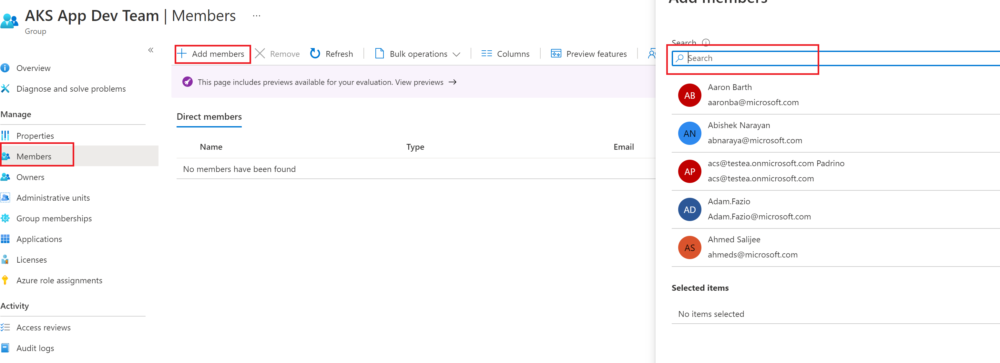

# Prerequisites and Microsoft Entra ID

This is the starting point for the instructions on deploying the [AKS Baseline private cluster reference implementation](../README.md). There is required access and tooling you'll need in order to accomplish this. Follow the instructions below and on the subsequent pages so that you can get your environment ready to proceed with the AKS cluster creation.

## Steps

1. Latest [Azure CLI installed](https://learn.microsoft.com/cli/azure/install-azure-cli?view=azure-cli-latest) (must be at least 2.37), or you can perform this from Azure Cloud Shell by clicking below.
1. An Azure subscription.

   The subscription used in this deployment cannot be a [free account](https://azure.microsoft.com/free); it must be a standard EA, pay-as-you-go, or Visual Studio benefit subscription. This is because the resources deployed here are beyond the quotas of free subscriptions.

   > :warning: The user or service principal initiating the deployment process _must_ have the following minimal set of Azure Role-Based Access Control (RBAC) roles:
   >
   > * [Contributor role](https://learn.microsoft.com/azure/role-based-access-control/built-in-roles#contributor) is _required_ at the subscription level to have the ability to create resource groups and perform deployments.
   > * [User Access Administrator role](https://learn.microsoft.com/azure/role-based-access-control/built-in-roles#user-access-administrator) is _required_ at the subscription level since you'll be performing role assignments to managed identities across various resource groups.

1. **This step only applies if you are creating a new EID group for this deployment. If you have one already existing and you are a part of it, you can skip this prerequisite, and follow the import portion of the instructions below**. 
   
   A Microsoft Entra tenant to associate your Kubernetes RBAC Cluster API authentication to.

   > :warning: The user or service principal initiating the deployment process _must_ have the following minimal set of Microsoft Entra ID permissions assigned:
   >
   > * Microsoft Entra [User Administrator](https://learn.microsoft.com/entra/identity/role-based-access-control/permissions-reference#user-administrator-permissions) is _required_ to create a "break glass" AKS admin Microsoft Entra security group and user. Alternatively, you could get your Microsoft Entra ID admin to create this for you when instructed to do so.
   >   * If you are not part of the User Administrator group in the tenant associated to your Azure subscription, please consider [creating a new tenant](https://learn.microsoft.com/entra/fundamentals/create-new-tenant#create-a-new-tenant-for-your-organization) to use while evaluating this implementation. The Microsoft Entra tenant backing your cluster's API RBAC does NOT need to be the same tenant associated with your Azure subscription.

## Create or import Microsoft Entra groups for AKS
Before creating the Microsoft Entra ID integrated cluster, groups must be created that can be later mapped to the Built-In Roles of "Azure Kubernetes Service Cluster User Role" and "Azure Kubernetes Service RBAC Cluster Admin".

Depending on the needs of your organization, you may have a choice of existing groups to use or a new groups may need to be created for each cluster deployment.  

Navigate to "/Scenarios/AKS-Secure-Baseline-PrivateCluster/Terraform/03-EID" folder, either "03-EID-create" or "03-EID-import"
```
cd ./Scenarios/AKS-Secure-Baseline-PrivateCluster/Terraform/03-EID-import
```

In the "variables.tf" file, update the defaults to reflect the display names as needed to either match existing groups or create names that fit your requirements.  

Once the files are updated, deploy using Terraform Init, Plan and Apply. 

```bash
terraform init -backend-config="resource_group_name=$TFSTATE_RG" -backend-config="storage_account_name=$STORAGEACCOUNTNAME" -backend-config="container_name=$CONTAINERNAME"
```

```
terraform plan
```

```
terraform apply
```

If you get an error about changes to the configuration, go with the `-reconfigure` flag option.

## Ensure you are part of the Microsoft Entra group you just created or pointed to

1. Go to Azure portal and type Microsoft Entra
2. Select **Microsoft Entra ID**
3. Click on **Groups** in the left blade
4. Select the Admin User group you just created. For the default name, this should be *AKS App Admin Team*
5. Click on **Members** in the left blade
6. 
7. Click **+ Add members**
8. Enter your name in the search bar and select your user(s)
9. Click **Select**

### Next step

:arrow_forward: [Creation of Hub Network & its respective Components](./04-network-hub.md)
