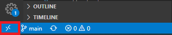
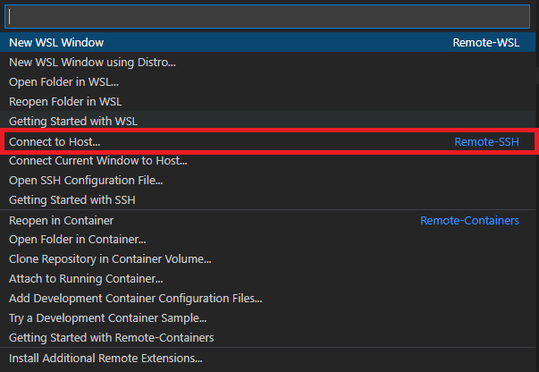
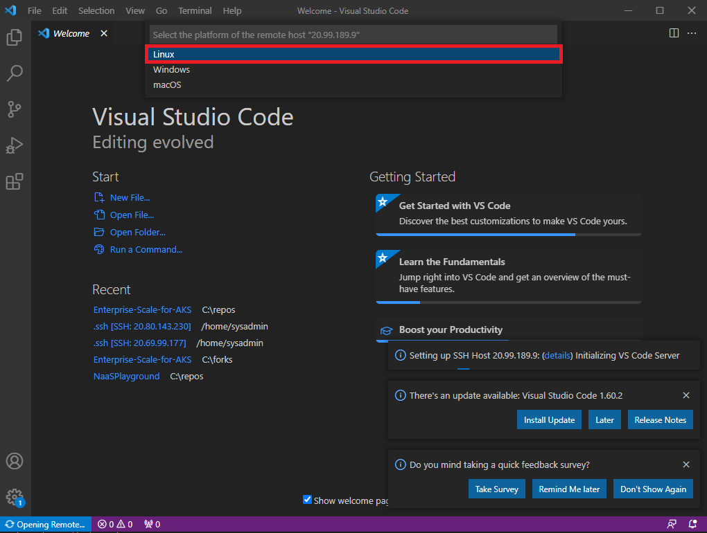
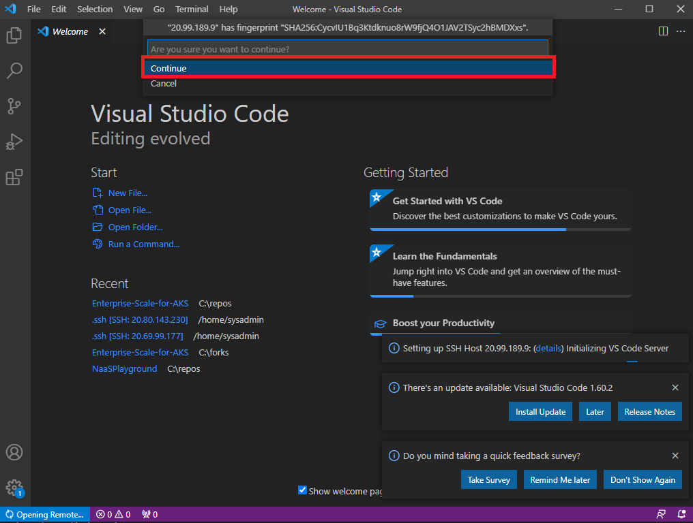
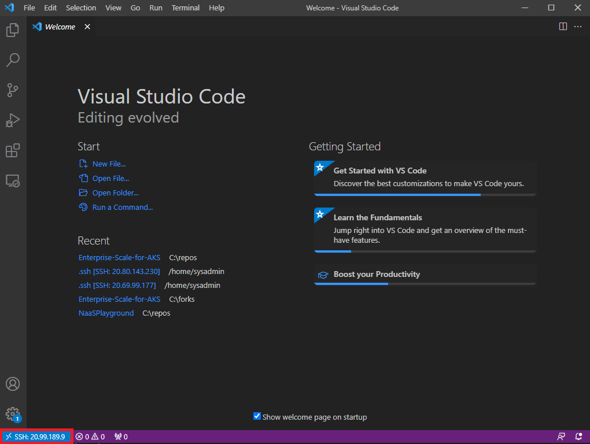

# Create the Hub Network

The following will be created:
* Resource Group for Hub Neworking (hub-networking.tf)
* Hub Network (hub-networking.tf)
* Azure Firewall (firewall.tf)
* Azure Bastion Host (hub-networking.tf)
* Resource Group for Dev Jumpbox (dev-setup.tf)
* Virtual Machine (dev-setup.tf)

To easily modify manifest files, you will connect to the control plane using Remote - SSH VS code extension. An SSH tunnel will be used to connect to the server-dev-linux virtual machine to run everything from the remote vm connected using your local vs code. In order to support this method you will need to go to the vs code extension marketplace and install Remote - SSH (https://marketplace.visualstudio.com/items?itemName=ms-vscode-remote.remote-ssh).

Prerequisites
To get started, you need to have done the following steps:

1. Install an OpenSSH compatible SSH client (PuTTY is not supported). https://docs.microsoft.com/en-us/windows-server/administration/openssh/openssh_install_firstuse
2. Install Visual Studio Code.

When the Remote-SSH vs code extension is installed you should see the following icon in the lower left screen of your vs code windows


To access and further lockdown the server-dev-linux vm change the `source_address_prefix` variable in the terraform.tfvars file to the public ip address that your local computer is using. The default value for `source_address_prefix` is `*` which means any inbound connection using port 22 will be able to hit the vm. To find the public IP address of your local machine use the following link : whatismypublicip.com

**Generate keys with ssh-keygen command**

To generate your private key that will be installed on your local machine and the public key to be placed of the server-dev-linux vm use the ssh-keygen command running on an elevated shell (admin shell).

The following command will created an 4096 bit RSA key pair (must use at a minimum 2048 bit) : ***ssh-keygen -t rsa -b 4096***. 

The private key will be placed in the `C:\Users\User\.ssh\id_rsa` directory on your local machine. The public key will be placed in the `~/.ssh/id_rsa.pub` directory. You will take the contents of the id_rsa.pub file, copy it, and paste the value inside the the ssh_key_settings map located in the terraform.tfvars file.
example :

```
ssh_key_settings = {
    username   = "username"
    public_key = "public key"
}
```


Navigate to "/Scenarios/AKS-Secure-Baseline-PrivateCluster/Terraform/04-Network-Hub" folder
```
cd ../04-Network-Hub
```

In the "variables.tf" file, update the defaults to reflect the tags  you'd like to use throughout the rest of the deployment.  There are a group of "sensitive" variables for the username and password of the jumpbox.  It is not recommended that these variables be commited to code in a public repo, you should instead create a separate terraform.tfvars file (not committed via gitignore) or use GitHub secrets (with a workflow) to pass those values in at deployment time. (A sample terraform.tfvars.sample file is included for reference. Enter your values and rename it **terraform.tfvars**)

Once the files are updated, deploy using Terraform Init, Plan and Apply. 

```bash
terraform init -backend-config="resource_group_name=$TFSTATE_RG" -backend-config="storage_account_name=$STORAGEACCOUNTNAME" -backend-config="container_name=$CONTAINERNAME"
```

> Enter terraform init -reconfigure if you get an error saying there was a change in the backend configuration which may require migrating existing state

```bash
terraform plan
```

```bash
terraform apply
```

**Connecting into the server-dev-linux vm using SSH**

When the server-dev-linux vm is provisioned with the inbound NSG rule allowing your local machine's public IP to connect to the it, navigate to the lower left hand of your screen and click on the Remote - SSH.


**Click connect to Host**



**Connect to the remote host**

Enter the username needed to login into the VM and the Public IP address of the server-dev-linux virtual machine.


**SSH VS Code Window**

When the username and pip are entered a new SSH VS Code window will open. When the window appears, at the top select `Linux` as the platform for the remote host.



**Verify Fingerprint**

When the Fingerprint drop down appears, select continue.



**Successfully connecting to the remote host**

When connected to the server-dev-linux vm using an SSH tunnel, in the bottom left hand corner you will see that you are connected to the VM using SSH and the Public IP address assigned to the server-dev-linux vm.



:arrow_forward: [Creation of Spoke Network & its respective Components](./05-network-lz.md)