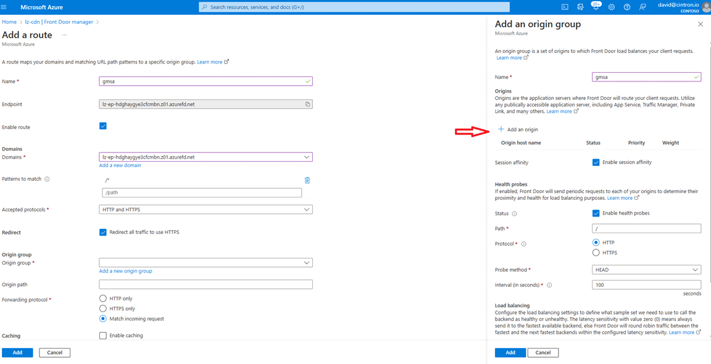
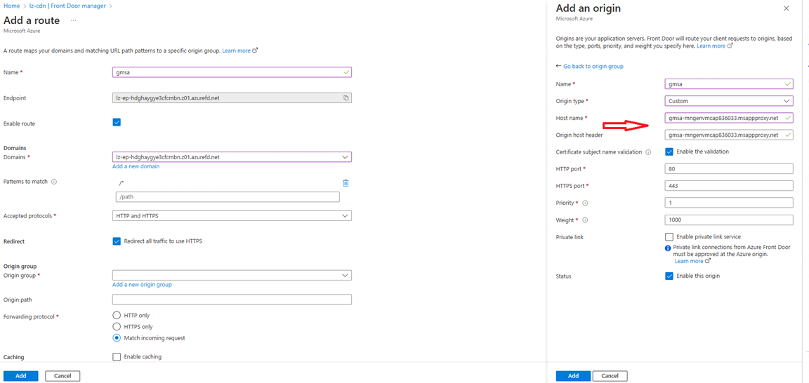
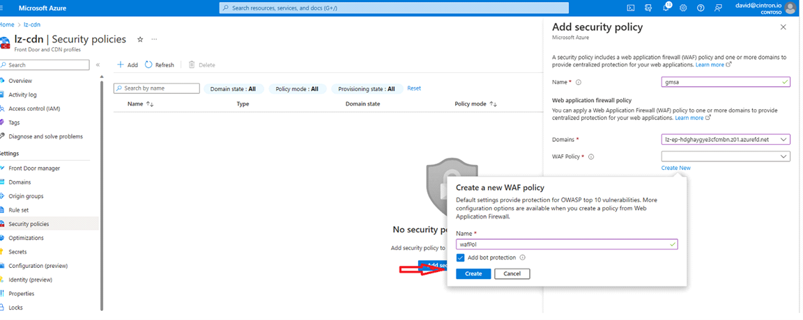

# Create the ingress configuration for the Fruit Smoothie Ratings application

You will be creating or updating the following:
* Azure Front Door
   
## Update the routing rules for Azure Front Door

1. Navigate to your Front Door instance created in your spoke resource group.
2. Click **Front Door manager** and then **Add a route**. Give your route a name such as "sampleapp" or "gmsaapp". 
3. Click on **Add a new origin group**. Give it a name such as "sampleappgroup" or "gmsagroup", enable session affinity and enable health probes.
   
4. In the window where you are creating your origin group, click **Add a new origin**. Give your origin a name such as "apporigin".
   - Origin Type : Custom
   - Host name: Your app proxy URL
   - Http port: 80
   - Https port: 443
   - Priority: 1
   - Weight: 1000
  
   
5. In the Front Door pane on the far left, select **Security policies**. Click **Add** at the top and fill in the window. Give it a name such as "gmsaapppolicy". Select your domain and then click **Create new** under **WAF Policy**. This will create a new default policy. 
   

# Next Step
:arrow_forward:[Cleanup](./10-cleanup.md)