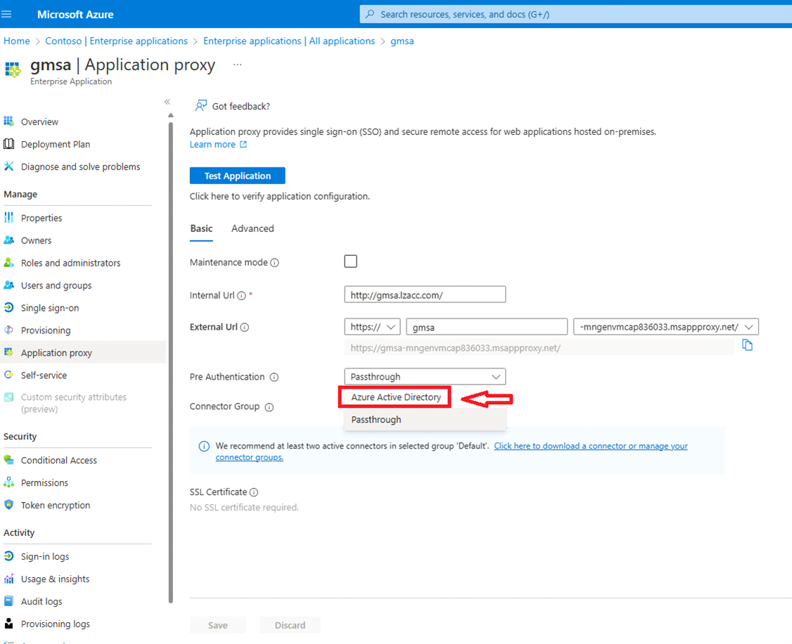

# Create the ingress configuration for GMSA

You will be creating or updating the following:
* Azure Application Proxy
* Azure Front Door

## Create Azure Application Proxy

Azure Application Proxy helps route the incoming request from Azure Front Door to the application on AKS. Currently, Azure Application Proxy can't be created through Terraform and has to be created manually. As a reminder, you will need Global Admin on your Azure AD tenant to complete this step.

1. Follow the [Microsoft Learn docs](https://learn.microsoft.com/azure/active-directory/app-proxy/application-proxy-add-on-premises-application#install-and-register-a-connector) from "Install and Register a connector" until you get to "Test the sign-on". Please see notes below before proceeding.
   - The connector you will be installing should be downloaded to your domain controller that you created in the previous steps.
   - Azure Application Proxy supports Passthrough or Azure AD for pre-authentication of a user's access request. We recommend using Azure AD for pre-authentication. If you choose not to use Azure AD for pre-authentication, users can hit your application directly without going through Azure Front Door.
   
   
## Update the routing rules for Azure Front Door

1. Navigate to your Front Door instance created in your spoke resource group.
2. Click **Front Door manager** and then **Add a route**. Give your route a name such as "sampleapp" or "gmsaapp". 
3. Click on **Add a new origin group**. Give it a name such as "sampleappgroup" or "gmsagroup", enable session affinity and enable health probes.
   
4. In the window where you are creating your origin group, click **Add a new origin**. Give your origin a name such as "apporigin".
   - Origin Type : Custom
   - Host name: Your app proxy URL
   - Http port: 80
   - Https port: 443
   - Priority: 1
   - Weight: 1000
  
   
5. In the Front Door pane on the far left, select **Security policies**. Click **Add** at the top and fill in the window. Give it a name such as "gmsaapppolicy". Select your domain and then click **Create new** under **WAF Policy**. This will create a new default policy. 
   

# Next Step
:arrow_forward:[Cleanup](../../Terraform/../AKS-Secure-Baseline-PrivateCluster/Terraform/10-cleanup.md)