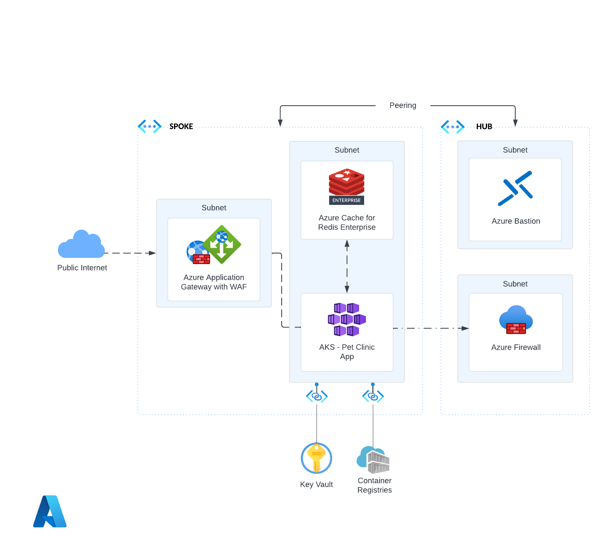

# AKS with secure Azure Cache for Redis Enterprise cluster

## Core architecture components when deploying workload

* Azure
* Azure Infra (Hub & Spoke Topology)
* Azure Infra (VNet Peering)
* Azure User Defined Routing (UDR)
* Azure Application Insights
* Azure Log Analytics
* Azure Application Gateway
* Azure Fire Wall
* Azure Bastion
* Azure Container Registry (ACR)
* Azure Kubernetes Service (AKS) Cluster
* Azure PostgreSQL DB
* Azure Cache for Redis Enterprise
* Github Actions
* Bicep
* Docker
* Flask

## Deploy this scenario
:arrow_forward: [Deploy this scenario](./Bicep/README.md)
