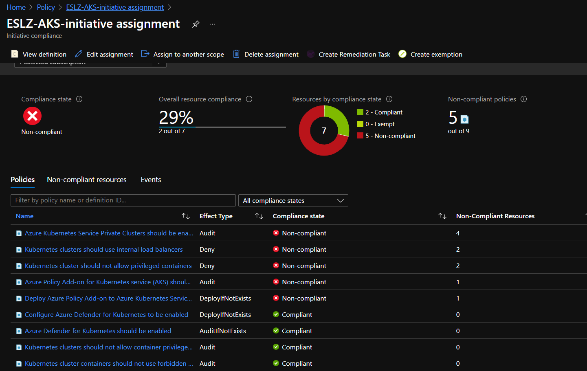

## ARM Templates for Azure Policy Initiative for for ES AKS ###

The ARM Templates in this directory creates an Enterprise Scale secure baseline Policy Initiative consisting of selected default Azure policies related to Azure Kubernetes Services (AKS). 

This initiative  can be used to audit any brownfield environment to make sure that the AKS clusters comply with the Enterprise Scale best practices. With the enforcement mode set to “Default”, this initiative can be also used to enforce the prohibitive policies for new AKS clusters.  

### Template Details
This ARM template needs to be applied at the subscription level and it creates 2 resources. It first creates a policy initiative comprising of the selected default policies in the subscription. It then creates a Policy assignment resource, which assigns this newly created initiative to the subscription.

The ARM Template currently groups the following policies with default configurations as a custom initiative "EnterpriseScale AKS - Azure Policy Initiative" and applies them in the audit mode. Additional policies can be added to the list of *policyDefinitions* in the template file for more coverage as needed. 

- Azure Kubernetes Service Private Clusters should be enabled
- Azure Policy Add-on for Kubernetes service (AKS) should be installed and enabled on your clusters
- Azure Defender for Kubernetes should be enabled
- Deploy Azure Policy Add-on to Azure Kubernetes Service clusters
- Kubernetes clusters should not allow container privilege escalation
- Kubernetes clusters should use internal load balancers
- Kubernetes cluster should not allow privileged containers
- Kubernetes cluster containers should not use forbidden sysctl interfaces
- Kubernetes cluster containers should not share host process ID or host IPC namespace
- Kubernetes cluster containers should only use allowed capabilities
- Kubernetes cluster pod hostPath volumes should only use allowed host paths
- Kubernetes cluster pods should only use approved host network and port range

### Steps to deploy this policies in a subscription:

##### Powershell:
```Powershell
New-AzSubscriptionDeployment -Location eastus -TemplateFile .\aks_initiative_template.json -TemplateParameterFile .\aks_initiative_params.json
```
##### AZ CLI:
```powershell
az deployment sub create --location eastus --template-file .\aks_initiative_template.json --parameters aks_initiative_params.json
```

You may change the deployment scope to Management Groups, Resource group etc based on the scope of policy enforcement.  

### Validation

#### Initiative:
Once the custom initiative is created, it will come up under the Azure Policies - Initiatives like the below:

Example:


#### Compliance
Once the initiative is assigned, you can verify the compliance details from the Azure portal. 

Example:


### New Enhancements to Azure Policy for AKS
The Azure policy team has made some enhancements to Azure policy for AKS which includes the ability to create custom policies for AKS and embed your own Gatekeeper constraint templates. Check out the [announcement blog](https://techcommunity.microsoft.com/t5/azure-governance-and-management/azure-policy-announces-enhancements-for-gradual-rollout-custom/ba-p/3645336) for more information
              

#### NOTE: The above Azure policies represents a baseline and are configured with default settings. The policy parameters for individual policies may need to be updated based on custom compliance requirements. More details on these policies to follow
