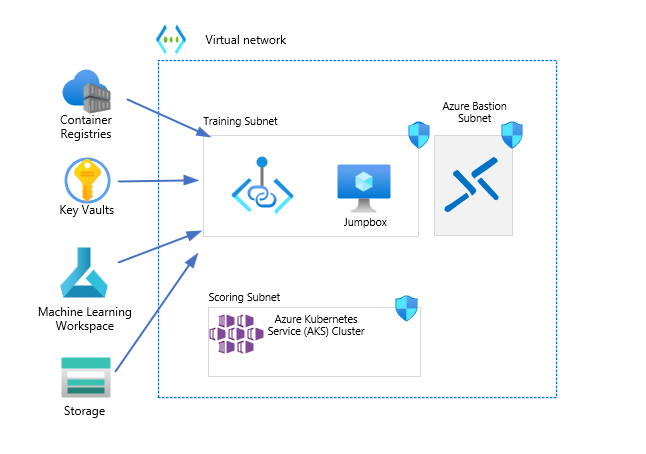

# Using Azure ML on a Secure AKS Cluster

This architectural pattern describes how to deployment an AKS cluster to be used by Azure ML. This follows the guiding tenets of the [Azure Well-Architected Framework](https://learn.microsoft.com/azure/architecture/framework/). 

At it's core, this pattern provides a prescriptive way to use Azure Marchine Learning in a private AKS cluster using the following topology:

 - An AKS Private Cluster
 - Jumpbox
 - Azure Bastion
 - Azure Machine Learning Workspace
 - Azure Container Registry

 

In the above mentioned scenario the desired outcome is to apply these changes without affecting the applications and/workloads hosted in the AKS cluster.
This pattern is also at the basis for the mission critical deployment of workloads on AKS, the main difference is that in that scenario, the resiliency and AKS distribution in multiple regions are the main drivers and elements of the solution.

For this solution, we will be using the `Machine Learning End-to-End Secure` template available at the [Azure Quickstarts repository](https://github.com/Azure/azure-quickstart-templates/tree/master/quickstarts/microsoft.machinelearningservices/machine-learning-end-to-end-secure). This template can be deployed via the Azure Portal, ARM or through Bicep. We will demonstrate how to deploy the solution using Bicep.

## Procedure using Bicep

1. Clone the `machine-learning-end-to-end-secure` from the `azure-quickstarts` git repository

Since the `azure-quickstarts` contains the templates for many solutions in Azure, we will be cloning only the `Machine Learning End-to-End Secure` directory:

```bash
git clone --depth 1 --no-checkout https://github.com/Azure/azure-quickstart-templates.git
cd azure-quickstart-templates
git sparse-checkout set quickstarts/microsoft.machinelearningservices/machine-learning-end-to-end-secure
git checkout
```

At this point you have successfully cloned only the `quickstarts/microsoft.machinelearningservices/machine-learning-end-to-end-secure` directory to your local machine. 

With the cloned locally, navigate to the `quickstarts/microsoft.machinelearningservices/machine-learning-end-to-end-secure` to deploy the Bicep template:

```bash
cd quickstarts/microsoft.machinelearningservices/machine-learning-end-to-end-secure
```

1. Configuring and deploying the template:

```bash
# setup these variables to reflect your environment
RG_NAME=az-k8s-aml-rg
LOCATION=EastUS
```

1. Deploy the template
```bash
# create a resource group
az group create -l $LOCATION -n $RG_NAME

# deploy the solution
az deployment group create -g az-k8s-blabla-rg  --template-file main.bicep
```
