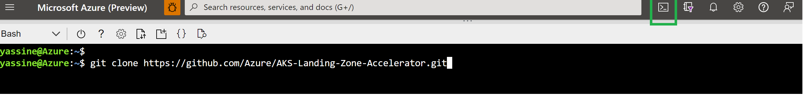
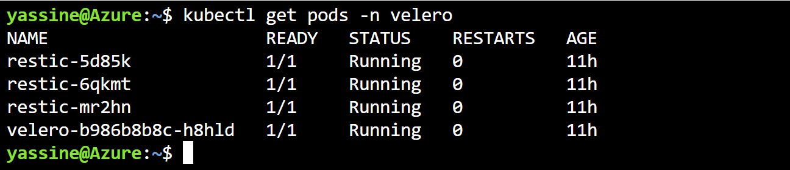
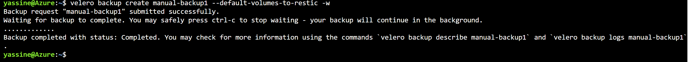
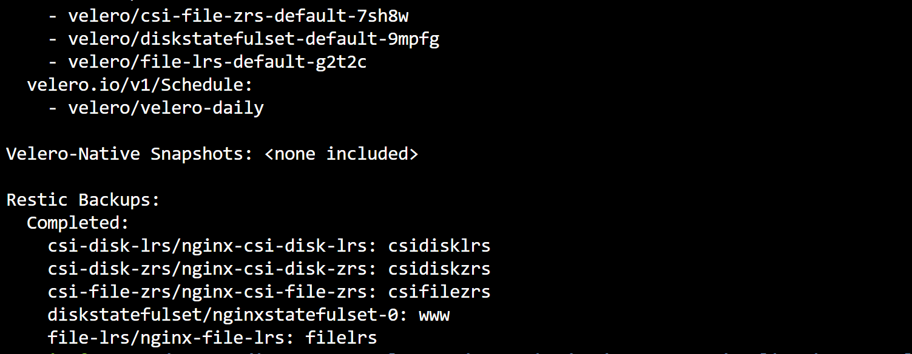
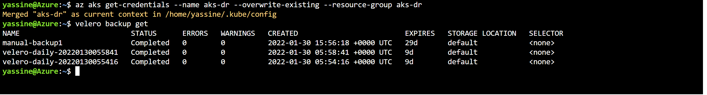
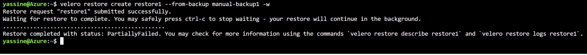
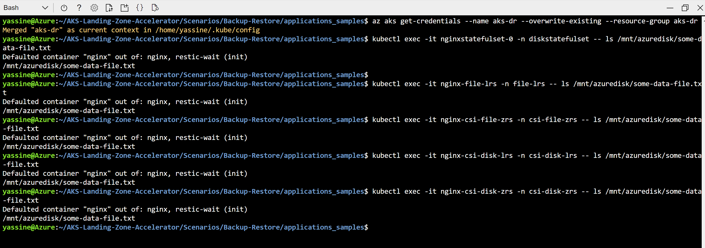

### Articles in the Backup Restore Scenario
🚩 This page: AKS Backup & Restore, using open source tool [Velero](https://velero.io) 

Next Reads:

:arrow_forward: [Monitoring Velero with Azure Container Insights](./monitoring/README.md)

:arrow_forward: [Plan your AKS Backup & Restore](./plan_backup_restore.md)

:arrow_forward: [Deep Dive on Velero configuration for AKS](./velero_terraform_sample)


## Overview

This topic describes how to back up and restore AKS clusters using Velero tool and Azure Blob (as the storage location). 

[Velero](https://velero.io) is an open-source community standard tool for backing up and restoring Kubernetes cluster objects and persistent volumes, and it supports a variety of storage providers to store its backups.

If a workload cluster crashes and fails to recover, you can use a Velero backup to restore its contents and internal API objects to a new cluster.

## Velero Features

- Backup & Restore of Kubernetes objects (Cluster configuration)
- Backup & Restore of persistent volumes


## How Velero works (High Level Architecture)


Check out How Velero works  https://www.youtube.com/watch?v=8skHGzUBZ-Q

## See it in action (it takes 15 minutes) !

The sample code provides a **Terraform module** to install & configure Velero.


The implemented scenario using this sample code, shows how to backup a primary AKS cluster, and restore it to a secondary cluster (in a secondary region).

The Terraform code does the following:

**1 - In the Primary Region (WestEurope in the sample)**
- Creates a primary AKS cluster named **primary-aks1**, configured with Availability zones
- Installs and configures Velero in primary cluster **primary-aks1** (referencing backup location in secondary Region)

**2 - In the Secondary / Backup Region (NorthEurope)**
- Creates a secondary AKS cluster named **aks-dr**, configured with Availability zones
- Creates a storage location (Azure Storage Account) to store backups 
- Installs and configures Velero in secondary cluster **aks-dr** (Velero referencing the same backup location in secondary Region)


**Steps to deploy!**

* Connect to your Azure Cloud Shell on the Portal:


* Clone the AKS Accelerator repository: 
    ```bash
    git clone https://github.com/Azure/AKS-Landing-Zone-Accelerator.git
    ```

* Navigate to the Backup & Restore directory:
```bash
cd AKS-Landing-Zone-Accelerator/Scenarios/Backup-Restore/velero_terraform_sample
```

* Create the Service Principal, representing Velero, to perform backups & restores:

```bash
az ad sp create-for-rbac --name sp-velero-aks1 --role Reader --scopes /subscriptions/{subscriptionId}
```

* Deploy the Terraform sample code:

```bash
terraform init
terraform plan
terraform apply
```

* Check that the install is successful: 
  - First, install Velero client (CLI) to interact with Velero Server (pods deployed on AKS cluster):
       - You can download the client binary for linux : https://github.com/vmware-tanzu/velero/releases/tag/v1.7.1. An example code is provided below.
       ```bash
       wget -c https://github.com/vmware-tanzu/velero/releases/download/v1.7.1/velero-v1.7.1-linux-amd64.tar.gz -O - | tar -xz
       ```
       - Or checkout other options for Windows & MAC  https://velero.io/docs/v1.7/basic-install/#install-the-cli

    If you are using Azure Cloud Shell, you cannot run "sudo" commands. Instead, you can download velero binary and use an alias to reference it
     ```bash
     alias velero=/home/path-to-velero-client-binary
    ``` 
    an example is provided below
    ```bash
    alias velero=./velero-v1.7.1-linux-amd64/velero
    ```


  - Connect to the Primary AKS Cluster (following the sample code as is): 
  ```bash
     az aks get-credentials --name primary-aks1 --overwrite-existing --resource-group primary-aks1
  ```
  
   - Check that velero is installed and running correctly: 
    ```bash
    kubectl get pods -n velero
    ```
     
    

* Deploy [sample stateful applications](./applications_samples/) in the primary cluster:

   ```bash
    kubectl apply -f ../applications_samples/
  ```

   - Wait for the applications to be running
    ```bash
    kubectl get pods --all-namespaces -w
    ```
   - Create some data files (to test backups and restores):
  ```bash
  kubectl exec -it nginx-csi-disk-zrs -n csi-disk-zrs -- touch /mnt/azuredisk/some-data-file.txt
  ```
  ```bash
  kubectl exec -it nginx-csi-disk-lrs -n csi-disk-lrs -- touch /mnt/azuredisk/some-data-file.txt
  ```
  ```bash
  kubectl exec -it nginx-csi-file-zrs -n csi-file-zrs -- touch /mnt/azuredisk/some-data-file.txt
  ```
  ```bash
  kubectl exec -it nginx-file-lrs -n file-lrs -- touch /mnt/azuredisk/some-data-file.txt
  ```
  ```bash
  kubectl exec -it nginxstatefulset-0 -n diskstatefulset -- touch /mnt/azuredisk/some-data-file.txt
  ```


    
  

     - Check that data is created :
  ```bash
  kubectl exec -it nginx-csi-disk-zrs -n csi-disk-zrs -- ls /mnt/azuredisk/some-data-file.txt
  ```
  ```bash
  kubectl exec -it nginx-csi-disk-lrs -n csi-disk-lrs -- ls /mnt/azuredisk/some-data-file.txt
  ```
  ```bash
  kubectl exec -it nginx-csi-file-zrs -n csi-file-zrs -- ls /mnt/azuredisk/some-data-file.txt
  ```
  ```bash
  kubectl exec -it nginx-file-lrs -n file-lrs -- ls /mnt/azuredisk/some-data-file.txt
  ```
  ```bash
  kubectl exec -it nginxstatefulset-0 -n diskstatefulset -- ls /mnt/azuredisk/some-data-file.txt
  ```

* Create a backup for primary AKS cluster: (You can [filter resources to backup](https://velero.io/docs/v1.8/resource-filtering/))

   ```bash
  velero backup create manual-backup1  -w
    ```
  

* Describe created backup:

   ```bash
  velero backup describe manual-backup1 --details
    ```
     

* Restore to secondary AKS cluster:
  - Connect to the Secondary / Backup AKS Cluster (following the sample code as is): 
    ```bash
    az aks get-credentials --name aks-dr --overwrite-existing --resource-group aks-dr
    ```

  - Check running pods :
    ```bash
    kubectl get pods --all-namespaces
    ```

  - As Velero is configured, in the secondary backup cluster, to reference the same backup location (storage account container), You should see the same backups available :
    ```bash
    velero backup get
    ```
     
  
  - Restore from backup : (you may get a partially failed status when trying to restore existing objects, such as kube-system resources). 
    ```bash
    velero restore create restore1 --from-backup manual-backup1 -w
    ```
     

* Check that Restore is successful:
  - Check restored applications / pods
    ```bash
    kubectl get pods --all-namespaces
    ```
  - check restore details 
    ```bash
    velero restore get restore1
    ```
     ```bash
    velero restore describe restore1 --details
    ```
  
   - check restore logs 
        ```bash
        velero restore logs restore1
        ```
  
   - Check that data is restored (verify existence of data files):
  ```bash
  kubectl exec -it nginx-csi-disk-zrs -n csi-disk-zrs -- ls /mnt/azuredisk/some-data-file.txt
  ```
  ```bash
  kubectl exec -it nginx-csi-disk-lrs -n csi-disk-lrs -- ls /mnt/azuredisk/some-data-file.txt
  ```
  ```bash
  kubectl exec -it nginx-csi-file-zrs -n csi-file-zrs -- ls /mnt/azuredisk/some-data-file.txt
  ```
  ```bash
  kubectl exec -it nginx-file-lrs -n file-lrs -- ls /mnt/azuredisk/some-data-file.txt
  ```
  ```bash
  kubectl exec -it nginxstatefulset-0 -n diskstatefulset -- ls /mnt/azuredisk/some-data-file.txt
  ```
  
  
  
  

### Next steps
:arrow_forward: [Monitoring Velero with azure Container Insights](./monitoring/README.md)

:arrow_forward: [Plan your AKS Backup & Restore](./plan_backup_restore.md)

:arrow_forward: [Deep Dive on Velero configuration for AKS](./velero_terraform_sample)


