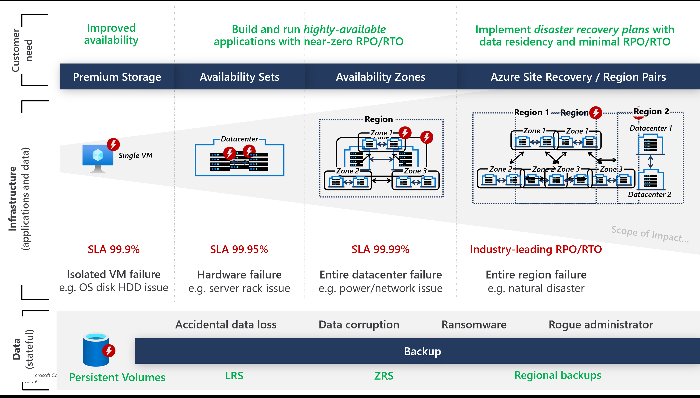
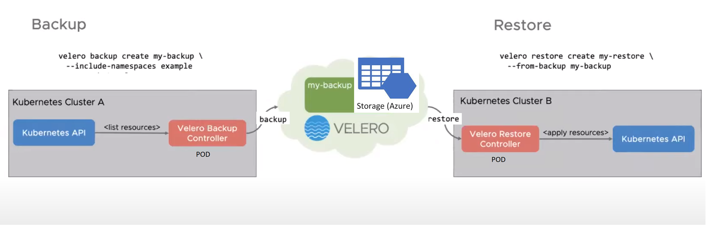
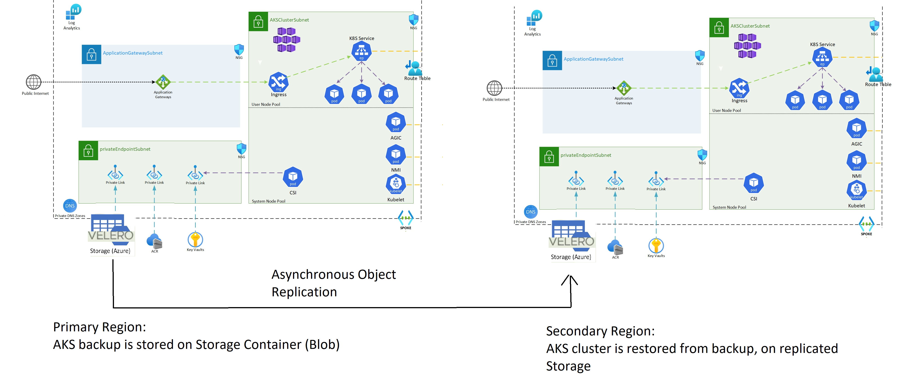

## Architecting for High Availability & Resiliency

**First, check out** [Best practices for business continuity and disaster recovery in Azure Kubernetes Service (AKS)](https://learn.microsoft.com/azure/aks/operator-best-practices-multi-region)

## High Availability Considerations

* **AKS Cluster Configuration**:
	- Enable [Uptime SLA](https://learn.microsoft.com/azure/aks/uptime-sla) for production workloads
	- Use [Availability Zones](https://learn.microsoft.com/azure/aks/availability-zones) (with Standard Load Balancer)
	- Use [multiple node pools](https://learn.microsoft.com/azure/aks/use-multiple-node-pools) spanning AZs
	- Enforce [Resource Quotas](https://learn.microsoft.com/azure/aks/operator-best-practices-scheduler#enforce-resource-quotas) and Plan for [pod disruption budgets](https://learn.microsoft.com/azure/aks/operator-best-practices-scheduler#plan-for-availability-using-pod-disruption-budgets)
	- Control Pod scheduling using [Taints & Tolerations](https://learn.microsoft.com/azure/aks/operator-best-practices-advanced-scheduler#provide-dedicated-nodes-using-taints-and-tolerations), & [Pod Affinity](https://learn.microsoft.com/azure/aks/operator-best-practices-advanced-scheduler#control-pod-scheduling-using-node-selectors-and-affinity)

* **Applications**: 
  - Configure applications [requests & limits](https://learn.microsoft.com/azure/aks/developer-best-practices-resource-management#define-pod-resource-requests-and-limits)
  - to ensure the PVs are located in the same zone as the pods:
     - Use Volume Binding Mode: WaitForFirstConsumer (In your storage classes)
     - Use StatefulSets
     - Use Zone-Redundant (ZRS) Disks (preview)
   - to optimally route traffic within the same zone to avoid unnecessary latency: 
      - Use Service Topology (deprecated in Kubernetes 1.21, +, feature state alpha)
      - Use Topology Aware Hints (from Kubernetes 1.21+, feature state alpha)

* **Data**: 
Storage Class Configuration (used to create dynamic peristent volumes)
	- Use CSI Driver as it is the standard provider for exposing storage to applications running on Kubernetes
	- Use Azure Disk with ZRS (currently in Preview) --> available via Azure Disk CSI Driver
	- Use Azure File with ZRS

Checkout the repo section on [High Availability Baseline](https://github.com/Azure/AKS-Landing-Zone-Accelerator/tree/velero-backup-restore/Scenarios/High-Availability-Baseline)

## Backup & Restore architecture

### Scenario 1: using a shared storage between the primary and secondary AKS Clusters

- It might be simpler for most cases
- You can expose the storage account to both regions, in a secure manner, via [Azure private link](https://learn.microsoft.com/azure/private-link/private-link-overview)
- The secondary cluster should be configured to have readonly access to the backup storage 
- to enable Regional Disaster Recovery, Storage account should be configured to have regional redundancy (sku RA-GRS or RA-GZRS)

### Scenario 2: using a primary storage account, replicated with a storage account in a secondary region

- This scenario offers better security as it ensure a strict isolation of environments
- Velero (blob) Container is configured with [Object Replication](https://learn.microsoft.com/azure/storage/blobs/object-replication-overview?tabs=powershell), to the secondary storage account 

## Integrate Velero with your infrastructure:
- You can see the example in the provided Velero module, which requires a storage account access as a dependency. 
- You can prepare your storage accounts and integrate them with the code. [Check out the example](./velero_terraform_sample#using-the-module): 

## Scheduling backups:
- You can run backups for the CICD / Devops Chain 
- Or Run them on a schedule: https://velero.io/docs/v1.6/how-velero-works/#scheduled-backups

## Backup & Restore Planning

* Plan for Backup & Restore
	-  Prepare Cluster & POD Identities
	- Plan network segmentation & DNS resolution
	- Prepare Subscription for storing backups (optional but recommended)
	- Prepare storage location in Backup Region to store backups

	- Prepare Cluster Node Pools :
	  - Create Nodes & re-deploy Node Configuration
	  - Use Automated configuration using CICD or [GitOps!](https://learn.microsoft.com/azure/azure-arc/kubernetes/conceptual-gitops-flux2)

	-  Prepare Applications Persistent volumes : 
	  	-  Prepare StorageClasses & VolumeSnapshotClasses 

* Run a Drill Tests:
	* Create secondary AKS ecosystem (ACR, Keyvault, App Gateway, Firewall, NSG)
	* Create secondary AKS Cluster (with its dependencies installed: aad-podid, velero, csi-drivers) + RBAC for Azure services & velero identity (backup tool)

	To restore **Stateless** Application: 
	* Redeploy Application Configuration using Devops CICD

	To restore **stateful** Application, you need to backup and restore:
	* Cluster configuration (storage classes, volumesnapshotclasses, technical pods)
	*  Persistent Volumes (Azure Disk & Azure Fileshare)
	*  Application Configuration (bound to the restored persistent volumes)
	
	➡️ A tool such as Velero simplifies the process fo backup & restore for stateful applications
	
	➡️ **Coming Soon!** Perform Backup for Persistent Volume of AKS clusters using [Azure Backup](https://azure.microsoft.com/updates/akspvbackupprivatepreview/)
	
	:arrow_forward: [Deep Dive on Velero configuration for AKS](./velero_terraform_sample)

