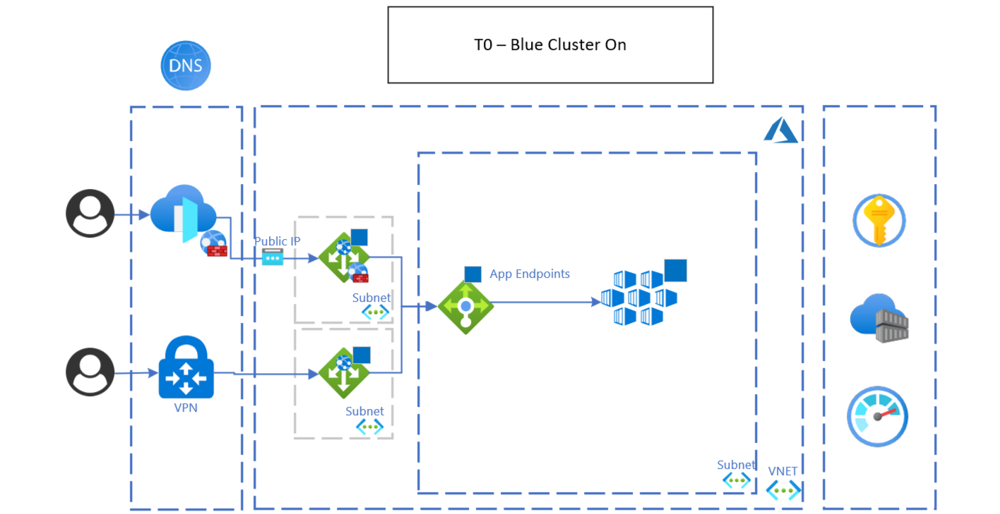
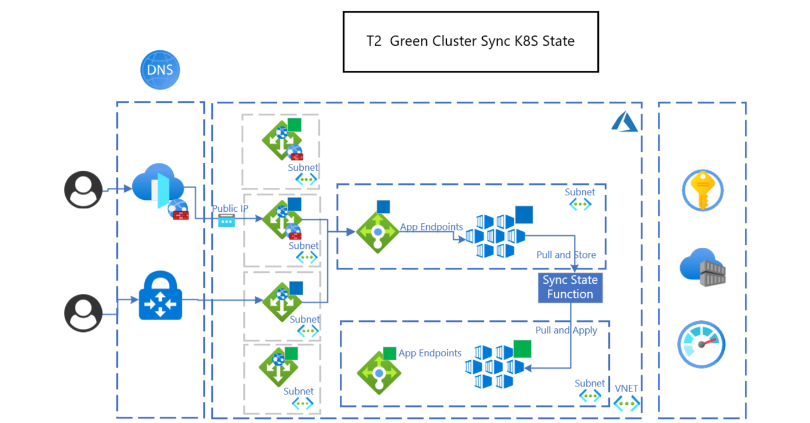

## Overview 

What happen when you need to upgrade the kubernetes version in a cluster or even better when you need to change kubernetes platform components like: ingress gateway, service mesh, operators and so on, but you don't want to have impact on the workloads/applications that are running on the cluster itself?

The answer that will make everyone happy from business into infra to apps is blue green deployment at Kubernetes infra level.
With modern principles and availability of cloud services like:
- [IaC](https://docs.microsoft.com/en-us/devops/deliver/what-is-infrastructure-as-code)
- [Immutable Infrastructure](https://www.hashicorp.com/resources/what-is-mutable-vs-immutable-infrastructure)
- [Cloud Elasticity](https://azure.microsoft.com/en-us/overview/what-is-elastic-computing/)
- [Continuous Delivery](https://docs.microsoft.com/en-us/devops/deliver/what-is-continuous-delivery)

Blue Green deployment has become a de-facto standard pattern for the release management and operation at infra and application level in kubernetes environments.

In this article is described the design and implementation of the blue green deployment for AKS leveraging Azure Cloud managed services and native kubernetes features. Adoption of this pattern improves the operation and availability during the deployment of changes/upgrades of AKS clusters.

The main benefits of the solution are:
- Minimized downtime during the release
- Rollback strategy out of the box
- Improved control and operation during the release and deployment of AKS changes and upgrades
- Test for DR procedure

The Azure services that are part of the pattern are listed in the [components](#components) section; below are the main ones:
- AKS
- Azure Application Gateway
- Azure Private DNS

From an automation and CI/CD perspective the solution can be implemented in multiple ways. We suggest:
- Bicep or Terraform for the IaC
- Azure Pipelines or Github Actions for the CI/CD

## Potential use cases

This solution is a generalized architecture pattern, which can be used for many different scenarios and industries. In particular it can be applied in AKS deployments and is also used for [Mission Critical scenario](https://docs.microsoft.com/en-us/azure/architecture/reference-architectures/containers/aks-multi-region/aks-multi-cluster). See the following example solutions that build off of this core architecture:

- [Link to first solution idea or other architecture that builds off this solution](filepath.yml)

## Architecture

Below is the high level architecture that describes the pattern and related services invovled. The [Worklfow section](#workflow) describ in detail the steps for the implementation of the pattern and in particular the sequence of events to have the proper switch between the clusters.

An important point to mention is the region of the deployment is an invariant, that means that you can deploy the two clusters in different regions or in the same region. Deploying into the same region require certain prerequisties:
- VNET and Subnet sizing to host two clusters
- Azure capacity for the subscription

*Download* a [Visio file](https://arch-center.azureedge.net/[filename].vsdx) of this architecture.*

### Workflow

Before start the explanation of the workflow to implement the blue gren deployment for AKS, it is importnant to highlight that we need to see at this patter like a state machine in which blue or green cluster are on at the same time only for a limitied period of time, this is done to optmize the costs and operational effort.
Assuming this we can summarizie the pattern in 5 stages:
1. T0: Blue Cluster is On
2. T1: Green Cluster Deployment
3. T2: Sync K8S State between Blue and Green clusters
4. T3: Traffic Switch to the green cluster
5. T4: Blue cluster is destroyed

The workkfow then will start again for the next planned release of the cluster, and the flow will start from the green cluster one.
The triggers to transition in the multiples stages can be programtically configured and executed, this is usually the desired end state, that start from a manual/semi-automatic implementation. The triggers are related to functional parameters together with SLO/SLI defined at operation levele to cover apps and infra aspects.
This pattern is flexible on the network discoverabiity of the clusters, in fact you can have multiple options:
- A DNS record dedicated to the blue and green clusters IP
- A DNS record dedicated to the blue green cluster pointing to the App Gateway IP

#### T0: Blue Cluster is On

The initial stage of the pattern is to have the existing live cluster on, let assume that is the blue one. At this stage we are preparing for the deployment of the new version of the cluster.

The trigger condition for the [next stage](#t1-green-cluster-deployment) is the release of a new version of the clusters.

#### T1: Green Cluster Deployment

At this time the deployment of the new version is started, and the first step is to deploy the new cluster in parallel to the existing one. At this time the new cluster is only deplyed, the live traffic is still routed in the blue cluster, that is the live site. 

The trigger to move into the [T2 stage](#t2-sync-k8s-state-between-blue-and-green-cluster) is the validation of AKS at platform level, usually are used native metrics avaiaable in Azure Monitor and CLI commands to check the healthy of the deployment.

#### T2: Sync K8S State between Blue and Green cluster

At this stage there is the alignment between the two clusters, that means that all:
- applications
- operators
- K8S resources
are deployed in the green cluster, the ultimate goal is that at the end of the sync the clusters are equivalent.
There are multiple solutions/approaches to replicate/sync K8S state on clusters:
- Redeployment via Ci/CD
- GitOps with solutions promoted in CNCF
- Customized solution that store the K8S configs and resources, usually databses and K8S manifests generators

Usually to facilitate the sync the deployment of new applications is not permitted the deployment in the live cluster, this menas there there is a prediod of time that start from the sync and finish when the switch to the green is completed. This period can be avoided if there are advaanced mechanism to manage the K8S state in multiple clusters, which are the solutions and how to implement this, is not part of this article.

When the sync is completed is required to perform a test/validation of the cluster from an infra to applications, this include also a check on the monitoring and logging platforms, to validate the healthy of the cluster. Usually the Green cluster is exposed on the App Gateway or External LB with an internal URL, that is not visibile for external users.
This test/validation stage is used as a trigger for the [next state](#t3-traffic-switch-to-the-green-cluster) of the pattern.
#### T3: Traffic Switch to the green cluster

After that the sync is complete and Green cluster has been vaidated at platform and application then it is ready to be promoted as primary to start receive the live traffic and manage live transactions. The switch is mainly related to networking level, often the workloads are stateless but if the workloads are statefull then is required to put in place the proper solution to mantain the state and caching when the switch happen between the 2 clusters.
An important point to mention is that this pattern is based on a full switch, menas that the 100% of the traffic is routed to the new cluster whne the switch is applied. It is, of course, possible to have different type of switch to have more control during the swith like canary release, but this is not in the scope the article, that want to cover the fundamental flow of the blue green deployment.

From a networking perspective the pattern is based on the definition of 3 hostnames:
- Cluster host, that is the official hostname used by the consumers of the workloads hosted in the clusters
- Blue Cluster host, this is the dedicated host for the blue cluster
- Green Cluster host, this is the dedicated host for the green cluster

The cluster host is the one configured at Application Gateway level to manage the ingress traffic, moreover the hostname is also part of the AKS Ingress configuration in order to manate the TLS properly. This host is used only for live transactions and requests.
The Blue and Green cluster hosts are mainly used for:
- Test and Validate the specific cluster, like mentioned in [Step 2](#t2-sync-k8s-state-between-blue-and-green-cluster)
- The switch of the live traffic, mainly the hosts are used for the backend pools configuration at Application Gateway level, in this way the switch is transparent for the end user of the workloads
For the testing and validation purpose the hosts are also exposed at Application Gateway level with dedicated endpoints and also at AKS Ingress controller level to manage the TLS in the proper way.
At this stage the validation is based on the infra and app monitoring metrics and official SLO and SLI, when avaialble. If the validation gate is satisfied than is possible to move in the [last state](#t4-blue-cluster-is-destroyed) of the pattern.

#### T4: Blue cluster is destroyed

The execution of the switch of the traffic bring the pattern in the final stage, in which there is still a validation and monitoring that the green cluster is working as expected also with live traffic; is always important to remind that the valadiation and monitoring cover both platform and application level.
After that also this validation is completed, then the blue cluster can be destroyed.
The destryoyment is mainly is a step that is strongly recommended in order to have under control the costs and make the proper usage of the elastcity provided by Azure, in particular AKS.

### Components

Below the main components and azure services that are part of the blue green deployment for AKS.
- [Application Gateway](https://azure.microsoft.com/services/application-gateway/), the main responsability is to act as gateway and Load balancer for the AKS clusters.
- [AKS](https://azure.microsoft.com/services/kubernetes-service/), is the subject of the patter.
- [Container Registry](https://azure.microsoft.com/services/container-registry/), has the main role to store and distribute the artifacts in the AKS clusters, example of artifacts are Container Images, HELM Charts, etc.. .
- [Azure Monitor](https://azure.microsoft.com/services/monitor/), is the core monitoring platform for AKS, it is strongly recommended with his native integration with AKS, providing logs, metrics and alerting to manage the different stages of the pattern.
- [Azure Firewall](https://azure.microsoft.com/services/azure-firewall/), has the main responsability to manage the egress traffic into the clusters, in partcular in hub and spoke topology and connections with external datacenters or locations.
- [KeyVault](https://azure.microsoft.com/services/key-vault/), it is required to manage in the proper way the secrets and certificates that need to be use at AKS level.

### Alternatives

From a pattern perspective there altrenative scenarios to implement a more controlled switch between the cluster, that means that the core pattern remin the same, and the main change is on the traffic switch method, just as example is possible to have a *canary release* with traffic rules based on:
- percentage of the incoming traffic
- http headers
- Cookies

Another alternative that has more impact on the blast radius of the deployment is to have a ring based deployments, that means that instead of just blue and green cluster is possible to have more clusters, that are called rings, usually each ring enlarge the number of users that have access to the new version/config of the AKS. As for the blue green pattern described than the rings can be removed to have the proper cost optimization and control.

There are two Azure Servies listed in the [Componets Section](#components), for which is possible to use also alternative products and/or OSS solutions. The two services are:
- [Application Gateway](https://azure.microsoft.com/services/application-gateway/)
- [Container Registry](https://azure.microsoft.com/services/container-registry/)

The intent of the article is not to provide a curated list of alternatives, but is to empathize the message that is possible to adopt different components to achieve the same implementation of the patern.
Just to give some example possible alternatives are:
- NGINX, HAProxy, etc.. instead of Application Gateway
- Harbor, etc.. instead of Container Registry

The following alternative solutions provide scenario-focused lenses to build off of this core architecture: 

- [Link to first solution idea or other architecture that builds off this solution](filepath.yml)
- [Second solution idea that builds off this solution](filepath.yml)

## Considerations

The following considerations have their basis on the [Microsoft Azure Well-Architected Framework](/azure/architecture/framework) and [Cloud Adoption Framework](addlink).
One of the main consideration is that this pattern can be adopted in a full automated scenario, like 0 touch deployment. Usually the basic implementation has manual triggere to activate the different steps decribed. Along the way and with the proper matutiry and monitoring features is possible to automate also the triggers, that means that there are automated testing and specific metrics, SLA and SLO to automatize the triggers.

One important lesson learnt is to have dedicated hostnames for the blue green clusters and also have a dedicated endpoints configuration on the Gateway/Load Balancer in front of the clusters, this is critical to improve the reliability and validity of the deployment of the new cluster, in this way the validation of the deployment happen with the same architecture and configurations of a standard production cluster.

The blue green pattern is also an enabler to implement and test BC/DR solutions for AKS and related workloads.

A key aspect is related to the *Cost Optimization*, in detail the blue green cluster pattern is widely adopted in the cloud for the native elasticiy provided by cloud providers, in particular Azure, this include the cost saving and control to manage and mantain the blue green cluster deploymentm; in paritcular as described the main action is to destroy the cluster that is no longer needed.

It is important to highlight that a succesfull implementation of the pattern is related to the fact that the all the aspects like automation, monitoring and validation need to be applied at AKS Platform levele but also the workloads/apps deployed on top of it; only with the E2E coverge is possible to really benefit of the value of the blue green pattern.

### Reliability

The blue green pattern has a direct and positive impact on the availability of AKS platform and workloads. In particular the pattern improve the availability during the deployment of the AKS platform changes, in particular downtime is near to zero and it can be affected by how user sessions are managed. Moreover the blue green provide also covergae for reliability during the deployment because by default there is the option to fallback in the previous version of the AKS cluster. 
Here more detail about the resiliency and avalaibility pillar defined in the [Well Architected Framework](/azure/architecture/framework/resiliency/overview).

### Cost optimization

> REQUIRED: This section is required. Cost is of the utmost importance to our customers.

> How much will this cost to run? See if you can answer this without dollar amounts.
> Are there ways I could save cost?
> If it scales linearly, than we should break it down by cost/unit. If it does not, why?
> What are the components that make up the cost?
> How does scale affect the cost?
> Include a link to the [Overview of the cost optimization pillar](/azure/architecture/framework/cost/overview).

> Link to the pricing calculator with all of the components in the architecture included, even if they're a $0 or $1 usage.
> If it makes sense, include small/medium/large configurations. Describe what needs to be changed as you move to larger sizes.

As described before on of the main advantages and benefits of the blue green deployment is to mantain a control and optimization of the costs without impacting the resiliency, availability, continuous delivery of the workloads and apps. This is achieved with the automation of the destroyment of the old cluster after that the switch is completed and validated. Another important point to mention is that to cotinue to have the same cost baseline the two clusters are usually hosted in the same subnet, in this way all the network connections and access to the resources/services is the same, that means that all the azure services and resources remain the same during the blue green deployment.
If we should quantify the azure costs to implement this pattern we can say that you shoudl double the costs of the AKS services during the time of the blue green deployment, that usually happen in hours; this also another reason to explain the large adoption of this pattern.
If you are courios and want to have more insight about cost optmization you can [here](/azure/architecture/framework/cost/overview).

### Operational excellence

> This includes DevOps, monitoring, and diagnostics.
> How do I need to think about operating this solution?
> Include a link to the [Overview of the operational excellence pillar](/azure/architecture/framework/devops/overview).

As we all know automation, continous delivery, reslient deployment are fundamental capabilities for modern applications and products. As described in the [Architecture](#architecture) the blue green pattern brings natively all this capabilities when implemented.
Automation is a key pre requirements to implement, manage and mantain the blue green pattern along the time.
One of the key aspect of the Continuos Delivery is to be able to iteratively deliver increments of platform and workloads, with the blue green patter for AKS platform you can unlock the continous delivery at AKS level providing a controlled and safety experience.
Resiliency during the deployment is one of the main benefits of the pattern, because natively there is the fallback option of the previous cluster.
The key benefits mentioned before are also part of the [Well Architected Framework](/azure/architecture/framework/devops/overview).

## Deploy this scenario

> (Optional, but greatly encouraged)

> Is there an example deployment that can show me this in action?  What would I need to change to run this in production?

An implemented example and template is available at [AKS Landing Zone Accelerator](https://github.com/Azure/AKS-Landing-Zone-Accelerator).

## Contributors

> (Expected, but this section is optional if all the contributors would prefer to not include it)

> Start with the explanation text (same for every section), in italics. This makes it clear that Microsoft takes responsibility for the article (not the one contributor). Then include the "Pricipal authors" list and the "Additional contributors" list (if there are additional contributors). Link each contributor's name to the person's LinkedIn profile. After the name, place a pipe symbol ("|") with spaces, and then enter the person's title. We don't include the person's company, MVP status, or links to additional profiles (to minimize edits/updates). (The profiles can be linked to from the person's LinkedIn page, and we hope to automate that on the platform in the future). 
> Implement this format:

*This article is maintained by Microsoft. It was originally written by the following contributors.*

**Principal authors:**
 * [Vincenzo Morra](https://www.linkedin.com/in/vincenzo-morra-29658a20/?locale=en_US) | SAO Incubation Architect

**Other contributors:** > Include contributing (but not primary) authors, major editors (not minor edits), and technical reviewers. Listed alphabetically by last name. Use this format: Fname Lname. It's okay to add in newer contributors.

 * [Contributor 1 Name](http://linkedin.com/ProfileURL) | (Title, such as "Cloud Solution Architect")

## Next steps

> Link to Docs and Learn articles, along with any third-party documentation.
> Where should I go next if I want to start building this?
> Are there any relevant case studies or customers doing something similar?
> Is there any other documentation that might be useful? Are there product documents that go into more detail on specific technologies that are not already linked?

Examples:
* [IaC](https://docs.microsoft.com/en-us/devops/deliver/what-is-infrastructure-as-code)
* [BlueGreen Martin Fowler Article](https://martinfowler.com/bliki/BlueGreenDeployment.html)
* [AKS Landing Zone Accelerator for Blue Green](https://github.com/Azure/AKS-Landing-Zone-Accelerator)
* [Azure Kubernetes Service (AKS) documentation](https://azure.microsoft.com/services/kubernetes-service/)
* [Application Gateway](https://azure.microsoft.com/services/application-gateway/)
* [Azure Monitor](https://azure.microsoft.com/services/monitor/)
 
## Related resources

> Use "Related resources" for architecture information that's relevant to the current article. It must be content that the Azure Architecture Center TOC refers to, but may be from a repo other than the AAC repo.
> Links to articles in the AAC repo should be repo-relative, for example (../../solution-ideas/articles/article-name.yml).
> Lead this section with links to the solution ideas that connect back to this architecture.

This solution is a generalized architecture pattern, which can be used for many different scenarios and industries. See the following example solutions that build off of this core architecture:

- [Link to first solution idea or other architecture that builds off this solution](filepath.yml)
- [Second solution idea that builds off this solution](filepath.yml)

> Include additional links to AAC articles. Here is an example:

See the following related architecture guides and solutions:

  - [Artificial intelligence (AI) - Architectural overview](/azure/architecture/data-guide/big-data/ai-overview)
  - [Choosing a Microsoft cognitive services technology](/azure/architecture/data-guide/technology-choices/cognitive-services)
  - [Chatbot for hotel reservations](/azure/architecture/example-scenario/ai/commerce-chatbot)
  - [Build an enterprise-grade conversational bot](/azure/architecture/reference-architectures/ai/conversational-bot)
  - [Speech-to-text conversion](/azure/architecture/reference-architectures/ai/speech-ai-ingestion)