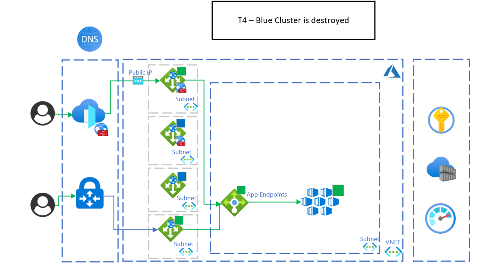

## Overview 
What happen when you need to upgrade the kubernetes version in a cluster or even better when you need to change kubernetes platform components like: ingress gateway, service mesh, operators and so on, but you don't want to have impact on the workloads/applications that are running on the cluster itself?

The answer that will make everyone happy from business into infra to apps is blue green deployment at Kubernetes infra level.
With modern principles and availability of cloud services like:
- [IaC](https://docs.microsoft.com/en-us/devops/deliver/what-is-infrastructure-as-code)
- [Immutable Infrastructure](https://www.hashicorp.com/resources/what-is-mutable-vs-immutable-infrastructure)
- [Cloud Elasticity](https://azure.microsoft.com/en-us/overview/what-is-elastic-computing/)
- [Continuous Delivery](https://docs.microsoft.com/en-us/devops/deliver/what-is-continuous-delivery)

Blue Green deployment has become a de-facto standard pattern for the release management and operation at infra and application level in kubernetes environments.

This articles describes the design and implementation of the blue green deployment for AKS leveraging Azure Cloud managed services and native kubernetes features. Adoption of this pattern improves the operation and availability during the deployment of changes/upgrades of AKS clusters.

The main benefits of the solution are:
- Minimized downtime during the release
- Rollback strategy out of the box
- Improved control and operation during the release and deployment of AKS changes and upgrades
- Test for DR procedure

The Azure services that are part of the pattern are listed in the [components](#components) section; below are the main ones:
- AKS
- Azure Application Gateway
- Azure Private DNS

From an automation and CI/CD perspective the solution can be implemented in multiple ways. We suggest:
- Bicep or Terraform for the IaC
- Azure Pipelines or Github Actions for the CI/CD

## Potential use cases
This solution is a generalized architecture pattern, which can be used for many different scenarios and industries. In particular it can be applied in AKS deployments and is also used for [Mission Critical scenario](https://docs.microsoft.com/en-us/azure/architecture/reference-architectures/containers/aks-multi-region/aks-multi-cluster). See the following example solutions that build off of this core architecture:

- [Link to first solution idea or other architecture that builds off this solution](filepath.yml)

## Architecture
Below is the high level architecture that describes the pattern and related services invovled. The [Worklfow section](#workflow) describes in detail the steps for the implementation of the pattern, including the sequence of events to have the proper traffic switch, from networking and app perspcetve, between the blue and green clusters.

An important point to mention is the region of the deployment is an invariant, that means that you can deploy the two clusters in different regions or in the same region. Deploying into the same region require certain prerequisties:
- VNET and Subnet sizing to host two clusters
- Azure capacity for the subscription

*Download* a [Visio file](../media/blue-green-diagrams.vsdx) of this architecture.*

### Workflow
In this section are described the deatils of the implementation of the pattern.
It is importnant to highlight that this pattern is like a state machine, in which there clear states and transaction. The blue or green clusters are both on at the same time, but only for a limitied period of time. This is done to optmize the costs and operational effort.

5 stages of the Pattern:
1. T0: Blue Cluster is On
2. T1: Green Cluster Deployment
3. T2: Sync K8S State between Blue and Green clusters
4. T3: Traffic Switch to the green cluster
5. T4: Blue cluster is destroyed

The pattern is recursive, and blue and green clusters swap roles in different iteration of the pattern; to simplify this menas that in a specific iteration the blue cluster is the current active cluster and then the next iteration the green is the current actvie cluster. The triggers to transition in the multiples stages can be automated, this is usually the desired end state, but the starting point is quite often manual/semi-automatic. The triggers of the transitions are related to specific workload metrics, SLO and SLA, together with Azure Platform metrics in order to have the proper data set to evaluate the status of the workloads and AKS cluster.
This pattern is flexible on the network discoverabiity of the clusters, in fact you can have multiple options:
- A DNS record dedicated to the blue and green clusters IP
- A DNS record dedicated to the blue green cluster pointing to the App Gateway IP

#### T0: Blue Cluster is On
The initial stage of the pattern is to have the existing live cluster on, which is called the Blue Cluster. At this stage we are preparing for the deployment of the new version of the cluster.

The trigger condition for the [next stage](#t1-green-cluster-deployment) is the release of a new version of the cluster.

#### T1: Green Cluster Deployment
Now the deployment of the new version is started and the the new Green Cluster is deployed in parallel to the existing Blue Cluster. After the Green cluster is deployed, the live traffic is still routed in the Blue Cluster. 

The trigger to move into the [T2 stage](#t2-sync-k8s-state-between-blue-and-green-cluster) is the validation of AKS at platform level, using native metrics available in Azure Monitor and CLI commands to check the health of the deployment.

#### T2: Sync K8S State between Blue and Green cluster
At this stage there isn't a parity between the two clusters, meaning that **applications**, **operators** and **K8S resources** are not yet deployed in the green cluster, or at least not all of them are applicable and deployed whne the AKS cluster is provisioned. The ultimate goal of this stage is that at the end of the sync the clusters are equivalent, in this way is possible to validate the status of the new cluster before move in state [Traffic Switch to the green cluster](#t3-traffic-switch-to-the-green-cluster).

There are multiple solutions/approaches to replicate/sync K8S state on clusters:
- Redeployment via CI/CD, usually is enough to use the same CI/CD pipeliens used for the normal deployment.
- GitOps with solutions promoted in CNCF, like [Flux](https://www.cncf.io/projects/flux/) and [ArgoCD](https://www.cncf.io/projects/argo/)
- Customized solution that stores the K8S configs and resources in datastore; usually these solutions are based on K8S manfiests generators starting from metadata definition and then store the generated K8S manifests into a datastore like CosmsoDB; usually are bespoke solutgions because based on the application description framework in use.

Usually syncing the deployment of new applications is not permitted in the live cluster, so there is a period of time that starts with the sync and finishs when the switch to the green is completed. This period can be avoided with advanced mechanisms that manage the K8S state in multiple clusters, but that is not part of this article.

When the sync is completed, a test/validation of the cluster is required. This includes a check on the monitoring and logging platforms to validate the health of the cluster. Usually the Green cluster is exposed on the App Gateway or External LB with an internal URL, that is not visibile for external users.

This test/validation stage is used as a trigger for the [next state](#t3-traffic-switch-to-the-green-cluster) of the pattern.

#### T3: Traffic Switch to the green cluster
After the sync is complete and Green cluster vaidated at platform and application level, then the Green cluster is ready to be promoted as the primary cluster to start receiving the live traffic. The switch is done at the networking level. Often the workloads are stateless. However, if the workloads are stateful then an additional solution must be implemented to mantain the state and caching during the switch.

An important point to mention is that this pattern is based on a full switch, meaning 100% of the traffic is routed to the new cluster when the switch is applied. Alternative switching, like canary releases, are possible but not in the scope the article.

From a networking perspective this pattern is based on the definition of 3 hostnames:
- Cluster host - the official hostname used by the consumers of the workloads hosted in the clusters
- Blue Cluster host - the dedicated host for the blue cluster
- Green Cluster host - the dedicated host for the green cluster

The cluster host is the one configured at Application Gateway level to manage the ingress traffic, moreover the hostname is also part of the AKS Ingress configuration in order to manage the TLS properly. This host is used only for live transactions and requests.

The Blue and Green cluster hosts are mainly used for:
- Test and Validate the specific cluster, like mentioned in [Step 2](#t2-sync-k8s-state-between-blue-and-green-cluster)
- The switch of the live traffic, mainly the hosts are used for the backend pools configuration at Application Gateway level, in this way the switch is transparent for the end user of the workloads.
For the testing and validation purpose the hosts are also exposed at Application Gateway level with dedicated endpoints and also at AKS Ingress controller level to manage the TLS in the proper way.
At this stage the validation is based on the infra and app monitoring metrics and official SLO and SLI, when avaialble. If the validation gate is satisfied then is possible to move in the [last state](#t4-blue-cluster-is-destroyed) of the pattern.

#### T4: Blue cluster is destroyed
The execution of the switch of the traffic bring the pattern in the final stage, in which there is still a validation and monitoring that the green cluster is working as expected with live traffic; it is always important to remember that the valadiation and monitoring cover both platform and application level.
After this validation is completed, then the blue cluster can be destroyed.
The destruction is a step that is strongly recommended in order to reduce costs and make the proper usage of the elastcity provided by Azure, in particular AKS.

### Components
Below are the main components and azure services that are part of the blue green deployment for AKS.
- [Application Gateway](https://azure.microsoft.com/services/application-gateway/), the main responsability is to act as gateway and Load balancer for the AKS clusters.
- [AKS](https://azure.microsoft.com/services/kubernetes-service/), is the core component of the pattern.
- [Container Registry](https://azure.microsoft.com/services/container-registry/), has the main role to store and distribute the artifacts in the AKS clusters, example of artifacts are Container Images, HELM Charts, etc.. .
- [Azure Monitor](https://azure.microsoft.com/services/monitor/), s the core observability platform for AKS and strongly recommended given its native integration with AKS and its ability to provide logging, monitoring and alerting capabilities used to manage the different stages of this pattern.
- [Azure Firewall](https://azure.microsoft.com/services/azure-firewall/), has the main responsability to manage the egress traffic into the clusters, in partcular in hub and spoke topology and connections with external datacenters or locations.
- [KeyVault](https://azure.microsoft.com/services/key-vault/), s recommended for securely managing secrets and certificates used by the Azure resources and the applications that depend on them.

### Alternatives
From a pattern perspective there altrenative scenarios to implement a more controlled switch between the cluster, that means that the core pattern remin the same, and the main change is on the traffic switch method, just as example is possible to have a *canary release* with traffic rules based on:
- percentage of the incoming traffic
- http headers
- Cookies

Another alternative that has more impact on the blast radius of the deployment is to have a ring based deployments. Instead of just blue and green clusters, it is possible to have more clusters called rings. Each ring is large enought for the number of users that have access to the new version/config of the AKS. As for the blue green pattern described, the rings can be removed to have the proper cost optimization and control.

There are two Azure Services listed in the [Componets Section](#components), for which is possible to use also alternative products and/or OSS solutions. These two services are:
- [Application Gateway](https://azure.microsoft.com/services/application-gateway/)
- [Container Registry](https://azure.microsoft.com/services/container-registry/)

The intent of the article is not to provide a curated list of alternatives, but is to emphasize that is possible to adopt different components to achieve the same implementation of the patern.
Just to give some example possible alternatives are:
- NGINX, HAProxy, etc.. instead of Application Gateway
- Harbor, etc.. instead of Container Registry

The following alternative solutions provide scenario-focused lenses to build off of this core architecture: 

- [Link to first solution idea or other architecture that builds off this solution](filepath.yml)
- [Second solution idea that builds off this solution](filepath.yml)

## Considerations
The following considerations have their basis on the [Microsoft Azure Well-Architected Framework](/azure/architecture/framework) and [Cloud Adoption Framework](addlink).
One main consideration is that this pattern can be adopted in a full automated scenario, like a zero touch deployment. Usually the basic implementation has a manual trigger to activate the different steps described. Along the way and with the proper maturity and monitoring features is possible to automate also the triggers, that means that there are automated testing and specific metrics, SLA and SLO to automatize the triggers.

One important lesson learned is to have dedicated hostnames for the blue green clusters and also have a dedicated endpoints configuration on the Gateway/Load Balancer in front of the clusters. This is critical to improve the reliability and validity of the deployment of the new cluster. In this way the validation of the deployment happen with the same architecture and configurations of a standard production cluster.

The blue green pattern is also an enabler to implement and test BC/DR solutions for AKS and related workloads.

A key aspect is related to the **Cost Optimization**, in detail the blue green cluster pattern is widely adopted in the cloud for the native elasticiy provided by cloud providers, in particular Azure, this include the cost saving and control to manage and mantain the blue green cluster deploymentm; in paritcular as described the main action is to destroy the cluster that is no longer needed.

It is important to highlight that a succesfull implementation of the pattern is related to the fact that the all the aspects like automation, monitoring and validation need to be applied at AKS Platform levele but also the workloads/apps deployed on top of it; only with the E2E coverge is possible to really benefit of the value of the blue green pattern.

### Reliability
The blue green pattern has a direct and positive impact on the availability of AKS platform and workloads. In particular the pattern improves the availability during the deployment of the AKS platform changes, in particular downtime is near to zero and it can be affected by how user sessions are managed. Moreover the blue green provide also coverage for reliability during the deployment because by default there is the option to rollback in the previous version of the AKS cluster if something goes wromg in the new cluster version. 
Here more detail about the resiliency and avalaibility pillar defined in the [Well Architected Framework](/azure/architecture/framework/resiliency/overview).

### Cost optimization

As described before on of the main advantages and benefits of the blue green deployment is to mantain a control and optimization of the costs without impacting the resiliency, availability, continuous delivery of the workloads and apps. This is achieved with the automation of the destroyment of the old cluster after that the switch is completed and validated. Another important point to mention is that to cotinue to have the same cost baseline the two clusters are usually hosted in the same subnet, in this way all the network connections and access to the resources/services is the same, that means that all the azure services and resources remain the same during the blue green deployment.
If we should quantify the azure costs to implement this pattern we can say that you shoudl double the costs of the AKS services during the time of the blue green deployment, that usually happen in hours; this also another reason to explain the large adoption of this pattern.
If you are courios and want to have more insight about cost optmization you can [here](/azure/architecture/framework/cost/overview).

### Operational excellence

As we all know automation, continous delivery, reslient deployment are fundamental capabilities for modern applications and products. As described in the [Architecture](#architecture) the blue green pattern brings natively all this capabilities when implemented.
Automation is a key pre requirements to implement, manage and mantain the blue green pattern along the time.
One of the key aspect of the Continuos Delivery is to be able to iteratively deliver increments of platform and workloads, with the blue green patter for AKS platform you can unlock the continous delivery at AKS level providing a controlled and safety experience.
Resiliency during the deployment is one of the main benefits of the pattern, because natively there is the fallback option of the previous cluster.
The key benefits mentioned before are also part of the [Well Architected Framework](/azure/architecture/framework/devops/overview).

## Deploy this scenario

An implemented example and template is available at [AKS Landing Zone Accelerator](https://github.com/Azure/AKS-Landing-Zone-Accelerator).

## Contributors

**Principal authors:**
 * [Vincenzo Morra](https://www.linkedin.com/in/vincenzo-morra-29658a20/?locale=en_US) | SAO Incubation Architect

**Other contributors:**
 * [Scott Simock](https://www.linkedin.com/in/scottsimock) | Cloud Solution Architect

## Next steps

Further reading:
* [IaC](https://docs.microsoft.com/en-us/devops/deliver/what-is-infrastructure-as-code)
* [BlueGreen Martin Fowler Article](https://martinfowler.com/bliki/BlueGreenDeployment.html)
* [Azure Kubernetes Service (AKS) documentation](https://azure.microsoft.com/services/kubernetes-service/)
* [Application Gateway](https://azure.microsoft.com/services/application-gateway/)
* [Azure Monitor](https://azure.microsoft.com/services/monitor/)
 

Examples:
* [AKS Landing Zone Accelerator for Blue Green](https://github.com/Azure/AKS-Landing-Zone-Accelerator)

## Related resources

This solution is a generalized architecture pattern, which can be used for many different scenarios and industries. See the following example solutions that build off of this core architecture:

- [Mission Critical Workloads Pattern](https://docs.microsoft.com/en-us/azure/architecture/framework/mission-critical/mission-critical-architecture-pattern)
- [Multi Region WebApp](https://docs.microsoft.com/en-us/azure/architecture/example-scenario/sql-failover/app-service-private-sql-multi-region)