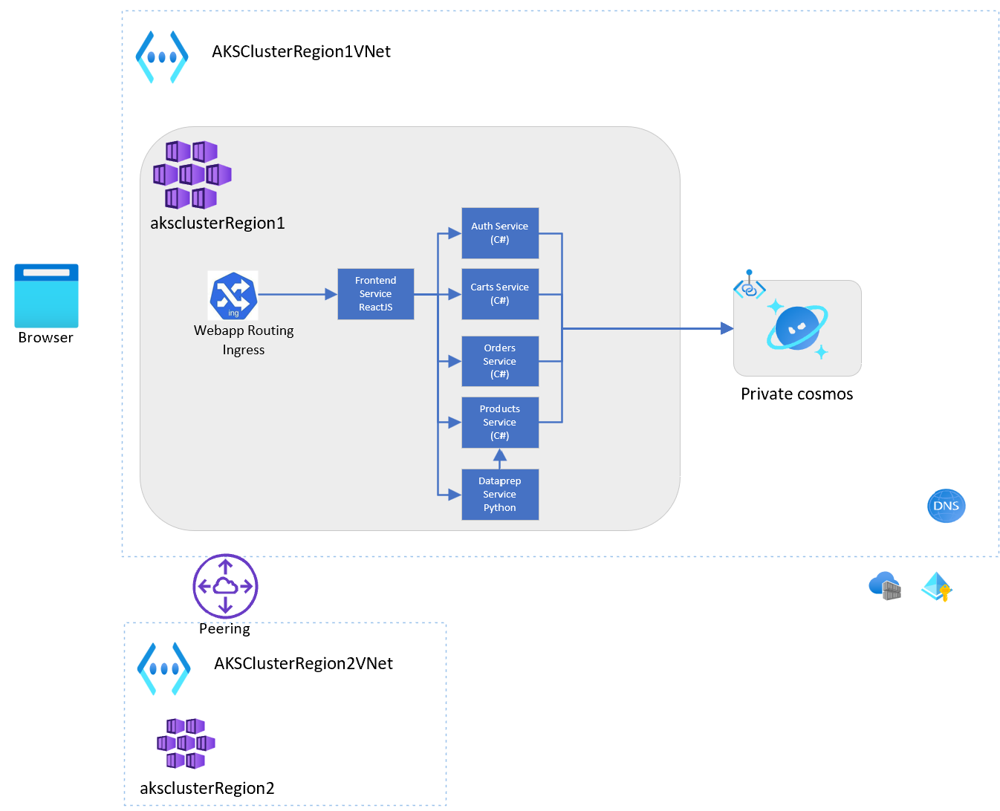
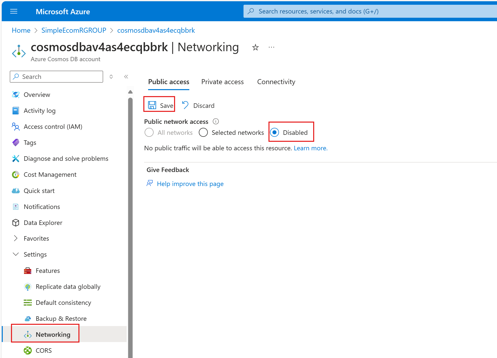
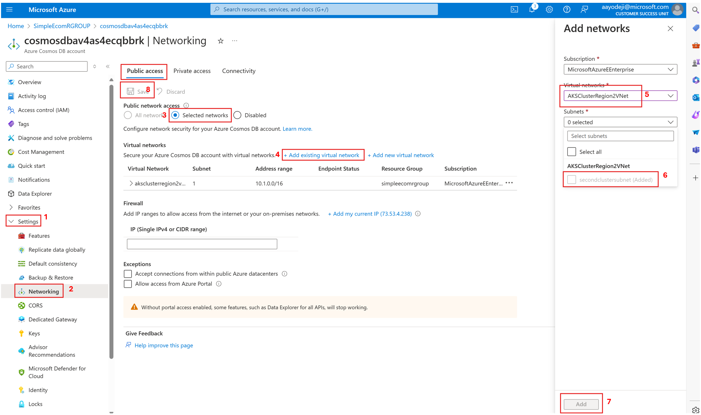

# NoSQL Cosmosdb Multi-region Scenario

Imagine you are building a new e-commerce application and you would like to deploy it to AKS. You have decided you would build it a microservices and use CosmosDB's NoSQL API as your database. You have completed building the first version of the app. You have tested it locally using docker-compose and you have an insecure test CosmosDB instance you used for development and testing. Your next step is to deploy it to AKS.

## Architecture

For information about the application architecture, check it out at the [code repository](https://github.com/mosabami/simpleecom/blob/main/README.md#application-architecture)

The diagram below shows the architecture of our environment after the resources have been deployed


### AKS Components

The following AKS features will be used in this workshop

1. AKS workload identity / user defined managed identity
1. AKS Webapp routing
1. ACR Build

### Cosmos DB Components

1. Private link / endpoint (disabling public network access)
1. Geo replication
1. Event sourcing (change feed)

Most of the resources will be deployed using Bicep with the others deployed manually to aid learning.

## Deploy the Azure Environment

### Clone the repo

We begin by cloning the repo while pulling the simpleecom application code as a submodule at the same time.
```bash
git clone --recurse-submodules https://github.com/Azure/AKS-Landing-Zone-Accelerator
```

### Set environment variables

Next we set some environment variables

```bash
region1=eastus
region2=swedencentral
deploymentName=SimpleEcom
aksnamespace=simpleecom
RGNAME=SimpleEcomRGROUP

currentUserGuid=$(az ad signed-in-user show --query id -o tsv )
az ad group create --display-name AKSCADMs --mail-nickname AKSCADMs --description "Members who can administer AKS Clusters"
aksAdminsGroupId=$(az ad group show --group AKSCADMs --query id -o tsv)
az ad group member add --group $aksAdminsGroupId --member-id $currentUserGuid
```

Make sure your env variables were configured properly and cd to the directory with the bicep files

```bash

echo "deplyment name is :" && echo $deploymentName
echo "region 1 is :" && echo $region1
echo "region 2 is: " && echo $region2
echo "aks admin group id is: " && echo $aksAdminsGroupId
echo "main rg name is: " && echo $RGNAME

cd Scenarios/CosmosDB-nosql-Resiliency/Bicep
```

Deploy the main resources

```bash
az deployment sub create -n $deploymentName -l $region1   -f main.bicep -p parameters.json -p secondLocation=$region2 -p aksAdminsGroupId=$aksAdminsGroupId -p resourceGroupName=$RGNAME
```

Get required env variables for remaining steps

```bash
RGNAME=$(az deployment sub show --name $deploymentName --query properties.outputs.resourceGroupName.value -o tsv) && echo "The resource group name is: $RGNAME"

ACRNAME=$(az deployment sub show --name $deploymentName --query properties.outputs.acrName.value -o tsv) && echo "The ACR name is: $ACRNAME"

cosmosDbName=$(az deployment sub show --name $deploymentName --query properties.outputs.cosmosDbName.value -o tsv) && echo "The Cosmosdb name is: $cosmosDbName"


FIRSTCLUSTERNAME=$(az deployment sub show --name $deploymentName --query properties.outputs.firstAKSCluseterName.value -o tsv) && echo "The first cluster's name is: $FIRSTCLUSTERNAME"

SECONDCLUSTERNAME=$(az deployment sub show --name $deploymentName --query properties.outputs.secondAKSCluseterName.value -o tsv) && echo "The second clusters name is: $SECONDCLUSTERNAME"
```

Attach your acr to the aks clusters

```bash
az aks update -n $FIRSTCLUSTERNAME -g $RGNAME --attach-acr $ACRNAME
az aks update -n $SECONDCLUSTERNAME -g $RGNAME --attach-acr $ACRNAME
```

Get the information required to create the federated identity credentials

```bash
FIRSTOIDCISSUERURL=$(az deployment sub show --name $deploymentName --query properties.outputs.firstoidcIssuerUrl.value -o tsv) && echo "The first OIDC Issuer URL is: $FIRSTOIDCISSUERURL"
SECONDOIDCISSUERURL=$(az deployment sub show --name $deploymentName --query properties.outputs.secondoidcIssuerUrl.value -o tsv) && echo "The second OIDC Issuer URL is: $SECONDOIDCISSUERURL"
workloadIdentityId=$(az deployment sub show -n $deploymentName  --query properties.outputs.workloadIdentityResourceId.value -o tsv) && echo "The workloadIdentityId is: $workloadIdentityId"
IDNAME=$(az deployment sub show --name $deploymentName --query properties.outputs.workloadIdentityName.value -o tsv) && echo "The identity name  is: $IDNAME"
OBJECT_ID=$(az deployment sub show --name $deploymentName --query properties.outputs.workloadIdentityObjectId.value -o tsv) && echo "The identity object id is: $OBJECT_ID"
CLIENT_ID=$(az deployment sub show --name $deploymentName --query properties.outputs.workloadIdentityClientId.value -o tsv) && echo "The identity client id is: $CLIENT_ID"
```

Create federated credentials for both clusters using the same MI

```bash
az identity federated-credential create --name aksfederatedidentity --identity-name $IDNAME --resource-group $RGNAME --issuer $FIRSTOIDCISSUERURL --subject system:serviceaccount:simpleecom:serversa
az identity federated-credential create --name aksfederatedidentityreg2 --identity-name $IDNAME --resource-group $RGNAME --issuer $SECONDOIDCISSUERURL --subject system:serviceaccount:simpleecom:serversa
```

If you run into parsing issues, run the following command

```bash
export MSYS_NO_PATHCONV=1
```

Grant your managed identity access to read cosmosdb data. Scope / means you are granting it access to the entire cosmosdb instance

```bash
az cosmosdb sql role assignment create \
    --resource-group $RGNAME \
    --account-name $cosmosDbName  \
    --role-definition-name "Cosmos DB Built-in Data Contributor" \
    --principal-id $OBJECT_ID \
    --scope /
```

## Prepare environment for deployment

Enable webapp routing addon.

```bash
az aks approuting enable --resource-group $RGNAME --name $FIRSTCLUSTERNAME
az aks approuting enable --resource-group $RGNAME --name $SECONDCLUSTERNAME
```

Connect to the first cluster

```bash
az aks get-credentials -n $FIRSTCLUSTERNAME -g $RGNAME
```

Build images and push to ACR

```bash
cd ../simpleecomapp/src
```

```bash
az acr build --registry $ACRNAME --image frontend:v1 --file frontend/Dockerfile frontend
az acr build --registry $ACRNAME  --image dataprep:v1 --file prepdata/Dockerfile prepdata
az acr build --registry $ACRNAME  --image auth:v1 --file Simpleecom.Auth/Dockerfile .
az acr build --registry $ACRNAME  --image carts:v1 --file Simpleecom.Cart.API/Dockerfile .
az acr build --registry $ACRNAME  --image orders:v1 --file Simpleecom.Orders.API/Simpleecom.Orders.API/Dockerfile .
az acr build --registry $ACRNAME  --image products:v1 --file Simpleecom.Products.API/Dockerfile .
az acr repository list --name $ACRNAME --output table # make sure you have 6 images
```

Set additional environment variables required for the application deployment steps

```bash
TENANTID=<your Azure tenant id>
COSMOSDB_CONN_ST=<your Cosmos DB connection string> # get this from Cosmos DB -> Settings -> Keys
COSMOSDB_URI=<your Cosmos DB URI> # get this from Cosmos DB resource overview page
```

## Deploy the application using connection string

First we will deploy the application using connection string which is insecure. We will later switch to use Workload Identity.

```bash
cd ../../k8s
kubectl apply -f namespace.yaml
```

Update deployment files with correct acr name

```bash
sed -i "s/<acr-name>/${ACRNAME}/g" auth.yaml
sed -i "s/<acr-name>/${ACRNAME}/g" carts.yaml
sed -i "s/<acr-name>/${ACRNAME}/g" orders.yaml
sed -i "s/<acr-name>/${ACRNAME}/g" products.yaml
sed -i "s/<acr-name>/${ACRNAME}/g" frontend.yaml
sed -i "s/<acr-name>/${ACRNAME}/g" dataprep.yaml
```

Update deployment files with correct conn string

```bash
sed -i "s|<cosmosdb-conn-string>|${COSMOSDB_CONN_ST}|g" auth.yaml
sed -i "s|<cosmosdb-conn-string>|${COSMOSDB_CONN_ST}|g" carts.yaml
sed -i "s|<cosmosdb-conn-string>|${COSMOSDB_CONN_ST}|g" orders.yaml
sed -i "s|<cosmosdb-conn-string>|${COSMOSDB_CONN_ST}|g" products.yaml
```

Deploy the containers

```bash
kubectl apply -f nginx-ingress.yaml # enabled by the webapp routing feature
kubectl apply -f dataprep.yaml
kubectl apply -f frontend.yaml
kubectl apply -f auth.yaml
kubectl apply -f carts.yaml
kubectl apply -f products.yaml
kubectl apply -f orders.yaml
```

### NOTE: What we have done so far - Insecure

Using the connection string gives the containers elevated access to the Cosmos DB and should not be done in production. It grants access to both the control plan and data plane. The microservices have lines of code in them that create the database and collections if they don't exist. This is great for demo purposes to save time. 

When we switch to using workload identity, the containers wont be able to perform these control plane operations. Just CRUD operations on existing databases and collections. In production, connection string Authentication should be disabled for security purposes.

Set context of your kubectl to the namespace we are using simpleecom and get ingress's public ip address

```bash
kubectl config set-context --current --namespace=simpleecom
kubectl get ingress
```

Go to browser and enter this address to Load the product catalog into your database: `http://<your ingress ip address>/prepdata/send_data`. Your connection might timeout, but that doesn't mean the products were not loaded properly.

Go on browser and enter the address to test out the app: http://<your ingress ip address>. You need to sign up first by clicking on Registration page.

## Deploy the app using managed identity and private link

Our first step here is to make our Cosmos DB only accessible from our private network.

1. Head to the portal and click on your Cosmos DB resource
1. Click on Networking under Settings
1. Under public network Access click on **Disabled**
1. **IMPORTANT** Click on Save


Next up, we will create a service account which will use the AKS workload identity feature to map the pod's access to the access granted to the managed identity. We will then use default credentials to authenticate to our cosmosdb. Only pods using the service account will have direct access to Cosmos DB. The frontend and dataprep pods wont. This is how you can limit access to sensitive resources.

First update the service account with correct Tenant ID and Client ID.

```bash
sed -i "s/<tenant-id>/${TENANTID}/g" svc-account.yaml
sed -i "s/<client-id>/${CLIENT_ID}/g" svc-account.yaml
```

Deploy the service account

```bash
kubectl apply -f svc-account.yaml
```

Delete the existing deployments that need to connect to cosmosdb

```bash
kubectl delete -f auth.yaml
kubectl delete -f carts.yaml
kubectl delete -f products.yaml
kubectl delete -f orders.yaml
```

Update deployment files with correct Cosmos DB endpoint

```bash
sed -i "s|<cosmosdb endpoint>|${COSMOSDB_URI}|g" auth.yaml
sed -i "s|<cosmosdb endpoint>|${COSMOSDB_URI}|g" carts.yaml
sed -i "s|<cosmosdb endpoint>|${COSMOSDB_URI}|g" orders.yaml
sed -i "s|<cosmosdb endpoint>|${COSMOSDB_URI}|g" products.yaml
```

Enable the use of the service account on your pods. This will switch the `azure.workload.identity/use` value to true and remove the comment hash next to the service account name in the yaml.

```bash
sed -i "s|false|true|g" auth.yaml
sed -i "s|false|true|g" carts.yaml
sed -i "s|false|true|g" orders.yaml
sed -i "s|false|true|g" products.yaml

sed -i "s| #||g" auth.yaml
sed -i "s| #||g" carts.yaml
sed -i "s| #||g" orders.yaml
sed -i "s| #||g" products.yaml
```

Get your pod to use default credentials instead of Cosmosdb connection string by switching the ASPNETCORE_ENVIRONMENT env variable from Development to Non-dev. This will allow the use of the managed identity we configured earlier to authenticate to the data plane of cosmosdb. Safer than using secrets. Thanks for AKS workload identity, only pods that need access to the database will have access to this service account. So frontend and dataprep, which don't need access to the database wont have access to cosmosdb.

When using workload identity, the pods can only handle data plane operations. Operations like creating database and collections on cosmosdb are not allowed. We expect that the Ops team would have set this up for developers. But for demo purposes, we started by using the `Development` mode with the connection string so that our code can setup the database for you. Going forward the pods wont have access to do this anymore.

```bash
sed -i "s|Development|Non-dev|g" auth.yaml
sed -i "s|Development|Non-dev|g" carts.yaml
sed -i "s|Development|Non-dev|g" orders.yaml
sed -i "s|Development|Non-dev|g" products.yaml
```

Redeploy the pods so that they now use the service account's workload identity

```bash
kubectl apply -f auth.yaml
kubectl apply -f carts.yaml
kubectl apply -f products.yaml
kubectl apply -f orders.yaml
```

Make sure the pods restarted. If they didn't delete the deployments and redeploy


## Deploy into your second cluster

Log into the second cluster

```bash
az aks get-credentials -n $SECONDCLUSTERNAME -g $RGNAME
```

Deploy the namespace

```bash
kubectl apply -f namespace.yaml
```

## Deploy the other resources

Since we are using the same ACR and the same managed identity in both clusters, we can just deploy the resources using the existing configuration file.

We will however make a minor configuration change to the frontend deployment file so that it sets the REACT_APP_SERVER_NAME value to `aksclusterRegion1`

```bash
sed -i "s|aksclusterRegion1|aksclusterRegion2|g" frontend.yaml
```

Deploy the application and its supporting services

```bash
kubectl apply -f namespace.yaml
kubectl apply -f svc-account.yaml
```

```bash
kubectl apply -f .
```

Set context of your kubectl to the namespace we are using simpleecom

```bash
kubectl config set-context --current --namespace=simpleecom
kubectl get pods
```

Watch the deployments for the 4 services that need to connect to cosmosdb fail.

This is failing because  there the Cosmos DB only allows local access. We will fix this shortly. 

```bash
kubectl delete -f auth.yaml
kubectl delete -f carts.yaml
kubectl delete -f products.yaml
kubectl delete -f orders.yaml
```

### Providing access to a peered Virtual Network

1. Head to the portal and click on your Cosmos DB
1. Go to Settings -> Networking
1. Click on **Selected networks** 
1. Click on **+ Add an existing virtual network**
1. Choose your second cluster's vnet
1. Close the subnet where your cluster resides
1. Click on **Add**
1. **IMPORTANT**: Click on Save


### Deploy the pods again

Deploy the pods for the 4 microservices again

```bash
kubectl apply -f auth.yaml
kubectl apply -f carts.yaml
kubectl apply -f products.yaml
kubectl apply -f orders.yaml
```

Test it out using the new cluster's ingress controller ip address

```bash
kubectl get ingress
```

## Add geo replication for your Cosmos DB

Now that our application is running in two different regions, it wont help if the region where Cosmos DB is deployed goes down. To counter that, we will enable Geo replications on Cosmos DB.

1. Go on your portal and click on your Cosmos DB
1. Click on Settings -> **Replicate data globally**
1. Click on Sweden central on the presented map
1. Click on Enable Multi-region writes
1. Click the checkmark to enable Availability zone for Sweden Central
1. Click **Save** at the top left

## Additional challenges

This brings up to the end of the guided portion of our levelup. Below are some additional challenges

1. Use a self signed certificate to enable TLS on your ingress controller. You can learn how to do that at our [previous levelup workshop on webapp routing](https://github.com/sabbour/app-routing-tutorial)
1. Add a fleet manager in front of the two clusters so you can manage deployments, upgrades, etc more seamlessly. You can follow the instructions in the [step 7 folder of this scenario](./Bicep/07-Fleet/README.md) to get started.
1. Add front door to your resource groups and add add your cluster's ingress controllers as origins so that customers can access your application from either cluster using the same url
1. Use the automated deployments feature to configure a CI/CD pipeline for your clusters
