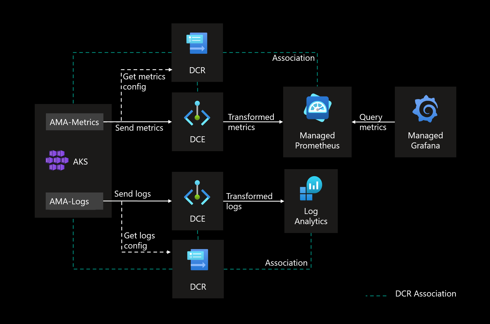

# Private Azure Grafana, Prometheus and Log Analytics with AKS

## Introduction

With AKS, you can use `Azure Monitor Workspace for Prometheus` and `Azure Managed Grafana` to collect, query and visualize the metrics from AKS.
And to collect logs, you can use `Azure Log Analytics`.

This lab will provide an implementation for monitoring and logging.

## Architecture



## Deploying the resources using Terraform

To deploy the Terraform configuration files, run the following commands:

```sh
terraform init

terraform plan -out tfplan

terraform apply tfplan
```

The following resources will be created.


## Cleanup resources

To delete the creates resources, run the following command:

```sh
terraform destroy
```

## More readings

https://learn.microsoft.com/en-us/azure/azure-monitor/essentials/azure-monitor-workspace-manage?tabs=azure-portal
