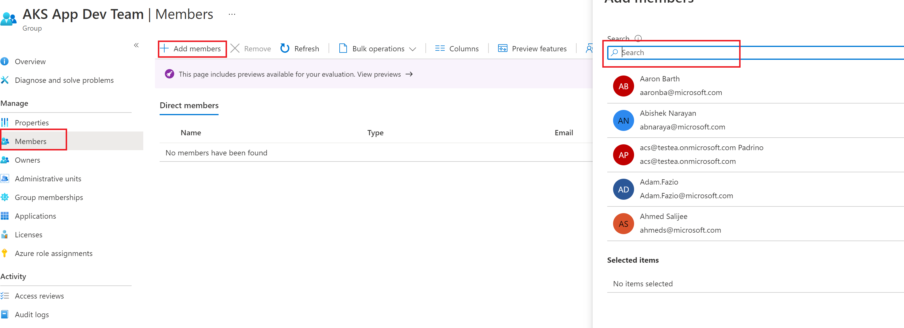

# Create or Import Azure Active Directory Groups for AKS

Before creating the Azure Active Directory integrated cluster, groups must be created that can be later mapped to the Built-In Roles of "Azure Kubernetes Service Cluster User Role" and "Azure Kubernetes Service RBAC Cluster Admin".

Depending on the needs of your organization, you may have a choice of existing groups to use or a new groups may need to be created for each cluster deployment.  

Navigate to "/Scenarios/AKS-Secure-Baseline-PrivateCluster/Bicep/02-AAD" folder

Use az cli or Az PowerShell to create the AD groups

# [CLI](#tab/CLI)

```azurecli
appdevs=''
aksops=''

az ad group create --display-name $appdevs --mail-nickname $appdevs
az ad group create --display-name $aksops --mail-nickname $aksops
```

# [PowerShell](#tab/PowerShell)
Running the command to create the new AAD groups requires the New-AzADGroup cmdlet. More details can be found [here](https://docs.microsoft.com/en-us/powershell/azure/install-az-ps?view=azps-7.0.0).

Install New-AzADGroup cmdlet
```azurepowershell
Set-ExecutionPolicy -ExecutionPolicy RemoteSigned -Scope CurrentUser
Install-Module -Name Az -Scope CurrentUser -Repository PSGallery -Force
```

Run the command below to create two new AAD groups in your tenant. 

```azurepowershell
./ad_groups.ps1 -appdevs <App Dev Group> -aksops <AKS Operations Team>
```

## Ensure you are part of the AAD group you just created or pointed to

1. Go to Azure portal and type AAD
2. Select **Azure Active Directory**
3. Click on **Groups** in the left blade
4. Select the Admin User group you just created. For the default name, this should be *AKS App Admin Team*
5. Click on **Members** in the left blade
6. 
7. Click **+ Add members**
8. Enter your name in the search bar and select your user(s)
9. Click **Select**

### Next step

:arrow_forward: [Creation of Hub Network & its respective Components](./03-network-hub.md)
