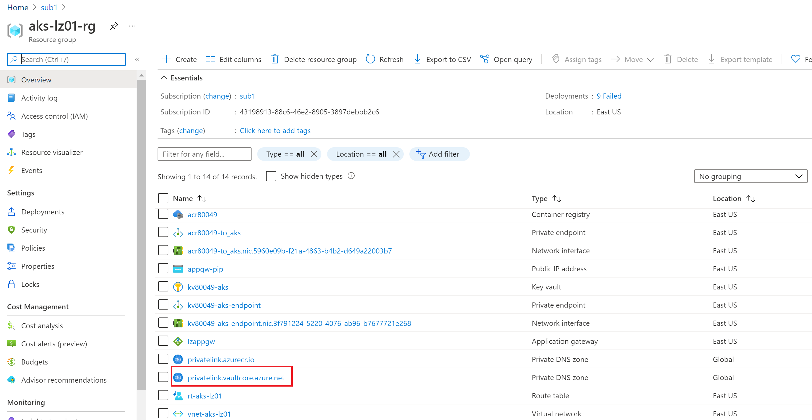

## The Key Vault Add-On
The AKS Key Vault Add-On is not currently supported for deployment with Terraform. Configure that separately on the cluster after it is deployed. 

  :warning: **Note:** Because these steps are not being deployed by Terraform, TF state will not know these extensions exist. The features are not supported by Terraform yet because they are preview features. By continuing to use these extensions, you will be able to further update your AKS cluster using Terraform, but you won't be able to control these addons using terraform. We are adding these steps for training purposes. If you plan to use this deployment in production where you would need to continue updating your AKS infrastructure using Terraform, note that changes involve these addons can't be done with terraform

We start by creating some environment variables. The AKS cluster name can be found in the portal or in the variables file. The value is aks-<prefix value>, for example, in this case it is aks-escs. The resource group name by default is <prefix value>-lz01-rg-aks

```
AKSCLUSTERNAME=aks-escs
AKSRESOURCEGROUP=escs-lz01-rg-aks
```


## Enable aks-preview Azure CLI extenstion and add AKS-AzureKeyVaultSecretsProvider preview feature

You also need the *aks-preview* Azure CLI extension version 0.5.9 or later. If you don't already, enter the following in your command line

```bash
# Install the aks-preview extension
az extension add --name aks-preview

# Update the extension to make sure you have the latest version installed
az extension update --name aks-preview
```

You also need to register the AKS-AzureKeyVaultSecretsProvider preview feature in your subscription. Check to see if it has already been enabled

```bash
az feature list -o table --query "[?contains(name, 'Microsoft.ContainerService/AKS-AzureKeyVaultSecretsProvider')].{Name:name,State:properties.state}"
```

if not enter the command below to enable it

```bash
az feature register --namespace "Microsoft.ContainerService" --name "AKS-AzureKeyVaultSecretsProvider"
```

It takes a few minutes for the status to show *Registered*. Verify the registration status by using the [az feature list](https://docs.microsoft.com/en-us/cli/azure/feature#az_feature_list) command:

```bash
az feature list -o table --query "[?contains(name, 'Microsoft.ContainerService/AKS-AzureKeyVaultSecretsProvider')].{Name:name,State:properties.state}"
```

When ready, refresh the registration of the *Microsoft.ContainerService* resource provider by using the [az provider register](https://docs.microsoft.com/en-us/cli/azure/provider#az_provider_register) command:

```bash
az provider register --namespace Microsoft.ContainerService
```


##  Enable Keyvault Secrets Provider for your cluster

```
az aks enable-addons --addons azure-keyvault-secrets-provider --name $AKSCLUSTERNAME --resource-group $AKSRESOURCEGROUP
```

**IMPORTANT**: When completed, take note of the client-id created for the add-on:

...,
 "addonProfiles": {
    "azureKeyvaultSecretsProvider": {
      ...,
      "identity": {
        "clientId": "<client-id>",
        ...
      }
    }

Update the permissions on the Key Vault to allow access from the newly created identity. The object-type can be key, certificate or secret. Run the command below for each of the object types.
```
az keyvault set-policy -n <keyvault name> --<object type>-permissions get --spn <client-id>
```

## Grant access from hub network to private link created for keyvault

For the jumpbox you just created in the hub network to have access to Key vault's private link, you need to add the network to the access. To do this,

1. Find the Private DNS zone created for keyvault. This should be in the landing zone resource group (escs-lz01-rg for example)

   
   
2. Click on **Virtual network links** in the left blade under **Settings**
3. Click on **+ Add** in the in the top left of the next screen
4. enter a name for the link eg *hub_to_kv*
5. Select the hub virtual network for the **Virtual network** field
6. Click on **OK** at the bottom

:arrow_forward: [Deploy a Basic Workload](./08-workload.md)
