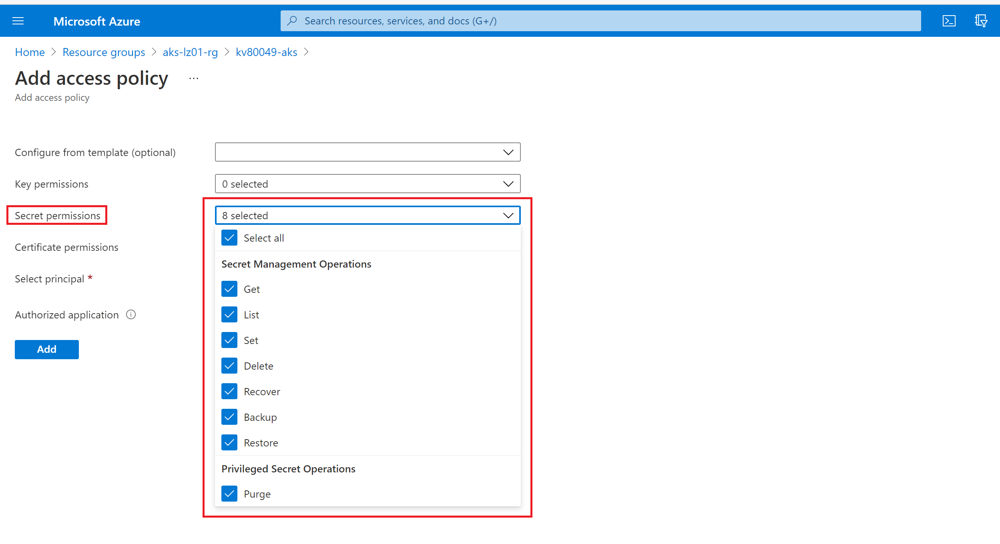
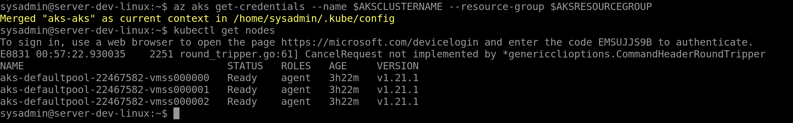
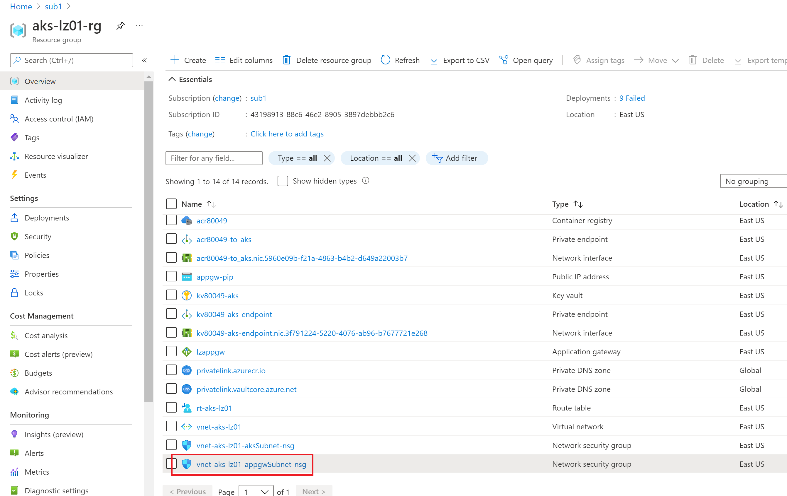
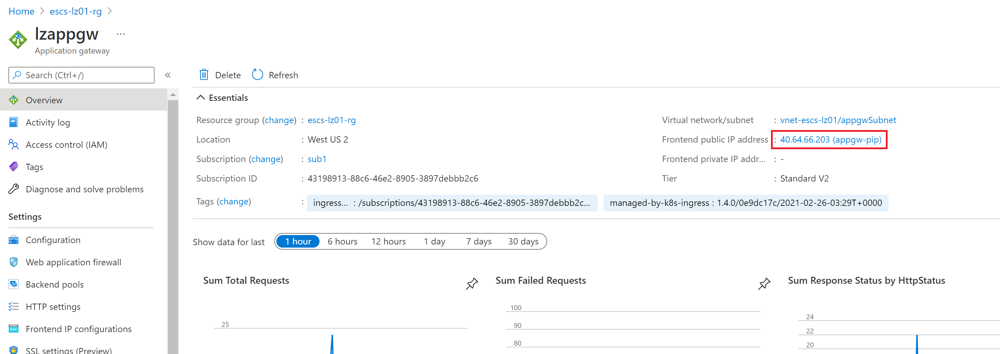
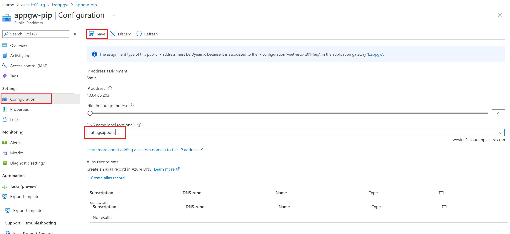

# Deploy a Basic Workload using the Fruit Smoothie Ratings Application

This application is provided by Microsoft Learning and is used as part of a self-paced Kubernetes training [workshop](https://docs.microsoft.com/en-us/learn/modules/aks-workshop/).  You may find reviewing that workshop helpful as it presents some alternative deployment options and features using different architecture requirements. The application consists of a web frontend, an API service and a MongoDB database.

Because the infrastructure has been deployed in a secure manner, only the API server to the AKS Cluster is accessible outside of the private network.  You will need to perform the majority of the application deployment from the Dev Jumpbox in the Hub VNET, connect via the Bastion Host service. If your computer is connected to the hub network, you may be able to just use that as well.

## Connecting to the Bastion Host

1. Log into Azure portal and find the virtual machine you created in the create hub network step. It should be in the *escs-hub-rg-dev* resource group if you used the default naming convention
2. Click on **Connect** at the top of the screen and select **Bastion**
3. Click on the **Use Bastion** button
4. Enter the username and password. It should be in the terraform.tfvars file in the Network Hub folder
5. Click on the **Connect** button. 

Once you connect ensure you permit the site to read the content of your clipboard

Install the following applications:

1. AZ CLI

```
curl -sL https://aka.ms/InstallAzureCLIDeb | sudo bash
```

2. Docker

```
sudo apt install docker.io -y
```

3. [Kubernetes CLI](https://kubernetes.io/docs/tasks/tools/install-kubectl-linux/)

4. [Helm]([Helm | Installing Helm](https://helm.sh/docs/intro/install/))

Once connected, install the Azure CLI and log into Azure. You must be a member of the appropriate
group (AKS App Dev Users, AKS Operations) to access the cluster. 

```
az login -t <tenant id>
```

**NOTE**: When you run az login, do not attempt to copy the code from the jump box as entering ctrl+c to copy it may cancel the login process. Instead, manually enter the code into https://www.microsoft.com/devicelogin page.

ensure you are connected to the correct subscription

```
az account set --subscription <subscription id>
```

OPTIONAL: If you need to log in with a service account:

```
az login --service-principal --username "${applicationId}" --password "${password}" --tenant "${tenantID}"
```

## Connect the Container Registry Private link to the Hub network

Since the Container registry can only be accessed via private link, we need to connect it to the network where jumpbox or whichever computer we are using to create the container images resides. We already added the container registry to the spoke network where the cluster resides using terraform. 

1. Go to Azure portal

2. Find the Private DNS zone created for keyvault. This should be in the landing zone resource group (escs-lz01-rg for example)

   

3. Click on **Virtual network links** in the left blade under **Settings**

4. Click on **+ Add** in the in the top left of the next screen

5. enter a name for the link eg *hub_to_acr*

6. Select the hub virtual network for the **Virtual network** field

7. Click on **OK** at the bottom


## Provide yourself Access to Create Secrets in your Key vault

1. Go to the Azure portal and find your container registry. This should be in the landing zone resource group (escs-lz01-rg for example)
2. You should see your pod-identity-example managed identity  as well as the azurekeyvaultsecrets identity. The pod identity will provide pods access to the pull secrets from the keyvault. The azurekeyvaultsecrets identity will be used by the keyvault driver. If either of these are missing, perhaps you are missing a step. 
3. Click on **Access policies** under **Settings** in the left blade
4. Select the required access policies 
5. Under **Select principal** click on the **None selected** link and select the user group(s) you created for this to provide you and everyone in the group access to the Key vault
6. Click **Select** at the bottom of the the screen
7. **IMPORTANT**: Click **Save** at the top of the next screen to save the changes 

7. 

## Build Container Images

Set your environmental variables

```
AKSCLUSTERNAME=aks-escs
AKSRESOURCEGROUP=escs-lz01-rg-aks
```

Clone the required repos to the Dev Jumpbox:

1. This repo. Feel free to use your forked repo as well.
```
git clone https://github.com/Azure/Enterprise-Scale-for-AKS
```
2. The Ratings API repo
```
git clone https://github.com/MicrosoftDocs/mslearn-aks-workshop-ratings-api.git
```
3. The Ratings Web repo
```
git clone https://github.com/MicrosoftDocs/mslearn-aks-workshop-ratings-web.git
```

Navigate to each of the application code directories, build and tag the containers with the name of your Azure Container Registry and push the images to ACR.

```
sudo docker build . -t <acrname>.azurecr.io/ratings-api:v1
sudo docker build . -t <acrname>.azurecr.io/ratings-web:v1
```

Log into ACR

```
sudo az acr login -n <acrname>
```

Push the images into the container registry. Ensure you are logged in u

```
sudo docker push <acrname>.azurecr.io/ratings-api:v1
sudo docker push <acrname>.azurecr.io/ratings-web:v1
```


Create the secret in keyvault if you havent already. You may use anything you'd like for the username and password for the MongoDB database but this needs to match what you will use when you create the helm chat in the next steps.

```
az keyvault secret set --name mongodburi --vault-name <acr name> --value "mongodb://<username>:<password>@ratings-mongodb.ratingsapp:27017/ratingsdb"
```

## Deploy the database into the cluster

You can deploy the workload into the cluster using your local computer since this is not a private cluster. This is not a very secure option. For better security, use a private cluster. We have a private cluster scenario in this repository. We are using a non private cluster for training purposes and for cases where you may not want to use a private cluster. It is easier to perform the following steps using your local computer since, it would be easy to modify the deployment files as needed. 

Get the connection credentials for the cluster:

```
az aks get-credentials --name $AKSCLUSTERNAME --resource-group $AKSRESOURCEGROUP
```

Ensure you have access to the cluster

```
kubectl get nodes
```



On the Kubernetes cluster, create a namespace for the Ratings Application. 

```
kubectl create namespace ratingsapp
```

The MongoDB backend application is installed using Helm. Your username and password must be the same username and password using in the connection string secret that was created in Key vault in the previous step.

```
helm repo add bitnami https://charts.bitnami.com/bitnami

helm install ratings bitnami/mongodb --namespace ratingsapp --set auth.username=<username>,auth.password=<password>,auth.database=ratingsdb
```

## Deploy the workload into the cluster

The steps below can be completed on your computer even if it is not connected to the cluster's virtual network. This makes it easier to tweak the yaml files for this demo. For a more secure AKS cluster, deploy a private cluster. Instructions on how to do that can be found in this repo.

On your computer, navigate to "/Scenarios/Secure-Baseline/Apps/RatingsApp" folder. 

```
cd ../../Apps/RatingsApp
```
Log into the cluster on your computer

```
az aks get-credentials -g $AKSRESOURCEGROUP -n $AKSCLUSTERNAME
```


Update the "api-secret-provider-class.yaml" file to reflect the correct Key Vault name, Client ID for the AKS Key Vault Add-on you saved earlier and the Tenant ID for the subscription.  

> If you don't have the Client ID, you can find it by going to the Key vault and clicking on **Access Policies** in the left blade. Find the identity that starts with "azurekeyvaultsecrets", then look for the resource by searching for the name in the search bar at the top. When you click on the resource, you will find the Client ID on the right side of the screen.

1. Deploy the edited yaml file.

```
kubectl apply -f api-secret-provider-class.yaml -n ratingsapp
```

2. Update the "1-ratings-api-deployment.yaml" file to reflect the correct name for the Azure Container Registry.  Deploy the file.

```
kubectl apply -f 1-ratings-api-deployment.yaml -n ratingsapp
```

3. Ensure the ratings-api deployment was successful. If you dont get a running state then it is likely that the pod was unable to get the secret from Key vault. This may be because the username and password of the db doesn't match the connection string that was created in Key vault or because the proper access to the Key vault wasn't granted to the azuresecret identity. 

   

   You can troubleshoot container creation issues by running

   ```
   kubectl describe pod <pod name>
   ```

4. Deploy the "2-ratings-api-service.yaml" file.

5. ```
   kubectl apply -f 2-ratings-api-service.yaml -n ratingsapp
   ```

6. Update the "3a-ratings-web-deployment.yaml" file to reflect the correct name for the Azure Container Registry. Deploy the file. 

   ```
   kubectl apply -f 3a-ratings-web-deployment.yaml -n ratingsapp
   ```

7. Deploy the "4-ratings-web-service.yaml" file.

   ```
   kubectl apply -f 4-ratings-web-service.yaml -n ratingsapp
   ```

   

## (Optional) Deploy the Ingress using without support for HTTPS

This step is optional. If you would like to go straight to using https which is the secure option, skip this section and go straight to the **Update the Ingress to support HTTPS traffic** section.

1. Deploy the "5a-ratings-web-ingress.yaml" file.

   ```
   kubectl apply -f 5-http-ratings-web-ingress.yaml -n ratingsapp
   ```

2. Get the ip address of your ingress controller

   ```
   kubectl get ingress -n ratingsapp
   ```

### Allow access to the application gateway via port 80 

For the first deployment we are using http, so we need to access the workload at port 80. Follow the steps below to allow access to the application gateway via port 80.

1. Go to Azure portal and in the lz resource group you'll find the appgwSubnet NSG

   

2. Click on the **Inbound rules** in the left blade

3. Add a new rule that allows access to the application gateway on port 80

4. Set the priority to 200. Your result should look like this

   

5. Click on **Add**

### Check your deployed workload

1. Get the ip address of your ingress controller

   ```
   kubectl get ingress -n ratingsapp
   ```

2. Copy the ip address displayed, open a browser, navigate to that address and explore your website

   

After you are done testing the workload, go back to the NSG and disable the inbound rule you just created. 


## Update the Ingress to support HTTPS traffic

A fully qualified DNS name and a certificate are needed to configure HTTPS support on the the front end of the web application. You are welcome to bring your own certificate and DNS if you have them available, however a simple way to demonstrate this is to use a self-signed certificate with an FQDN configured on the IP address used by the Application Gateway. 

1. Configure the Public IP address of your Application Gateway to have a DNS name. It will be in the format of <customprefix>.<region>.cloudapp.azure.com
2. Create a certificate using the FQDN and store it in KeyVault. 

### Creating Public IP address for your Application Gateway

1. Find your application gateway in your landing zone resource group and click on it. By default is has the name *lzappgw*.

2. Click on the *Frontend public IP address* 

   

3. Click on configuration in the left blade of the resulting page

4. Enter a unique DNS name in the field provided and click **Save**

   

### Create the self signed certificate using openssl

Create the self signed certificate using openssl. Note that these steps need to be created by a computer within the hub or spoke network since the Key vault is private. Head back to your jump box and enter these commands.

```
openssl req -x509 -nodes -days 365 -newkey rsa:2048 -out aks-ingress-tls.crt -keyout aks-ingress-tls.key -subj "/CN=ratingsappdns.westus2.cloudapp.azure.com/O=AKS-INGRESS-TLS"

openssl pkcs12 -export -out aks-ingress-tls.pfx -in aks-ingress-tls.crt -inkey aks-ingress-tls.key -passout pass:
```
Create the secret in Key vault

```
az keyvault certificate import -f aks-ingress-tls.pfx -n aks-ingress-tls --vault-name kv94640-akscs
```

### Redeploy the workload using HTTPS

Now that you have created the certificate in  Key vault you can switch back to your computer and redeploy the workload using HTTPS

1. Update the web-secret-class-provider.yaml with your keyvault name, user assigned identity for the keyvault add-on, the tenant ID and the user assigned identity. Deploy it.

   ```
   kubectl apply -f web-secret-provider-class.yaml -n ratingsapp
   ```

   

2. Delete the previous ratings-web deployment. 

   ```
    kubectl delete -f 3a-ratings-web-deployment.yaml -n ratingsapp
   ```

   Update the  "3b-ratings-web-deployment.yaml" file with the ACR name and redeploy the web application using the this file, which includes the necessary volume mounts to create the Kubernetes secret containing the certificate that will be used by the ingress controller.

   ```
   kubectl apply -f 3b-ratings-web-deployment.yaml -n ratingsapp
   ```

   Update the "5-https-ratings-web-ingress.yaml" file to use the FQDN that matches the certificate and application gateway public IP address.  Delete the previous ingress and redeploy the ingress with this file. 

   ```
   kubectl delete -f 5-http-ratings-web-ingress.yaml -n ratingsapp
   ```

   ```
   kubectl apply -f 5-https-ratings-web-ingress.yaml -n ratingsapp 
   ```

Now you can access the website using using your FQDN. When you navigate to the website using your browser you will see a warning stating the destination is not safe. This is because you are using a self signed certificate which we used for illustration purposes. Do not use a self signed certificate in production. Go ahead and proceed to the destination to get access to your deployment.


## Next Step

:arrow_forward: [Cleanup](./09-cleanup.md)

