# Testing scalability of your cluster using Azure Load Testing

In this walkthrough, we will explore the options of Azure Kubernetes Services (AKS) to scale based on actual user load. 
It will demonstrate the setup and use of following AKS platform capabilities:

- The [Kubernetes Horizontal Pod Autoscaler](https://kubernetes.io/docs/tasks/run-application/horizontal-pod-autoscale/), adding and removing pods to the existing set of virtual machines as load changes.
- The [Cluster Autoscaler of an AKS cluster](https://learn.microsoft.com/azure/aks/cluster-autoscaler), adding and removing virtual machines to scale up the scale set and providing more CPU and memory capacity.

To emulate user load, this tutorial uses [Azure Load Testing](https://learn.microsoft.com/azure/load-testing/overview-what-is-azure-load-testing).

##  Walthrough Overview
In this walkthrough, you will...
- create a new AKS cluster using the [AKS Construction Helper](https://azure.github.io/AKS-Construction/).
- build a new container image hosting an API that creates CPU load by generating random numbers,
- deploy this application to your AKS cluster,
- use Azure Load Testing to simulate concurrent user requests and inspect the resulting load,
- instruct the AKS scheduler to scale the number of pods depending on CPU utilization,
- enable the AKS cluster autoscaler to scale the number of nodes hosting your workload,
- use Azure Load Testing to simulate even more load and
- see how AKS adds and removes virtual machines to the scale set to provide more resources.

## Procedure

### Create your Azure Kubernetes Service (AKS) cluster and Azure Container Registry (ACR)

1. Use the [AKS Construction Helper](https://azure.github.io/AKS-Construction/) to setup your target AKS cluster. Use this [predefined configuration](https://azure.github.io/AKS-Construction/?ops=none&secure=low&deploy.clusterName=az-k8s-khim&deploy.rg=az-k8s-khim-rg&cluster.SystemPoolType=CostOptimised&cluster.agentCount=1&cluster.vmSize=default&cluster.osDiskType=Managed&cluster.osDiskSizeGB=0&cluster.availabilityZones=no&addons.registry=Basic&addons.azurepolicy=none&deploy.deployItemKey=deployArmCli&addons.monitor=aci) to make sure you configure it appropriately or use the Azure CLI snippets below.

   ```bash
   # Log in
   az login 

   # Create Resource Group
   az group create -l WestEurope -n az-k8s-khim-rg
   
   # Deploy template with in-line parameters
   az deployment group create \
      -g az-k8s-khim-rg  \
      --template-uri https://github.com/Azure/AKS-Construction/releases/download/0.8.11/main.json \
      --parameters \
   	  resourceName=az-k8s-khim \
   	  agentCount=1 \
   	  agentVMSize=Standard_D2ds_v4 \
   	  osDiskType=Managed \
   	  registries_sku=Basic \
   	  acrPushRolePrincipalId=$(az ad signed-in-user show --query id --out tsv) \
   	  omsagent=true \
        retentionInDays=30
   ```

1. Check resources got deployed successfully and take a note of the names of both resources.

   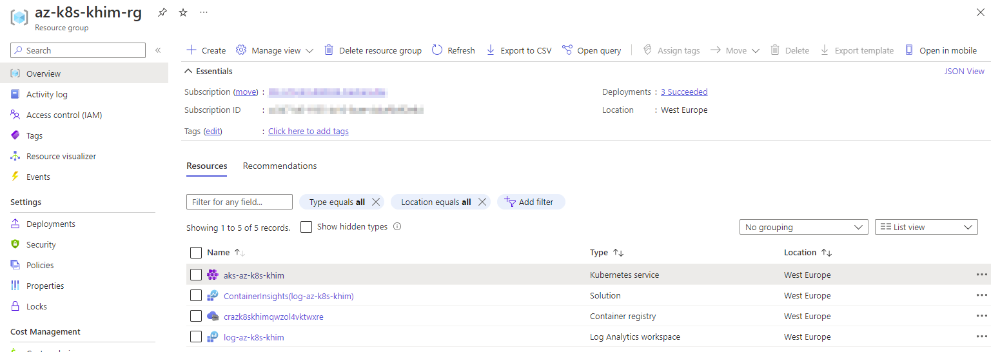

   ```bash
   az acr list -g "az-k8s-khim-rg" -o table
   ```

   ```output
   NAME                      RESOURCE GROUP    LOCATION    SKU    LOGIN SERVER                         CREATION DATE         ADMIN ENABLED
   ------------------------  ----------------  ----------  -----  -----------------------------------  --------------------  ---------------
   crazk8skhimqwzol4vktwxre  az-k8s-khim-rg    westeurope  Basic  crazk8skhimqwzol4vktwxre.azurecr.io  2022-09-08T11:03:35Z  False
   ```

   ```bash
   az aks list -g "az-k8s-khim-rg" -o table
   ```

   ```output
   Name             Location    ResourceGroup    KubernetesVersion    CurrentKubernetesVersion    ProvisioningState    Fqdn
   ---------------  ----------  ---------------  -------------------  --------------------------  -------------------  -------------------------------------------------
   aks-az-k8s-khim  westeurope  az-k8s-khim-rg   1.23.8               1.23.8                      Succeeded            az-k8s-khim-dns-318a3497.hcp.   westeurope.azmk8s.io
   ```

1. Check that you have the [`kubectl`](https://kubernetes.io/docs/tasks/tools/#kubectl) available on your machine.

   ```bash
   kubectl version
   ```

   ```output
   Client Version: version.Info{Major:"1", Minor:"25", GitVersion:"v1.25.0", GitCommit:"a866cbe2e5bbaa01cfd5e969aa3e033f3282a8a2", GitTreeState:"clean", BuildDate:"2022-08-23T17:44:59Z", GoVersion:"go1.19", Compiler:"gc", Platform:"linux/amd64"}
   Kustomize Version: v4.5.7
   ```

   If `kubectl` is not yet available, install it using Azure CLI:

   ```bash
   az aks install-cli
   ```

1. Log in to your AKS cluster using [Azure CLI](https://learn.microsoft.com/cli/azure/aks?view=azure-cli-latest#az-aks-get-credentials).

   ```bash
   az aks get-credentials \
     --resource-group az-k8s-khim-rg \
     --name aks-az-k8s-khim
   ```

1. Get the list of nodes of your AKS cluster to check connectivity to your AKS cluster:

   ```bash
   kubectl get nodes
   ```

   ```output
   NAME                               STATUS   ROLES   AGE   VERSION
   aks-npsystem-40226941-vmss000000   Ready    agent   23m   v1.23.8
   aks-npuser01-40226941-vmss000000   Ready    agent   23m   v1.23.8
   ```

### Clone repository and build image for new API

1. Clone repo [AKS-Landing-Zone-Accelerator](https://github.com/Azure/AKS-Landing-Zone-Accelerator) to your development machine.
   This application provides a very simple API to generate some load on your worker nodes.

   ```bash
   git clone https://github.com/Azure/AKS-Landing-Zone-Accelerator.git
   ```


1. Change into directory `Scenarios/Testing-Scalability/dotnet` that hosts the demo application to be used in this walkthrough.

   ```bash
   cd AKS-Landing-Zone-Accelerator/Scenarios/Testing-Scalability/dotnet
   ```

1. (optional) If you want to test it, run `dotnet run`...

   ```bash
   dotnet run
   ```

   ```output
   Welcome to .NET 6.0!
   ---------------------
   SDK Version: 6.0.202
   
   ...

   Building...
   info: Microsoft.Hosting.Lifetime[14]
       Now listening on: https://localhost:7230
   ```

   and browse to endpoint `https://localhost:7230/RandomNumbers`:

   ```bash
   curl -k https://localhost:7230/RandomNumbers
   ```

   ```output
   {"numbersGenerated":10000000,"timeUsed":45.7634}
   ```

1. (optional) Open [`Controllers/RandomNumbersController.cs`](./dotnet/Controllers/RandomNumbersController.cs) to inspect the application logic; see how Method `Get(.)` simply creates multiplications of random numbers.

1. Build this application as container in your Azure Container Registry:
   ```bash
   az acr build --image randomnumbers-linux:latest --registry "crazk8skhimqwzol4vktwxre" --file Dockerfile-linux .
   ...
   Run ID: cb7 was successful after 49s
   ```

1. Browse to the repositories and see that the image you just built:

   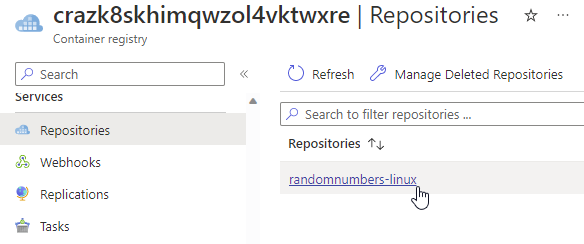


### Deploy API to AKS cluster

1. Edit the file `res/randomnumbers.yaml` and replace `<your acr name>` in the image of deployment `rand-deployment` to point to your ACR.

1. Apply the manifest:

   ```bash
   kubectl apply -f ./randomnumbers.yaml
   ```

   ...and check the deployment can be created successfully:

   ```bash
   kubectl get deployments -n scaling-wt
   NAME                         READY   UP-TO-DATE   AVAILABLE   AGE
   rand-deployment              2/2     2            2           2h
   ```

1. Get the public IP address of the Load Balancer from column `EXTERNAL-IP` of the corresponding service:

   ```bash
   kubectl get services -n scaling-wt
   NAME           TYPE           CLUSTER-IP      EXTERNAL-IP     PORT(S)        AGE
   rand-service   LoadBalancer   172.10.43.190   20.101.252.99   80:30263/TCP   2m29s
   ```

1. Open `http://<your external IP>/RandomNumbers` and check the API returns a response:
   
   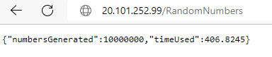

   ...or:

   ```bash
   curl http://20.101.252.99/RandomNumbers
   {"numbersGenerated":104857600,"timeUsed":405.4791}
   ```

   If you are surprised that it takes much longer to generate the random numbers on the AKS cluster than on your developer machine, note that the workload pods have a CPU restriction of 100 millicores, i.e. only 10% of one vCPU core (see `resources.limits.cpu` in `randomnumbers.yaml`).


###  Run your first Load Test with Azure Load Testing

1. (For your information only) We will use [Azure Load Testing](https://learn.microsoft.com/azure/load-testing/overview-what-is-azure-load-testing) in the following steps. This takes a [Apache JMeter](https://jmeter.apache.org/) test plan as input to simulate load on workloads running on the Azure platform. You can use the JMeter GUI (see screenshot) to define a testplan; in this tutorial, we will use a predefined test plan.

   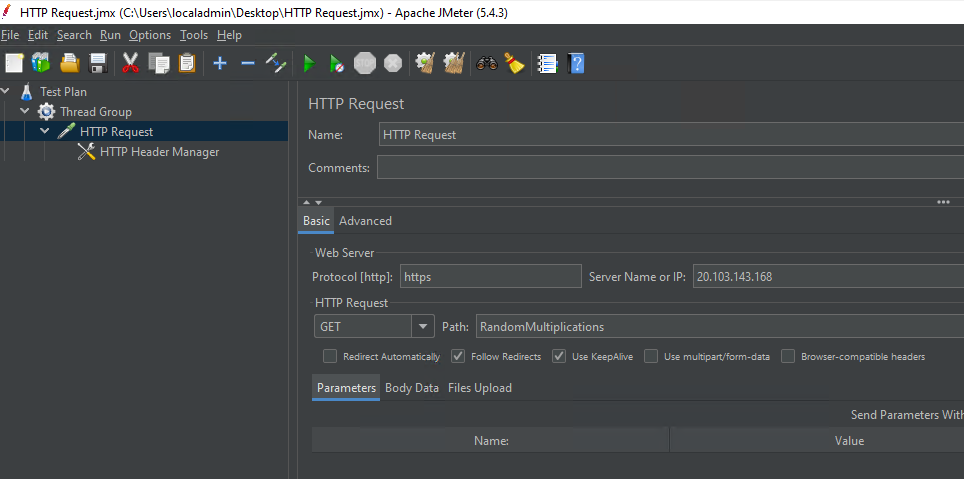

1. In the Azure portal, create a new Azure Load Testing resource in a region that is close to your resources (Please note that this resource is currently in Public Preview and therefore only available in a limited set of regions).

   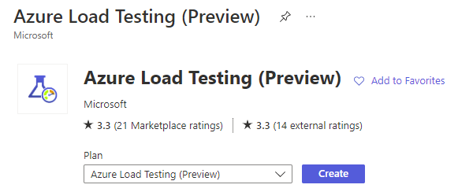

   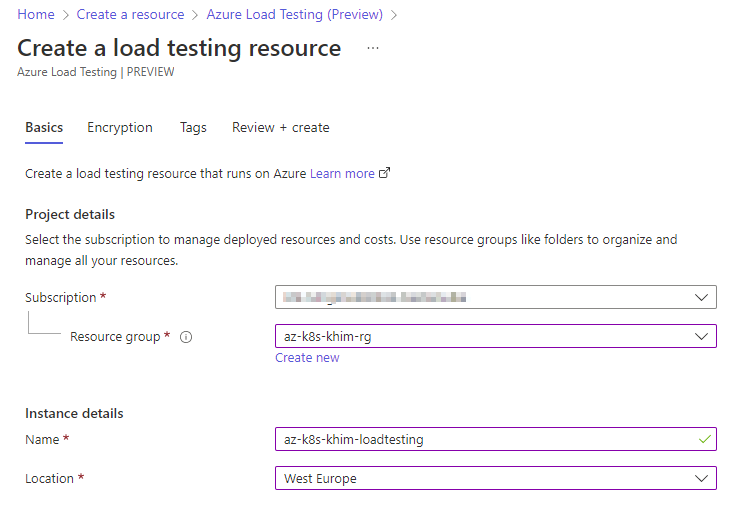

1. Once the Load Testing resource is created, browse to _Tests_ clade, create a new JMeter script test and name it "10 threads, 50 loops"
   
   :exclamation: Most screenshots below this will need to be updated -- if in doubt, follow instructions in text!

   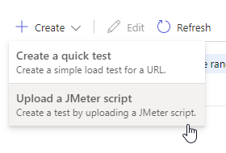

   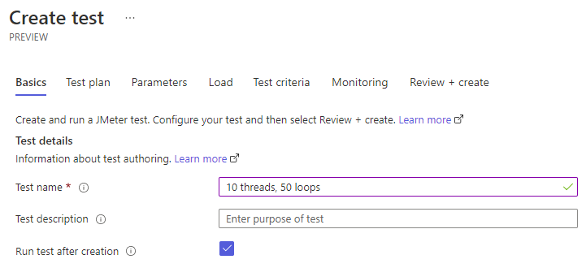

1. Upload `load-test.jmx` from the `res` directory.

   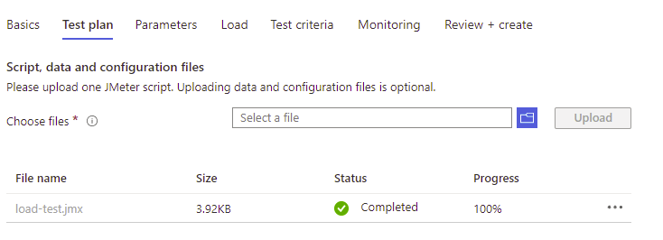

1. Define the parameters `protocol` (either `http` or `https`, please use `http` in this tutorial), `endpoint` (public IP of the service), `path` (`RandomNumbers` in this tutorial), `hostHeader` (same as in `endpoint`), `threads` (defining how many requests will be run in parallel) and `loops` (how many repetitions will be done):

   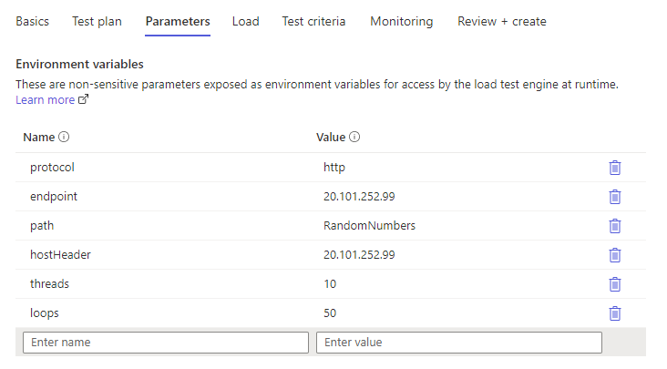

1. Accept the default values for _Load_ and _Test criteria_ 

1. Under _Monitoring_, add your `AKS` cluster resource and the `npuser` Virtual Machine Scale Set (typically found under the `MC_` resource group) as monitored resources (double-check you select the right ones ;-)).

   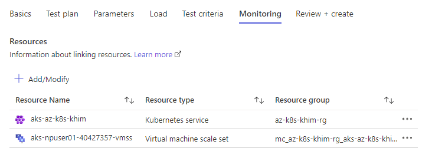

1. Wait for the test to complete. You might want to inspect _Insights_ of your AKS cluster while the test is running:

   <!--
   :construction: Execution time with 10/50: 4mins.
   :construction: Response times with 10/50: 6.59s
   -->

   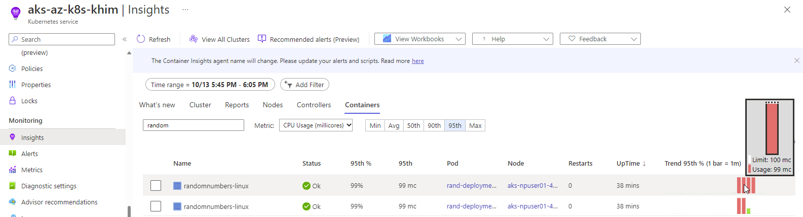

1. Inspect the results of your test. Response times are pretty high...


   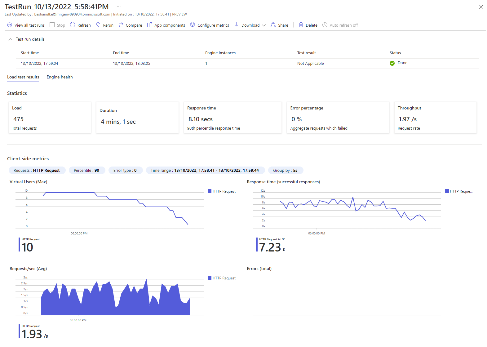

### Define the Horizontal Pod Autoscaler for your application and run a second Test

1. Inspect `randomnumbers-hpa.yaml` and see how the defined `Horizontal Pod Autoscaler` instructs the Kubernetes cluster to scale between 2 (line 8) and 10 (line 10) replicas, achieving a CPU utilization of 30% (line 13).
   
   Note: These values are example values provoking an aggressive scaling behavior for this demo; you might want to reconsider these values for your deployments.

1. Deploy the _Horizontal Pod Autoscaler_ as defined in `randomnumbers-hpa.yaml`.

   ```bash
   kubectl apply -f randomnumbers-hpa.yaml
   ```

1. Start watching the set of pods deployed to your cluster using `watch`:

   ```batch
   watch kubectl get pods -n scaling-wt
   ```

   Example output:
   ```bash
   Every 2.0s: kubectl get pods -n scaling-wt         LAPTOP-QP3491VL: Wed May  4 10:00:11 2022

   NAME                                        READY   STATUS    RESTARTS      AGE
   rand-deployment-7766b6c6b8-bdrwk            1/1     Running   0             14h
   rand-deployment-7766b6c6b8-tfgkm            1/1     Running   0             14h
   ...
   ```
1. Add a new JMeter script test in your Azure Load Testing resource with name "25 threads, 100 loops". Use the same script file `load-test.jmx` and same values for parameters `protocol`, `endpoint`, `hostHeader` and `path`. However, use configure the test to run with 25 as value for `threads` and 100 for value of `loops`.

1. Start your new Azure Load Test and observe how kubernetes deploys further (up to 10) pods to serve incoming requests.

   Example output:
   ```bash
   Every 2.0s: kubectl get pods -n scaling-wt         LAPTOP-QP3491VL: Wed May  4 10:07:09 2022

   NAME                                        READY   STATUS    RESTARTS      AGE
   rand-deployment-7766b6c6b8-2tpxg            1/1     Running   0             2m13s
   rand-deployment-7766b6c6b8-452v4            1/1     Running   0             3m13s
   rand-deployment-7766b6c6b8-45fx8            1/1     Running   0             2m13s
   rand-deployment-7766b6c6b8-8k2kt            1/1     Running   0             2m13s
   rand-deployment-7766b6c6b8-bdrwk            1/1     Running   0             14h
   rand-deployment-7766b6c6b8-ddpk6            1/1     Running   0             4m14s
   rand-deployment-7766b6c6b8-fzcj9            1/1     Running   0             3m59s
   rand-deployment-7766b6c6b8-gjqgx            1/1     Running   0             2m13s
   rand-deployment-7766b6c6b8-p8vnz            1/1     Running   0             4m14s
   rand-deployment-7766b6c6b8-tfgkm            1/1     Running   0             14h
   ...
   ```

   You can also observe _Insights_ of your AKS cluster again to see how new pods immediatly experience high load after creation:

   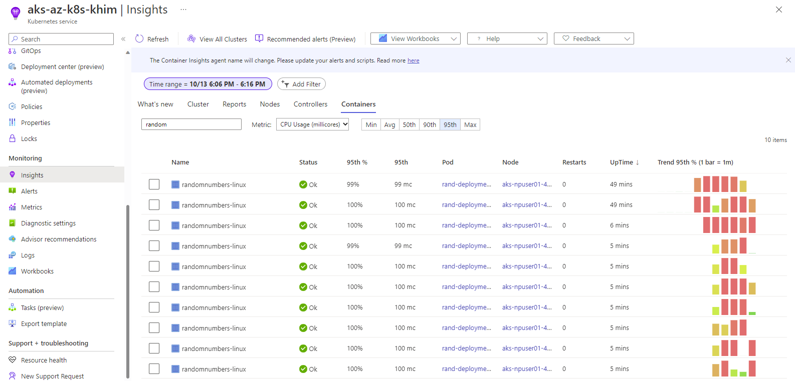

1. Inspect the results of the test again. You can see that (a) response times reduced towards after few minutes (b) much more requests could be processed per second.

   <!--
   :construction: Execution time with 25/100: 6:30mins.
   :construction: Response times with 25/100: 7.37s
   -->

   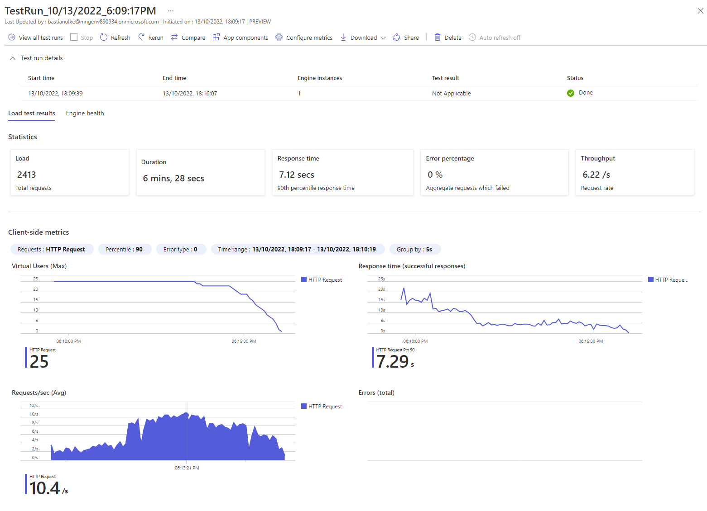

1. If you want, wait some time until the number of pods will be scaled down back to 2.

### Increase load by simulating more concurrent and sequential user requests

1. Increase `maxReplicas` in `randomnumbers-hpa.yaml` with an editor of your choice to 50 and redeploy the pod autoscaler.

   ```bash
   grep maxReplicas ./randomnumbers-hpa.yaml
   ```

   ```output
   maxReplicas: 50
   ```

   ```bash
   kubectl apply -f randomnumbers-hpa.yaml
   ```

1. Create another test in Azure Load Testing with "50 threads, 150 loops" and run it.

1. You will see the number of pods increasing again -- beyond the limit of 10 pods, but not reaching the 50 you specified in `randomnumbers-hpa.yaml`.

   <!--
   :construction: Execution time with 50/150: 13:07mins.
   :construction: Response times with 50/150: 10.49s
   -->

1. Browse to the _Nodes_ tab of your AKS _Insights_. you see the load on your worker node (containing the node pool `npuser01` in its name) and, after some minutes, a section titled _Unscheduled_ that lists some pods that the AKS cluster would have like to start but was unable to schedule:

   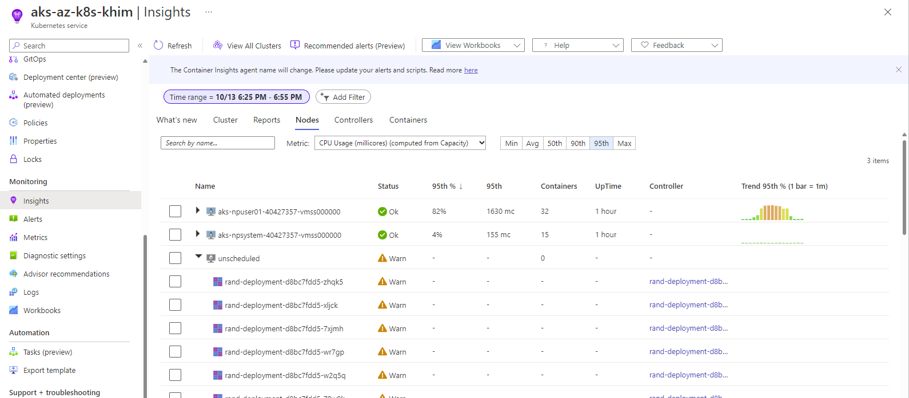

1. But why is that? Open the AKS Logs, search for the predefined query _Kubernetes events_ and run it.

   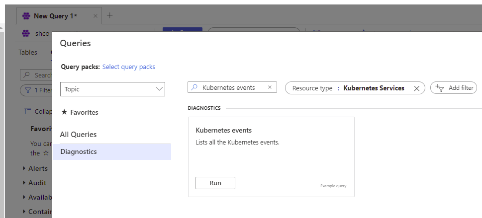

   The query is defined as follows...

   ```kql
   KubeEvents
   | where TimeGenerated > ago(7d) 
   | where not(isempty(Namespace))
   | top 200 by TimeGenerated desc
   ```

   ...and will reveal messages like:

   ```output
   0/2 nodes are available: 1 Insufficient cpu, 1 node(s) had taint {CriticalAddonsOnly: true}, that the pod didn't tolerate.
   ```
   
   The interesting part is `1 Insufficient cpu`, preventing pods from being assigned to the nodes of our `npuser01` node pool. Let us take a closer look at one of these nodes using:

   ```bash
   kubectl describe node aks-npuser01-37699233-vmss000000
   ```

   The output reveals that 1870 of 1900 available mili cores have already been allocated. 

   ```output
   Allocatable:
   cpu:                1900m
   ...
   Allocated resources:
   (Total limits may be over 100 percent, i.e., overcommitted.)
   Resource           Requests      Limits
   --------           --------      ------
   cpu                1830m (96%)   5556m (292%)
   ```

   As each pod requests 75 mili cores (see resource requests in `randomnumbers.yaml`), scheduling another one would exceed the limit of 1900 mili cores available on that node. Therefore, the scheduler considers the pod to be _unschedulable_ and does not proceed with creating the respective containers.

   Note that looking at the _Nodes_ tab of AKS _Insights_, CPU capacity does _not_ seem to be exhausted (the bars representing the load remain green and do not reach a high percentage). This is because this load represents the actual CPU load rather than the resource requests.

1. We have seen how the Horizontal Pod Autoscaler adds and removes pods as load on our application increases and decreases. It uses the resource requests (in mili cores of CPU capacity and bytes of memory) to decide if a node has sufficient remaining capacity to host another pod. If it has not, scheduling the pod may fail in lack of available resources.


### Enable the cluster autoscaler to add scale up the Virtual Machine Scale Set and add further VMs on demand

1. In the next step, you will enable the [cluster autoscaler](https://learn.microsoft.com/azure/aks/cluster-autoscaler) for your AKS cluster. It will add nodes to your node pool when pods cannot be scheduled due to resource constraints and will remove nodes from node pools when consolidation of pods allows. 

1. Run the following command to change the default cluster autoscaler profile (default values can be found in the [AKS Cluster REST API documentation](https://learn.microsoft.com/rest/api/aks/managed-clusters/create-or-update?tabs=HTTP#autoscalerprofile)). These parameters enable a rather aggressive scale-down to avoid longer waiting times in this tutorial. Please be mindful when setting these values in your own cluster.

   ```bash
   az aks update \
     --resource-group az-k8s-khim-rg \
     --name aks-az-k8s-khim \
     --cluster-autoscaler-profile \
       scale-down-unneeded-time=2m \
       scale-down-utilization-threshold=0.8
   ```

   Note that this command _does not enable_ autoscaling itself but only provides parameters for autoscaler where it is already enabled...

1. ...therefore, enable autoscaling between a number of 1 and 3 nodes on your `npuser01` node pool now:

   ```bash
   az aks nodepool update \
     --resource-group az-k8s-khim-rg \
     --cluster-name aks-az-k8s-khim \
     --name npuser01 \
     --enable-cluster-autoscaler \
     --min-count 1 \
     --max-count 3
   ```

1. Start watching the set of pods as well as the set of worker nodes using `watch`:

   ```batch
   watch kubectl get pods -n scaling-wt
   ```

   ```batch
   watch kubectl get nodes
   ```

1. Create a final test with "50 threads, 500 loops"; after some time, you will not only see the number of pods increasing, but also the number of nodes.

   ```batch
   kubectl get nodes
   NAME                               STATUS   ROLES   AGE    VERSION
   aks-npsystem-40226941-vmss000000   Ready    agent   10h    v1.23.8
   aks-npuser01-40226941-vmss000000   Ready    agent   10h    v1.23.8
   aks-npuser01-40226941-vmss000001   Ready    agent   28m    v1.23.8
   aks-npuser01-40226941-vmss000002   Ready    agent   3m7s   v1.23.8
   ```

1. Also, observing the _Nodes_ tab of your AKS _Insights_, you see the load on your worker nodes and how more workers are added to the cluster:

   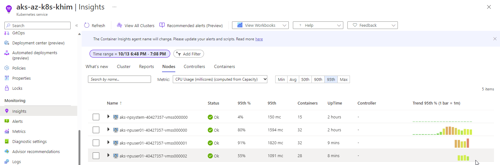

1. (For information only) Using the `Metrics` balde, you can also configure custom graphs to get insights about the state of your cluster. For example, select the namespace `insights.containers/pods`, metric `podCount` and apply a splitting by `Node` to see the number of pods scheduled on each node. 

   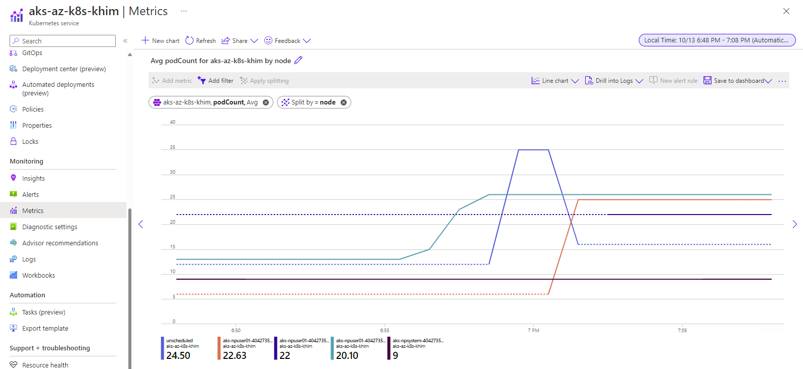

1. Once the test terminated, inspect the results of the test again. Also see how the peak of requests per second correlates with the peak of deployed pods.

   <!--
   :construction: Execution time with 50/500: 24:10mins.
   :construction: Response times with 50/500: 5.21s
   -->

   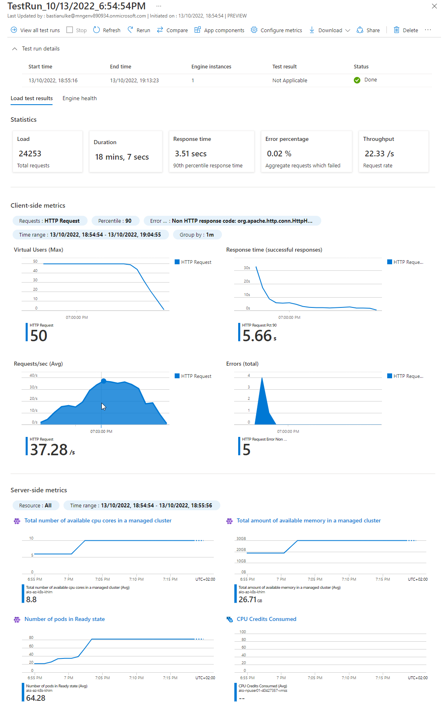

1. After some time, the number of pods and nodes will decrease again. The AKS logs reveal some further information:

   ```kql
   AzureDiagnostics
   | where Category == "cluster-autoscaler"
   | project TimeGenerated, attrs_s, log_s, pod_s
   | sort by TimeGenerated desc
   ```

   ...there will be messages like:

   ```output
   I0504 09:10:17.929359 1 azure_scale_set.go:755] Calling virtualMachineScaleSetsClient.DeleteInstancesAsync(&[6]) for aks-npuser01-61737176-vmss
   I0504 09:10:17.929205 1 azure_scale_set.go:705] Deleting vmss instances [azure:///subscriptions/ce9d064e-10a7-4b7c-8e8e-561fb2e718dd/resourceGroups/leho-rg-leho-aks-rio6zecikhluy-nodepools/providers/Microsoft.Compute/virtualMachineScaleSets/aks-npuser01-61737176-vmss/virtualMachines/6]
   I0504 09:10:17.928963 1 scale_down.go:1478] All pods removed from aks-npuser01-61737176-vmss000006
   ...
   I0504 09:09:51.687640 1 delete.go:104] Successfully added ToBeDeletedTaint on node aks-npuser01-61737176-vmss000006
   ...
   I0504 09:09:51.656027 1 cluster.go:148] Detailed evaluation: aks-npuser01-61737176-vmss000006 for removal
   ...
   I0504 09:09:51.657543 1 cluster.go:187] Detailed evaluation: node aks-npuser01-61737176-vmss000006 may be removed
   ...
   I0504 09:09:51.655112 1 cluster.go:148] Fast evaluation: aks-npuser01-61737176-vmss000006 for removal
   ...
   I0504 09:09:51.655837 1 scale_down.go:862] aks-npuser01-61737176-vmss000006 was unneeded for 2m0.633795839s
   ```

# Resources

## AKS Scaling and Monitoring
[Automatically scale a cluster to meet application demands on Azure Kubernetes Service (AKS)](https://learn.microsoft.com/azure/aks/cluster-autoscaler)


[Examine the node and pod health](https://learn.microsoft.com/azure/architecture/operator-guides/aks/aks-triage-node-health)

[AKS troubleshooting](https://learn.microsoft.com/azure/aks/troubleshooting)

_Resource logs_ in [Monitoring AKS data reference](https://learn.microsoft.com/azure/aks/monitor-aks-reference#resource-logs)

[Monitoring Azure Kubernetes Service (AKS) with Azure Monitor](https://learn.microsoft.com/azure/aks/monitor-aks)
[Horizontal Pod Autoscaling](https://kubernetes.io/docs/tasks/run-application/horizontal-pod-autoscale/)

## Kubernetes Scaling

[Horizontal Pod Autoscaler Walkthrough](https://kubernetes.io/docs/tasks/run-application/horizontal-pod-autoscale-walkthrough/)

[How to query logs from Container insights](https://learn.microsoft.com/azure/azure-monitor/containers/container-insights-log-query#resource-logs)

_Frequently Asked Questions_ (`autoscaler/cluster-autoscaler/FAQ.md`) in [kubernetes/autoscaler](https://github.com/kubernetes/autoscaler/blob/master/cluster-autoscaler/FAQ.md)

[Reserve Compute Resources for System Daemons](https://kubernetes.io/docs/tasks/administer-cluster/reserve-compute-resources/)

[Safely Drain a Node](https://kubernetes.io/docs/tasks/administer-cluster/safely-drain-node/)

## Azure Load Testing

[Quickstart: Create and run a load test with Azure Load Testing Preview](https://learn.microsoft.com/azure/load-testing/quickstart-create-and-run-load-test)


# :construction: Todos 
- Change github links to MS repo?
